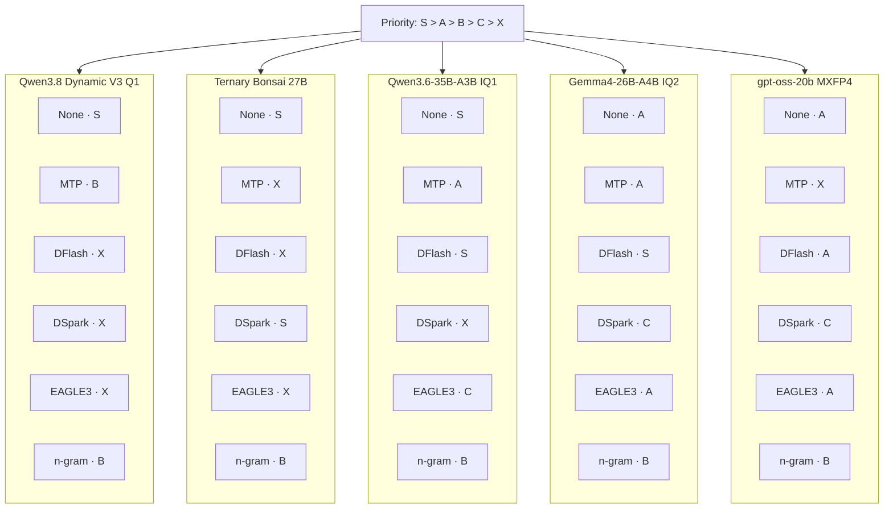
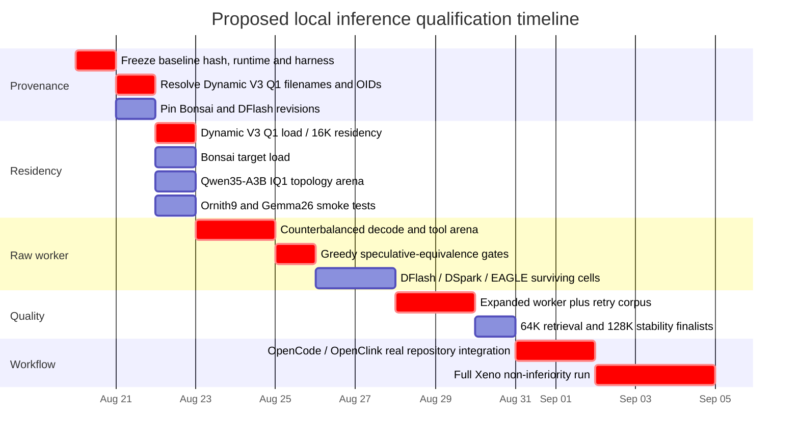

# Candidate Inference Configurations for a 12 GB RTX 4070 SUPER Xeno Coding Worker

## Executive summary

The target is **not the highest-benchmark model and not the highest decode throughput**. The target is the inference configuration that maximizes:

\[
\textbf{Verified Accepted Tasks / Hour}
\]

while preserving the quality of the final merged change under the existing Xeno workflow:

```text
Opus master / PRD / decomposition
        ↓
local worker
        ↓
tests + deterministic Xeno gates
        ↓
reviewer / code review / security review
        ↓
master PR review
        ↓
CI green
        ↓
merge
```

The current baseline is unusually strong. On the actual RTX 4070 SUPER 12 GB system, `Qwen3.8-27B-UD-IQ2_XXS.gguf` is **8.39 GiB / 9.010 GB decimal**, reaches **65/65 GPU residency**, decodes at **42.4 tok/s**, prompt-processes at roughly **809–818 tok/s**, and accepted **27/30 execution-verified coding tasks**, the same count as Q4, while raising verified throughput from Q4's 24.2 to **60.8 tasks/hour**. Its measured first-pass rate was 73.3%, but that is a lower-bound-like result because seven attempts hit the 3,072-token output limit. fileciteturn0file0

The most important hardware fact is the **residency cliff**. On this machine, Q2_K_XL with only four target layers left on CPU manages roughly 21–22 tok/s, while IQ2_XXS with those last four moved to GPU reaches 42.4 tok/s. Therefore a candidate that is “slightly smarter” but grows from roughly 9 GB to 10 GB can lose far more performance than its parameter or quant label suggests. fileciteturn0file0

That immediately changes how smaller models should be evaluated. A 9B model at Q8 is not automatically faster: Qwen3.5-9B Q8 is about 9.53 GB, essentially the same amount of weight traffic as the 9.01 GB baseline, whereas its Q6 is about 7.46 GB and therefore has a substantially better chance of producing an actual batch-one bandwidth advantage. Likewise, Gemma 4 12B Q5/Q6 are more interesting on this GPU than Q8. citeturn9search0turn20search2

The highest-value challengers are therefore:

| Priority | Configuration | Why it can plausibly beat the baseline |
|---|---|---|
| **S** | **Qwen3.8-27B Dynamic V3 1-bit, exact best artifact** | Same target behavior and integration, lower weight footprint, likely 65/65 with materially more KV/draft headroom. Lowest migration risk. |
| **S** | **Ternary Bonsai 27B + its exact DSpark drafter** | 7.17 GB deployed target, large VRAM reserve, custom ternary kernels, exact target-specific DSpark path; quality-oriented Bonsai point. citeturn13search0 |
| **S** | **Qwen3.6-35B-A3B UD-IQ1_M + topology experiment; then DFlash** | 35B total/3B active MoE, 10 GB IQ1 target and an exact current 772 MB DFlash drafter. Could enter a different compute regime from dense 27B. citeturn20search0turn21search10 |
| **A** | **Ornith-1.0-9B Q6-class** | Small high-precision counter-hypothesis; public agentic-coding results are unusually strong for 9B, so it may save retries/tokens rather than winning by raw tok/s alone. citeturn22search6 |
| **A** | **Gemma 4 26B-A4B low-bit + DFlash** | 25.2B total/3.8B active MoE, exact DFlash exists, and a Q8 DFlash conversion is only ~0.46 GB. citeturn20search2turn21search0turn21search11 |
| **A/B** | **gpt-oss-20b native MXFP4 + DFlash/EAGLE-3** | 21B total/3.6B active, designed for agentic/tool use; exact DFlash and EAGLE-3 ecosystem exists, but target weights already exceed comfortable 12 GB residency. citeturn7search0turn20search1turn21search1turn18view0 |

The **1-bit Bonsai 27B** should also be measured, but after Ternary Bonsai. It is only about 3.9 GB and uses a true ~1.125-bit representation, but Prism's own agentic/tool category is materially weaker than the ternary version, and Prism explicitly says long-horizon multi-file agentic coding is not yet a strong target of this release. citeturn13search1

There is one major strategic development that was absent from the earlier model-only research: **decoder ecosystem can justify changing the target model**. Current llama.cpp master supports `draft-eagle3`, `draft-dflash`, `draft-dspark`, `draft-mtp`, and several n-gram modes. DFlash has exact public drafters for Qwen3.6-27B, Qwen3.6-35B-A3B, Gemma 4 26B-A4B, gpt-oss-20b and other models—but the current Z-Lab supported-model list does **not** list Qwen3.8-27B. citeturn18view0turn14search1

That makes **Qwen3.6-35B-A3B + DFlash** and **Ternary Bonsai + DSpark** more interesting than their plain-model comparison would suggest. Conversely, MTP is already effectively rejected for the resident baseline: on the local measurements, its memory cost displaced target residency and turned speculation into a net regression. fileciteturn0file0

The report should therefore be read as a search over complete configurations:

```text
target architecture
×
quantization artifact
×
GPU/CPU residency topology
×
KV representation
×
speculative decoder
×
prompt-prefix behavior
×
agent trajectory
×
Xeno retry/reviewer/escalation policy
```

not as a leaderboard of models.

**Recommended deployment rule:** do not replace IQ2_XXS merely because a candidate gets more tok/s. Replace it only after a candidate reaches **≥69.9 verified tasks/hour**—a 15% gain over 60.8—while meeting every quality and safety gate below. The local harness established a ~13.6% restart-to-restart throughput noise floor, so requiring roughly 15% is also a reasonable minimum engineering margin for accepting the complexity of a new runtime/model. fileciteturn0file0


## Decision framework and hard gates

The baseline evidence must remain the source of truth for this machine. The system is an RTX 4070 SUPER with 12,282 MiB VRAM, i5-13500, 47.69 GB RAM, Windows 11, running the established baseline on llama.cpp build 10472, commit `60eeeb608`. fileciteturn0file0

A candidate can be extraordinarily fast in a vendor benchmark and still fail this selection if it increases retries, emits malformed tool calls, exhausts its output budget, destroys prefix reuse, pushes experts/layers onto an unfavorable CPU path, or requires an unreliable speculative implementation.

### Production gates

| Gate | Required result | Rationale |
|---|---|---|
| **Critical escaped defects** | **0** | Absolute gate. Any critical/high-severity semantic or security defect reaching the final accepted change rejects the configuration. |
| **Final merged quality** | Non-inferior to baseline | Worker raw quality may fall; merged quality may not. Final 200+ task run should target a non-inferiority margin of **≤3 percentage points** versus the current production configuration. |
| **CI** | **100% green on accepted work** | A candidate does not get credit for an “accepted task” unless the required tests/CI actually pass. |
| **Reviewer correctness** | No unresolved high/critical finding | Retry/correction cost counts against throughput; unresolved findings reject the task. |
| **Required tool fields** | **0 omissions** | Current baseline achieved zero required-field omissions in the nested-object probe; do not regress this. fileciteturn0file0 |
| **Tool-call schema** | ≥90% and not materially below current control | An absolute 100% gate is inappropriate because even Q4 scored 80% under the existing stochastic probe, while IQ2_XXS reached 93.3%; all observed non-calls were output-budget truncations rather than refusal. fileciteturn0file0 |
| **First-pass success** | Initial screen ≥70%; final evaluation control-relative | This is an economics metric, not the final quality metric. Measure again after removing output truncation. |
| **Locally accepted before escalation** | Target ≥90% | Current baseline is 27/30 = 90%; lower may still survive only if overall accepted-task economics clearly win. fileciteturn0file0 |
| **Verified Accepted Tasks/h** | **≥69.9/h** preferred replacement gate | 15% above the current measured 60.8/h baseline. |
| **Merged Tasks/h** | At least current 29.4/h; preferably ≥33.8/h | Includes the fixed review/CI and escalation model used in the existing report. fileciteturn0file0 |
| **Context** | **≥16K usable** | Minimum operating context requested by the workflow. |
| **Stability** | 100/100 sequential turns, zero hangs/stuck slots | The baseline already passes this. fileciteturn0file0 |
| **GPU reserve at 16K** | Prefer ≥768 MiB; reject unstable <512 MiB | The local project adopted 768 MiB as the normal fit target after observing instability around the lower margin. fileciteturn0file0 |
| **Host-memory safety** | No paging / no memory-pressure collapse | Particularly important for 20–35B MoE CPU-expert configurations. |
| **Prefix-cache reuse** | ~99% steady append-only reuse | Prefix breaks already cost roughly 63 s at 16K and ~248 s at 64K on the measured Q4 trajectory. fileciteturn0file0 |
| **Speculative equivalence** | Byte-identical greedy result against no-spec target on equivalence corpus | A current llama.cpp issue reports MTP/DSpark divergence with some quantized targets while BF16 matched, so “speculative decoding is theoretically lossless” is not sufficient as an implementation gate. citeturn1view2 |
| **Runtime reproducibility** | Exact model revision + SHA256 + exact runtime commit | No `main`, no ambiguous `-hf :substring` in final measurements. The local project has already downloaded the wrong same-sized artifact through substring selection once. fileciteturn0file0 |

The central metric remains:

```text
Verified Accepted Tasks / Hour
=
3600 × verified locally accepted tasks
──────────────────────────────────
total worker wall time
```

and the full-workflow metric must charge retries, reviewer corrections, escalation and CI. The local report is particularly important here because it disproved the earlier optimistic retry assumption: actual evidence-assisted retry success was 40% on Q4, 62.5% on IQ2_XXS and 20% on Q2_K_XL, while failed/retried tasks often consumed disproportionately large wall time. fileciteturn0file0

For final model selection, use this hierarchy:

```text
final merged correctness
        >
critical/security escape rate
        >
tool/reviewer reliability
        >
verified accepted tasks/hour
        >
merged tasks/hour
        >
trajectory tokens/task
        >
raw tok/s
```

This prevents a 70 tok/s model that loops, over-thinks or retries twice from defeating a 45 tok/s model that succeeds immediately.

For raw throughput comparisons, preserve the project's counterbalanced arena design:

```text
round A: baseline → candidate → candidate-2
round B: candidate-2 → candidate → baseline
round C: baseline → candidate → candidate-2
```

The existing machine shows about **13.6% peak-to-peak restart variation**, and previous apparent 8–12% tuning wins disappeared when re-run against fresh controls. A raw-speed claim below that floor should therefore not drive model selection. fileciteturn0file0


## Candidate inventory and Pareto analysis

### Current Qwen3.8 ladder

The local measurements already eliminate much of the Qwen3.8 search space.

| Qwen3.8 artifact | File | 16K topology | Result | Decision |
|---|---:|---:|---|---|
| **Dynamic V3 1-bit family** | Exact new file **unspecified** | Expected 65/0 if genuinely below current IQ2 footprint | Newly announced by Unsloth; exact artifact/OID must be resolved | **Highest-priority acquisition** |
| `UD-IQ2_XXS` | **9.010 GB / 8.39 GiB** | **65 + 0** | **42.4 tok/s; 27/30 accepted; 60.8 verified tasks/h** | **Production baseline** |
| `UD-IQ2_M` | 10.320 GB / 9.61 GiB | Unknown | Untested | Test only if it can still reach 65/0 |
| `UD-Q2_K_XL` | 10.676 GB / 9.94 GiB | 61 + 4 no-spec | 21–22 tok/s | Dominated |
| `UD-Q3_K_XL` | 13.441 GB / 12.52 GiB | Partial | Earlier phase rejected | Reject |
| `UD-Q4_K_XL` | 17.923 GB / 16.69 GiB | 33 + 32 with MTP | 12.6–13.7 tok/s | Q4 escalation/reference |

All numbers in this table except the newly announced V3 one-bit family are direct machine measurements or exact file byte counts from the existing report. fileciteturn0file0

The user-supplied Unsloth Dynamic V3 announcement says the new Qwen3.8-27B release improves low-bit divergence/KL behavior and adds a 1-bit operating point reported around the 8 GB memory class. The exact filename, file hash and whether the currently cached IQ2 artifact was regenerated as part of the same release remain unresolved in this research session because the supplied documentation endpoint is Markdown content that the browser could not parse. Treat the [Dynamic V3 documentation](https://unsloth.ai/docs/basics/dynamic-3.0-ggufs) as the primary acquisition source, but **do not run the new test until the file's revision and SHA256 are pinned**.

The reason Dynamic V3 deserves unusually high priority is methodological rather than the marketing accuracy percentage. Earlier Unsloth Dynamic quantization explicitly uses mixed/selective precision—important tensors can stay at high precision while others are pushed down to 1–6 bits—so a nominal “1-bit” artifact cannot be assumed equivalent to uniform 1-bit PTQ. citeturn2search0

The user-provided Atomic Chat chart should also remain in discovery, particularly its AD Q1/Q2 variants, but the chart's `AD-IQ2_XS` at roughly 9.9 GB already looks structurally unattractive on this machine: adding ~0.9 GB over the current 9.01 GB target would consume most of the measured 1.18 GB post-load headroom and is likely to cross back over the residency cliff. Its only reason to survive screening would be a sufficiently large execution-quality advantage. Exact current AD repository, filename and OID are therefore **unspecified** and must be resolved before acquisition.

### Dense small-model lane

This lane answers a different question:

> Is a smaller network at Q5/Q6/Q8 more trajectory-stable than a 27B network at extreme low-bit precision, enough to offset having fewer parameters?

High-precision does **not** imply high speed. At batch one, a fully resident dense decoder is frequently dominated by moving model weights. Qwen3.5-9B Q8 is about 9.53 GB—more bytes than the 9.01 GB current baseline—whereas Q6 is 7.46 GB. Gemma 4 12B Q8 is 12.7 GB and therefore does not fit comfortably in 12 GB VRAM, while Q5_K_M is about 8.41 GB and Q6_K about 9.79 GB. citeturn9search0turn20search2

| Family | Low-bit | Q4 class | Q5 | Q6 | Q8 | Q16/BF16 | 12 GB verdict |
|---|---:|---:|---:|---:|---:|---:|---|
| **Qwen3.5-9B** | IQ2_XXS ~3.19 GB | ~5.4–6.0 GB | ~6.4–6.7 GB | **7.46 GB** | **9.53 GB** | 17.9 GB | **Q6 first; Q8 quality control** citeturn9search0 |
| **Gemma 4 12B** | IQ2_M ~4.21 GB | ~6.4–7.4 GB | **8.2–8.6 GB** | **9.79 GB** | 12.7 GB | 23.8 GB | **Q5 first; Q6 second** citeturn20search2 |
| **Ornith-1.0-9B** | Custom GGUFs exist | Custom GGUF/AWQ exists | available | available | available | base BF16 | **Prefer Q6-class; obtain exact current pack/OID** citeturn22search6 |

Ornith is the most important small-model family because its developers specifically post-trained it for agentic coding. Its published evaluation reports, among other results, 43.1 on Terminal-Bench 2.1 Terminus, 69.4 on SWE-bench Verified, 42.9 on SWE-bench Pro and 27.2 on NL2Repo, versus materially lower figures for the Qwen3.5-9B base in the same reported setup. Those are not predictions of Xeno pass rates, but they provide a stronger reason to spend local benchmark time on Ornith than on a generic 9B Q8 control. citeturn22search6

A community GPTQ treatment of Qwen3.5-9B is 7.7 GB and another public AWQ line exists, so AWQ/GPTQ are genuine alternative small-model operating points. They imply a runtime switch to a GPTQ/AWQ-capable engine such as vLLM rather than the current GGUF/llama.cpp path, and should therefore be evaluated only after the simpler GGUF Q6 lane. citeturn22search0turn22search3

### MoE and specialist lane

Qwen3.6-35B-A3B is particularly interesting because it has **35B total parameters but only 3B activated**, 40 layers, 256 routed experts with 8 routed plus one shared expert active per token, native 262K context, and MTP training. citeturn21search4

Its Unsloth quant ladder is unusually relevant to a 12 GB card:

| Qwen3.6-35B-A3B | File size |
|---|---:|
| **UD-IQ1_M** | **10.0 GB** |
| UD-IQ2_XXS | 10.8 GB |
| UD-IQ2_M | 11.5 GB |
| UD-Q2_K_XL | 12.3 GB |
| UD-IQ3_XXS | 13.2 GB |
| UD-IQ3_S | 13.7 GB |
| UD-IQ4_XS | 17.7 GB |
| UD-Q4_K_S | 20.9 GB |
| MXFP4_MOE | 21.7 GB |
| UD-Q4_K_M | 22.1 GB |
| Q5_K_S | 24.9 GB |
| Q6_K | 29.3 GB |
| Q8_0 | 36.9 GB |
| BF16 | 69.4 GB |

citeturn20search0

The 10 GB IQ1 target is too close to the GPU limit to assume ordinary 40/40 residency with the project's preferred 768 MiB reserve, but MoE opens another topology: keep non-expert structure on GPU and deliberately place expert tensors in RAM using current llama.cpp MoE placement controls. That path must be quality-checked, not merely speed-checked; llama.cpp has received reports of model-dependent output-quality differences under different MoE expert placement, so CPU-MoE and GPU-expert runs require deterministic equivalence/correctness tests rather than being treated as interchangeable. citeturn17search5

Gemma 4 26B-A4B is another suitable MoE geometry: roughly 25.2B total, 3.8B active, 30 layers, 128 experts with eight active plus one shared, and a 256K context window. citeturn20search2 Its low-bit GGUF ladder reaches approximately 9.92 GB at UD-IQ2_XXS, ~11.4 GB around IQ3, ~13.6 GB for the compact IQ4 point, ~18.9 GB Q5, ~23.2 GB Q6 and ~26.9 GB Q8. citeturn10search0

`gpt-oss-20b` sits just below the requested 25–40B MoE band but belongs in the experiment because its 21B total / ~3.6B active architecture was released specifically for lower-latency local and agentic use, with tool use and structured workflows among the model's intended capabilities. citeturn7search0turn7search4 The important quantization peculiarity is that the model is already natively MXFP4-heavy: the Unsloth GGUF ladder stays around 11.5–12.1 GB from Q2 through Q8 rather than shrinking like a conventional BF16 dense model, and F16 is only about 13.8 GB. citeturn20search1 This makes it a **decoder/architecture experiment**, not a low-bit-residency experiment.

Ornith-1.0-35B should remain a quality-oriented MoE challenger. Its published GGUFs include roughly 21.2 GB Q4_K_M, 24.7 GB Q5_K_M, 28.5 GB Q6_K, 36.9 GB Q8 and 69.4 GB BF16, so the 12 GB system necessarily relies on expert/weight offload at useful quality levels. Its attraction is its agentic post-training, not residency. citeturn6search1

Devstral Small 2 is a lower-priority specialist discovery item. Public 24B community GGUF packs put Q2 around 9 GB, Q3 around 10.5–11.6 GB, Q4_K_M around 14.4 GB, Q5 around 16.9 GB, Q6 around 19.4 GB and Q8 around 25.2 GB. The Q2 point is therefore the only obvious full-residency candidate, which largely recreates the same “large dense, extreme quant” hypothesis already represented by Qwen3.8 rather than opening a new regime. citeturn20search3

### Custom low-bit architectures

Prism's current Bonsai releases deserve a separate category because they are **not conventional post-training Q1/Q2 files**.

Ternary Bonsai 27B derives from the Qwen3.6-27B architecture and represents language weights as `{-1,0,+1}` with group scaling. Prism reports a representation cost of ~1.71 true bits/weight and a current deployed GGUF footprint around **7.17 GB**, because today's implementation stores ternary values in 2-bit slots. The release includes custom CUDA/Metal kernels and an exact DSpark drafter. citeturn13search0

The binary Bonsai companion uses `{-1,+1}`, reports ~1.125 true bits/weight and a deployed footprint around **3.9 GB**. It buys considerably more context/draft headroom but loses more instruction/tool capability than the ternary point in Prism's own evaluations. citeturn13search1

The caveat is material: Prism itself states that long-horizon, multi-file run-test-repair agentic coding is **not yet a strong target** for this release. Therefore Bonsai public benchmark superiority to conventional IQ2 on selected reasoning/coding tests cannot be converted into a Xeno deployment claim without the complete workflow benchmark. citeturn13search0turn13search1

### Shortlist comparison against the current machine

The “tok/s estimate” below is deliberately a **planning envelope**, not a benchmark claim. For fully resident dense models it starts from the local 42.4 tok/s baseline and the approximate weight-footprint ratio; MoE and custom-kernel cases receive wider ranges because active-parameter routing and specialized kernels break simple byte scaling. “Verified tasks/h estimate” is the equal-trajectory planning envelope—what would happen if output length, retry behavior and acceptance were unchanged. It is **not** an expected production score. Unknown first-pass rates are left unknown rather than manufactured from unrelated public benchmarks.

| Model | Quant artifact name | File size GB | Effective BPW | Expected GPU residency @16K | tok/s estimate @16K | First-pass % | Verified tasks/hr estimate | Escalation path |
|---|---|---:|---:|---|---:|---:|---:|---|
| **Qwen3.8-27B baseline** | `UD-IQ2_XXS` | **9.010** | ~2.67 whole-file | **65/0 measured** | **42.4 measured** | **73.3 measured; truncation-confounded** | **60.8 measured** | Qwen3.8 Q4 + MTP2 fileciteturn0file0 |
| **Qwen3.8-27B** | best **Dynamic V3 Q1** | **unspecified; target < current 9.01 GB** | mixed ~1.x, exact unspecified | **65/0 expected** | **48–60 planning** | Unknown; gate ≥70 | ~69–86 equal-trajectory | IQ2_XXS → Q4 |
| **Ternary Bonsai 27B** | `Q2_0_g128` + optional DSpark `Q4_1` | **7.17 target + 1.95 draft on disk** | ~2.10 deployed / ~1.71 representation | **64/0 target expected** | ~45–70 plain; **~55–85 with DSpark planning** | Unknown | ~65–120 envelope | IQ2_XXS → Q4 citeturn13search0 |
| **Ornith-1.0-9B** | **Q6-class GGUF** | ~7–8 expected; exact finalist file **unspecified** | ~6–7 | **32/0 expected** | ~48–65 | Unknown; agentic evidence encouraging | ~69–93 envelope | IQ2_XXS → Q4 citeturn22search6 |
| **Qwen3.6-35B-A3B** | `UD-IQ1_M` | **10.0** | ~2.29 whole-file | All-GPU tight; test normal fit **and CPU-expert topology** | **~35–80**, topology-dependent | Unknown | ~50–115 envelope | IQ2_XXS → Q4 citeturn20search0 |
| **Qwen3.6-35B-A3B** | `UD-IQ1_M` + exact DFlash | 10.0 + **0.772 current BF16 drafter** | target ~2.29 | likely requires deliberate expert/draft placement | **~45–95 planning** | Same target as no-spec if verifier is correct | ~65–136 envelope | no-spec same target → IQ2 → Q4 citeturn21search10 |
| **Gemma 4 26B-A4B** | `UD-IQ2_XXS` + DFlash | ~9.92 + ~0.46 Q8 draft conversion | ~3.15 target whole-file | 30 layers; likely tight all-GPU, CPU-expert topology worth testing | ~45–85 | Unknown | ~65–122 envelope | IQ2_XXS → Q4 citeturn10search0turn21search11 |
| **gpt-oss-20b** | native MXFP4 GGUF + DFlash | ~11.5 + **1.57 BF16 draft** | ~4.38 whole-file target | full co-residency impossible; CPU offload required | ~30–60 | Unknown | ~43–86 envelope | IQ2_XXS → Q4 citeturn20search1turn21search9 |
| **Qwen3.5-9B calibration arm** | `Q6_K` | **7.46** | ~6.63 | 32/0 expected | ~48–60 | Unknown | ~69–86 envelope | IQ2_XXS → Q4 citeturn9search0 |
| **Gemma 4 12B calibration arm** | `Q5_K_M` | **~8.41** | ~5.63 | 48/0 likely | ~43–55 | Unknown | ~62–79 envelope | IQ2_XXS → Q4 citeturn20search2 |

The table exposes an important result before any downloads occur: **small Q8 is not automatically a throughput lane**. A 9B Q8 model with ~9.5 GB of weights has almost the same batch-one bandwidth burden as a 27B IQ2 model with ~9.0 GB of weights. Its advantage must therefore come from better kernels, shorter trajectories or fewer retries, not merely the parameter count. Q5/Q6 is the more rational first test for small dense models. citeturn9search0turn20search2

Likewise, Q16 is not attractive on this card: Qwen3.5-9B BF16 is ~17.9 GB and Gemma 4 12B BF16 ~23.8 GB, so even the small models lose full GPU residency. citeturn9search0turn20search2

AWQ/GPTQ should be treated as a **runtime-switch lane**, not mixed blindly into the llama.cpp arena. A community Qwen3.5-9B GPTQ artifact is ~7.7 GB and thus memory-feasible, whereas a Qwen3.6-35B-A3B GPTQ 4-bit treatment is reported around 25 GB because many non-expert components remain FP16, which is not a useful 12 GB full-residency point. citeturn22search0turn22search10


## Speculative decoders and compatibility

Current llama.cpp master has moved far beyond the speculative surface available when the original baseline binary was pinned. Its current speculative documentation lists `draft-eagle3`, `draft-dflash`, `draft-dspark`, `draft-mtp`, `draft-simple`, `ngram-cache`, `ngram-simple`, `ngram-map-k`, experimental `ngram-map-k4v`, and `ngram-mod`; it also exposes independent draft GPU-layer, CPU-thread, KV-cache and draft-MoE placement controls. citeturn18view0

This means speculative decoding should be benchmarked on a **separate pinned current llama.cpp build** before production is updated. The baseline binary `60eeeb608` must remain untouched until equivalence and performance are established. fileciteturn0file0

| Decoder | Approximate sidecar cost | Current llama.cpp status | Exact checkpoint situation for finalists | Realistic local expectation | Principal failure modes |
|---|---|---|---|---|---|
| **MTP** | Qwen local MTP tensors measured ~286 MB; Gemma MTP Q8 sidecar ~462 MB | **Supported: `draft-mtp`** citeturn18view0 | Qwen3.8/Qwen3.6 trained with MTP; Gemma 4 MTP artifacts exist | **Baseline: reject at IQ2 unless re-proven**; Q4 benefits | Sidecar displaces target layers; target becomes cheap enough that speculation overhead exceeds savings; quantized greedy divergence bug possible. fileciteturn0file0 citeturn1view2 |
| **DFlash** | Target-specific: Qwen3.6-35A3B current BF16 **772 MB**; Qwen3.6-27B BF16 **3.46 GB**; gpt-oss20 **1.57 GB**; Gemma26 Q8 community conversion ~**0.46 GB** | **Supported: `draft-dflash`** citeturn18view0 | Exact public drafts: Qwen3.6-27B, Qwen3.6-35A3B, Gemma26-A4B, gpt-oss20; **no exact Qwen3.8 in current Z-Lab list** citeturn14search1 | High-payoff if sidecar does not destroy residency; local planning ~1.1–1.8×, not paper headline | Residency loss; draft-target mismatch; hidden-state extraction overhead; large Qwen27 draft is especially problematic on 12 GB |
| **DSpark** | Checkpoint-dependent; Bonsai Q4 pack 1.95 GB on disk, Prism says ~0.5 GB drafter-unique serving weights when sharing target components | **Supported: `draft-dspark` on current master**; current docs still describe backbone restrictions citeturn18view0 | DeepSeek releases Qwen3 4/8/14B and Gemma4-12B research checkpoints; **Bonsai ships an exact custom DSpark**; no Qwen3.8 exact public checkpoint found citeturn15search1turn13search0 | Bonsai vendor CUDA result ~1.34×; single-user 4070 result must be measured | Same residency issue; confidence scheduling tuned to another engine can misfire; quantized greedy divergence issue in llama.cpp |
| **EAGLE-3** | Model-specific, usually small one-layer target-feature drafter; exact size must be recorded per checkpoint | **Supported: `draft-eagle3`** citeturn18view0 | llama docs list exact checkpoints for Qwen3 8/14, Gemma4-26B-A4B, gpt-oss20 and others; not Qwen3.8 citeturn18view0 | Potentially useful on small/MoE targets; expect modest local gain until measured | Sequential drafting overhead, sidecar memory, target-specific compatibility, runtime bugs |
| **DFlare** | Checkpoint/runtime dependent | **Not a current llama.cpp `--spec-type`** | Research/training through AngelSpec/AngelSlim; paper evaluates Qwen3 and gpt-oss20 | Future runtime-switch experiment | Requires non-llama runtime; engineering complexity; sidecar cost |
| **DFly** | Checkpoint dependent | **Not current llama.cpp `--spec-type`** | AngelSpec releases Qwen3-8B and Hy3 drafters | Future only for this machine | Runtime switch, checkpoint coverage, no exact shortlisted target |
| **n-gram map/mod** | `ngram-mod` docs describe ~**16 MB** constant structure; no model sidecar | **Supported** | Universal | Cheap one-test challenger; especially source-code/rewrite trajectories | No gain if trajectory lacks repetition; incorrect tuning can spend verify work without useful drafts |
| **draft-simple** | Small standalone model | Supported | Requires tokenizer/vocab compatibility | Low priority | Sequential drafting and separate model memory usually inferior to model-specific modern drafters |

citeturn18view0

DFlash is particularly relevant because it drafts a block in parallel rather than generating the draft autoregressively token by token. Its paper reports over 6× lossless acceleration in its evaluated settings and up to 2.5× the speedup of EAGLE-3, but those experiments are **not** 12 GB 4070S GGUF results. citeturn16academia24 The public `gpt-oss-20b-DFlash` model card is a more grounded reminder of the range: it reports roughly 1.9–2.2× in its own single-concurrency benchmark tasks, still on a different serving stack and hardware. citeturn21search1

DSpark extends parallel block drafting with a lightweight sequential/Markov component and confidence-scheduled verification. DeepSeek reports **60–85% higher per-user generation speed than its MTP-1 production baseline at matched throughput** in live DeepSeek-V4 serving. That is strong evidence for the architecture, but it is primarily a **production-concurrency** result, not a prediction for single-user consumer-GPU decode. citeturn15academia24

DeepSeek's current DeepSpec repository releases matched EAGLE-3, DFlash and DSpark checkpoints for Qwen3-4B/8B/14B and Gemma 4 12B, and explicitly advises re-training for domain-specific targets and thinking-mode behavior. This is important for Ornith: a Qwen3.5-9B DFlash checkpoint should **not** simply be declared compatible with an Ornith fine-tune because the architecture matches; acceptance quality depends on the exact target distribution and hidden-state relationship. citeturn15search1

EAGLE-3 remains a legitimate challenger where an exact checkpoint already exists. Its authors report substantial lossless speedups in their own multi-GPU FP16 experiments and explain that it fuses lower-, middle- and higher-layer target features. Again, the correct local question is not whether EAGLE-3 is “5× technology”; it is whether a specific sidecar leaves enough 12 GB VRAM for the target and produces a net wall-clock gain. citeturn15search0

DFlare and DFly are **research-backlog rather than immediate llama.cpp candidates**. Tencent's AngelSpec supports DFly, DFlash, DFlare, EAGLE-3, DSpark and MTP in one training framework, but its currently listed released models are concentrated on Hy3 and Qwen3-8B. citeturn16search0 DFlare's paper reports average speedups of 5.52× on Qwen3-4B, 5.46× on Qwen3-8B and 3.91× on gpt-oss-20b in its experimental setup, but no current llama.cpp spec type exists for it. citeturn16academia25turn18view0

The most important speculative safety gate is implementation equivalence. A current open llama.cpp issue reports greedy divergence for MTP and DSpark against some **quantized** targets, while BF16 DSpark matched in the repro; n-gram remained identical there. This report should therefore treat every speculative method as *potentially lossless only after the exact target/quant/runtime combination proves byte equivalence locally*. citeturn1view2

There is also direct evidence of model/runtime-specific speculative instability: an earlier llama.cpp issue involved Gemma 4 + EAGLE-3 failing on longer prompts on Windows/CUDA before a fix landed. That reinforces the need to pin the exact post-fix commit rather than infer reliability from feature availability. citeturn0search6

### Decoder compatibility matrix

| Target | None | MTP | DFlash | DSpark | EAGLE-3 | n-gram |
|---|---|---|---|---|---|---|
| **Qwen3.8 IQ2 baseline** | **S / measured** | **C / local regression** | **X: no exact public draft found** | **X: no exact public draft found** | X | B |
| **Qwen3.8 Dynamic V3 Q1** | **S** | B after residency check | X today | X today | X | B |
| **Ternary Bonsai 27B** | **S** | X | X | **S: exact shipped drafter** | X | B |
| **Ornith 9B Q6** | **S** | model-dependent | C: architecture-relative draft exists, not exact Ornith | C | C | B |
| **Qwen3.6-35B-A3B IQ1** | **S** | A | **S: exact 772 MB draft** | X exact | C | B |
| **Gemma4-26B-A4B IQ2** | **A** | A | **S: exact draft** | C | **A: exact checkpoint listed** | B |
| **gpt-oss-20b MXFP4** | **A** | X | **A: exact draft** | C | **A: exact checkpoint listed** | B |

Legend: **S** = highest-payoff test, **A** = strong test, **B** = cheap secondary test, **C** = compatibility/engineering uncertainty, **X** = do not test without a matched checkpoint.



### Sidecar provenance worth pinning now

A particularly important discovery is that DFlash repositories can change substantially. The Qwen3.6-35B-A3B DFlash file indexed at one prior revision was **2.98 GB** with SHA256 `e5aee9e313e8db2893c8fa97dfd1d017580807b6772b508a8763bb30aa1e51c7`, while the current indexed `main` artifact is **772 MB**, SHA256 `1fb90ef50a32bfb8dd2abfe601dd3608d6d5b59dc342820a98830f76f8cd72b7`, Xet hash `e384bddf5e194f5bdb9fdf2690dca1f4a6d8db59dd40cf1568a7629784bb0846`. **Never benchmark this repository by `main` without recording the revision.** citeturn21search6turn21search10

Other currently exposed hashes:

| Artifact | Size | SHA256 | Xet hash |
|---|---:|---|---|
| `Qwen3.6-35B-A3B-UD-IQ2_XXS.gguf` | 10.8 GB | `75ca642bd0e6a4cc4b0648ec2297a82a19c22380a5a3eb604a2b7091929b7127` | `c1cc442c6dfcaa8e55ab97e177da0b4fac1a3cc1a50067c0570f862ae5b7dd8a` citeturn20search11 |
| `Qwen3.6-35B-A3B-DFlash/model.safetensors` current indexed main | 772 MB | `1fb90ef50a32bfb8dd2abfe601dd3608d6d5b59dc342820a98830f76f8cd72b7` | `e384bddf5e194f5bdb9fdf2690dca1f4a6d8db59dd40cf1568a7629784bb0846` citeturn21search10 |
| `Qwen3.6-27B-DFlash/model.safetensors` | 3.46 GB | `e0c050b34798d32728a164d2c3f1681746ff85c11945701b0205b654e2f1fdbe` | `117d66a7bbde7821477e275c275dcdf0d7bb399da1e97bc7bc77b099311d20ad` citeturn21search7 |
| `gpt-oss-20b-DFlash/model.safetensors` | 1.57 GB | `66ae3e6e93575ff93f1ba9af4a940cc7bd1f8dde3f288fc01b5d30374b02ceb5` | `6ee16b254bef2badfe246f46865f4a7a92d07fcb8bf4fd2d3bcf2695e9f74119` citeturn21search9 |
| **Qwen3.8 Dynamic V3 Q1** | unspecified | **unspecified** | **unspecified** |
| **Current local Qwen3.8 IQ2_XXS** | 9,010,048,064 bytes | **unspecified in current report** | **unspecified** |
| **Ternary Bonsai target/DSpark** | 7.17 / 1.95 GB | **unspecified in retrieved source** | **unspecified** |

Those `unspecified` entries should be considered experiment blockers, not documentation niceties.


## Finalists and exact benchmark protocol

The recommended experiment is **six challengers plus the existing baseline control**, not a brute-force sweep of every quant.

| Rank | Finalist | First configuration | Second configuration only if first survives |
|---|---|---|---|
| **S1** | Qwen3.8-27B Dynamic V3 Q1 | no speculation | MTP only if it preserves 65/65 and improves decode |
| **S2** | Ternary Bonsai 27B | no speculation | exact shipped DSpark Q4_1 |
| **S3** | Qwen3.6-35B-A3B | UD-IQ1_M, compare normal `--fit` vs CPU-MoE | exact pinned DFlash |
| **A1** | Ornith-1.0-9B | Q6-class GGUF | Q8 only as quality/trajectory control |
| **A2** | Gemma 4 26B-A4B | lowest high-quality low-bit target, no spec | DFlash; then EAGLE-3 only if DFlash loses |
| **A3** | gpt-oss-20b | native MXFP4, no spec | DFlash, then EAGLE-3 |
| **Control** | Qwen3.8-27B | existing IQ2_XXS | existing Q4 escalation |

### Acquisition and reproducibility

Do **not** use an ambiguous quant substring for a measured run. Download exact filenames at an exact revision and run local paths.

```powershell
# Example pattern: pin the revision before download.
$Repo     = "unsloth/Qwen3.6-35B-A3B-GGUF"
$Revision = "<FULL_HF_COMMIT>"
$File     = "Qwen3.6-35B-A3B-UD-IQ1_M.gguf"
$Out      = "C:\AI\models\qwen36-35a3b-iq1"

hf download $Repo $File `
  --revision $Revision `
  --local-dir $Out

Get-FileHash "$Out\$File" -Algorithm SHA256
```

Record at minimum:

```text
model repo
exact filename
HF revision / commit
Xet hash if exposed
SHA256
exact byte size
chat-template source
draft repo + revision + SHA256
llama.cpp git commit
llama.cpp --version
CUDA runtime / driver
GPU free VRAM before load
GPU used/free after load
actual GPU/CPU layer assignment
KV type
context
all command flags
sampling parameters
max_tokens
prompt/corpus git revision
```

The baseline itself must now receive a SHA256/OID before another cross-model arena. The existing report contains exact byte size but not content hash. fileciteturn0file0

Maintain two llama.cpp installations:

```text
C:\AI\llama.cpp-baseline\
    commit 60eeeb608
    NEVER MOVE during comparison

C:\AI\llama.cpp-spec-current\
    pinned current commit
    DFlash / DSpark / EAGLE3 experiments
```

This isolates “new target model” from “new runtime” as experimental variables.

### Common no-spec server

Use the known-good local tuning as the common GGUF baseline:

```powershell
llama-server.exe `
  -m "<EXACT_LOCAL_MODEL.gguf>" `
  -c 16384 `
  -ngl auto `
  --fit on `
  --fit-target 768 `
  -fa on `
  -np 1 `
  -t 18 `
  -b 2048 `
  -ub 256 `
  --no-mmproj-auto `
  --host 127.0.0.1 `
  --port 8080
```

Those parameters are not generic internet recommendations; they are the already-measured operating point for this machine. fileciteturn0file0

For MoE candidates, test the ordinary fit first, then a separately labelled CPU-expert topology. Current llama.cpp exposes all-MoE and first-N-layer MoE CPU controls, including corresponding controls for draft models. citeturn18view0

Do **not** roll CPU-MoE into the same row as normal offload: the topology is part of the candidate identity.

### DFlash conversion and launch

Current llama.cpp's documented conversion path is:

```bash
python convert_hf_to_gguf.py <DRAFT_REPO> \
  --target-model-dir <EXACT_TARGET_HF_DIR> \
  --outtype bf16 \
  --outfile draft-dflash.gguf
```

and launch:

```powershell
llama-server.exe `
  -m "<TARGET.gguf>" `
  -md "<draft-dflash.gguf>" `
  --spec-type draft-dflash `
  --spec-draft-n-max 15 `
  -c 16384 `
  -ngl auto `
  --fit on `
  --fit-target 768 `
  -fa on `
  -np 1 `
  -t 18 `
  -b 2048 `
  -ub 256
```

The trained DFlash block size limits the meaningful draft maximum; current llama.cpp clamps the requested maximum to model metadata. citeturn18view0

For Qwen3.6-35B-A3B, test at least these **separate** memory layouts:

```text
A. target no-spec, normal fit
B. target no-spec, CPU experts
C. target + DFlash, normal target/draft auto placement
D. target + DFlash, CPU target experts
E. target + DFlash, CPU experts + explicit draft GPU placement
```

Do not continue C–E unless the no-spec target first passes quality gates.

### DSpark launch

For current mainline-compatible DSpark checkpoints:

```powershell
llama-server.exe `
  -m "<TARGET.gguf>" `
  -md "<draft-dspark.gguf>" `
  --spec-type draft-dspark `
  --spec-draft-n-max 7 `
  --spec-draft-conf-min 0 `
  -c 16384 `
  -fa on
```

Current llama.cpp documents `--spec-draft-conf-min` as the confidence-head cutoff and uses the trained block size as the upper draft boundary. citeturn18view0

**Bonsai is different.** Its headline `Q2_0_g128`/`Q1_0_g128` formats use Prism's custom low-bit kernels and therefore need the Prism runtime/fork path for the intended performance. The existing local report already discovered that stock llama.cpp's similarly named Q2 packing is not the same g128 representation. fileciteturn0file0 Prism's current card likewise instructs users to build its llama.cpp fork for the custom target. citeturn13search0turn13search1

Therefore Bonsai must be treated as:

```text
target model change
+
quant format change
+
runtime change
```

and compared against the frozen baseline as one complete configuration.

### EAGLE-3 launch

After conversion of an exact supported checkpoint:

```powershell
llama-server.exe `
  -m "<TARGET.gguf>" `
  -md "<eagle3.gguf>" `
  --spec-type draft-eagle3 `
  -c 16384 `
  -fa on
```

Current llama.cpp explicitly lists compatible EAGLE-3 examples including Gemma 4 26B-A4B and gpt-oss-20b. citeturn18view0

### Modern n-gram control

The local project already rejected a previous `ngram-simple` setup at 16K, so do **one**, not a large sweep, of the newer low-memory path:

```powershell
llama-server.exe `
  <baseline flags> `
  --spec-type ngram-mod `
  --spec-ngram-mod-n-match 24 `
  --spec-ngram-mod-n-min 48 `
  --spec-ngram-mod-n-max 64
```

Those are the current documented n-gram-mod defaults/examples for long repeated segments such as code rewriting. citeturn18view0

If it fails to clear the local 14% raw-noise threshold or improve end-to-end wall time, close the entire n-gram optimization branch again.

### Benchmark phases

**Raw worker phase**

Run every surviving configuration over the same code-rewrite and tool-oriented prompts, not tiny toy prompts. The existing project demonstrated that an 11-token probe produced meaningless prompt-processing and speculative results, and that MTP acceptance varied sharply with workload. fileciteturn0file0

Record per request:

```text
TTFT
prompt tokens
prompt processing tok/s
generated tokens
decode tok/s
reasoning tokens/chars
wall time
finish_reason
tool calls
tool rounds
schema validity
VRAM used/free
host RAM
page faults
actual layer split
draft proposed
draft accepted
accepted-length distribution
target verifications
prefix-cache reuse
```

Reject early if:

```text
< 16K stable context
VRAM instability
paging
malformed required tool args
greedy divergence under a supposedly lossless decoder
or
raw performance is both slower than baseline
and offers no obvious quality advantage
```

**Worker plus retry phase**

Use the existing ten-task corpus only as a compatibility bridge, then expand it. Run at least:

```text
bounded single-function tasks
multi-file changes
test-failure debugging
3–6-call tool sequences
strict scope/exclusion tasks
retrieval among irrelevant files
wrong-but-shallow-tests-pass semantic traps
security-sensitive bounded changes
```

Raise `max_tokens` sufficiently that the baseline and candidates stop failing due to output truncation. The current IQ2 result had 7/30 truncated attempts and the tool probe showed low-bit variants can consume much more reasoning budget than Q4. fileciteturn0file0

Protocol per task:

```text
attempt 1
   ↓ fail
actual test / traceback evidence
   ↓
one local retry
   ↓ fail
baseline IQ2 escalation
   ↓ fail / high-risk
Qwen3.8 Q4 or Opus lane
```

Record:

```text
p1
retry success conditional on failure
locally accepted %
attempts per accepted task
tokens per accepted task
wall per accepted task
escalations / 100
tool failures / 100
semantic failures
critical failures
```

The candidate must pay for its failures in wall time. Never use a flat theoretical retry constant to rank candidates.

**Full Xeno phase**

Only the top three worker+retry candidates enter:

```text
Opus-generated bounded PRD
        ↓
candidate worker
        ↓
test-first implementation
        ↓
deterministic Xeno gates
        ↓
reviewer
        ↓
security/code review
        ↓
master PR scrutiny
        ↓
CI
        ↓
accepted change
```

Use real repositories and real OpenCode/OpenClink serialization. The baseline report explicitly identifies this integration as still untested and shows that prefix invalidation can cost tens to hundreds of seconds, so a runtime winner can lose the workflow benchmark if the client mutates the prefix. fileciteturn0file0

Final run size should be at least **200 tasks/change units** if the purpose is a genuine non-inferiority decision rather than merely detecting a large collapse. The 30-task result is valuable evidence but the existing report correctly states that 27/30 versus 27/30 does not establish statistical equivalence. fileciteturn0file0


## Integration timeline and experiment order

The experiment should minimize sunk time by testing **cheap falsifiers before expensive corpus runs**.



The elimination tree should be:

```text
artifact provenance wrong/missing
        ↓ reject until fixed

cannot hold 16K stably
        ↓ reject

<512 MiB margin / paging / driver instability
        ↓ reject or topology experiment

greedy divergence in strict spec path
        ↓ reject decoder, keep target

catastrophic tool/schema behavior
        ↓ reject target

raw throughput does not improve
        │
        ├── but trajectory/quality much better → continue
        │
        └── no quality advantage → reject

worker+retry VATH ≤ baseline
        ↓ reject

full Xeno merged quality inferior
        ↓ reject

≥15% VATH improvement
+ equal merged quality
+ zero critical escapes
        ↓
NEW DEFAULT
```

The distinction between **target rejection** and **decoder rejection** matters. If Qwen3.6-35B-A3B is excellent without DFlash but DFlash loses due sidecar placement, keep the target in the arena. Conversely, if a DFlash configuration is fast but its target model fails Xeno quality, the decoder's speed is irrelevant.


## Recommendations and research backlog

The immediate goal is not to make a massive model spreadsheet. It is to answer the few architectural questions that could genuinely move the Pareto frontier beyond a baseline already doing 42.4 tok/s with 27/30 local acceptance. fileciteturn0file0

**Priority Zero — resolve and benchmark Qwen3.8 Dynamic V3 one-bit first.** This has the best expected information/value ratio because it preserves the exact model family and integration while potentially freeing another 1–3 GB of VRAM. The user-supplied Dynamic V3 announcement is therefore more important than downloading another conventional Q2/Q3.

**Priority Zero — benchmark Ternary Bonsai before binary Bonsai.** The ternary target is 7.17 GB, is explicitly the quality-oriented Bonsai operating point, and includes an exact target-specific DSpark path. The binary 3.9 GB model is the throughput/headroom extreme and should be promoted only if the Xeno workflow proves it can repair the larger instruction/tool gap. citeturn13search0turn13search1

**Priority Zero — test Qwen3.6-35B-A3B IQ1 before its larger IQ2/Q4 artifacts.** Its 10 GB IQ1 file is the only published Qwen3.6 MoE point close enough to 12 GB to probe the “large capacity, 3B active” hypothesis without immediately spending tens of gigabytes on CPU traffic. An exact DFlash checkpoint exists, and the currently indexed retrained DFlash file is only 772 MB. citeturn20search0turn21search2turn21search10

**Priority One — use Ornith9 Q6, not generic 9B Q8, as the small-model quality hypothesis.** Ornith has the stronger agentic-coding reason to exist, while Q6 saves enough bytes to plausibly improve decode. Q8 should be its quality-control arm, not the default small-model experiment. citeturn22search6

**Priority One — test Gemma 4 26B-A4B because it combines an A4B MoE geometry with exact DFlash/EAGLE ecosystem.** Its low-bit target is tight on 12 GB, so residency and expert placement must be measured before any task benchmark. citeturn20search2turn21search0turn18view0

**Priority One — keep gpt-oss-20b as a decoder-ecosystem wildcard, not a likely plain-model winner.** Its native ~11.5 GB MXFP4 target leaves little VRAM on this card, but an exact DFlash checkpoint reports useful acceptance/speed behavior and llama.cpp lists a gpt-oss-20b EAGLE-3 checkpoint. Its strong official tool/agent orientation means it is worth one tightly bounded experiment. citeturn7search4turn20search1turn21search1turn18view0

The longer discovery queue should include: **Dynamic selective 1-bit variants beyond Unsloth; AtomicChat AD low-bit Qwen3.8 artifacts; Prism binary/ternary kernels; Qwen A3B/A4B-class successors; Ornith 9B and 35B refreshes; Gemma 4 12B Q5/Q6 and 26B-A4B; gpt-oss-20b; Devstral Small 2 Q2; Qwen3-Coder-30B-A3B because Z-Lab already lists an exact DFlash model; and future DFlare/DFly checkpoints exposed through AngelSpec.** Z-Lab's current DFlash inventory confirms Qwen3-Coder-30B-A3B support, while AngelSpec already unifies the newer decoder architectures for training even though llama.cpp does not yet expose DFlare/DFly. citeturn14search1turn16search0

The sources Claude should continuously crawl are the **Unsloth Dynamic V3 documentation and exact HF file trees; Qwen and Google/OpenAI base model cards; Prism Bonsai model cards/fork; Z-Lab DFlash repository and target-specific HF repos; DeepSeek DeepSpec; SafeAILab EAGLE; Tencent AngelSpec/AngelSlim; and current ggml-org/llama.cpp speculative docs plus open issues**. The speculative stack is changing quickly enough that support status should be pinned by commit, not remembered from a previous report. citeturn14search1turn15search0turn16search0turn18view0

### Next nine actions for Claude

1. **P0 — Freeze provenance.** Calculate SHA256 for the current local `Qwen3.8-27B-UD-IQ2_XXS.gguf`, record its HF revision/OID if recoverable, record `60eeeb608`, and freeze the current benchmark corpus/harness commit. Do not run another comparative benchmark until this exists. fileciteturn0file0

2. **P0 — Resolve Dynamic V3 completely.** Crawl the supplied Unsloth Dynamic V3 page and current Qwen3.8-27B HF tree; enumerate every new Q1/Q2/Q3/Q4 file, exact byte size, revision, Xet/OID/SHA256, nominal/effective BPW, and determine whether the existing `UD-IQ2_XXS` content itself changed. Download only the best Q1 and, if changed, the new IQ2 control.

3. **P0 — Run a residency-only Dynamic V3 Q1 arena.** Before any coding corpus, establish 16K 65/0 residency, free VRAM, PP, TG, 64K topology and a 100-turn stability smoke. Reject the artifact immediately if it cannot beat IQ2's useful memory regime or shows catastrophic protocol degradation.

4. **P0 — Acquire Ternary Bonsai with exact hashes and build the Prism runtime separately.** Measure plain target first; only after it passes quality/tool smoke should its exact DSpark Q4_1 sidecar be loaded. Record both disk sidecar size and actual incremental VRAM, because Prism distinguishes the 1.95 GB package from roughly 0.5 GB drafter-unique serving weights. citeturn13search0

5. **P0 — Acquire `Qwen3.6-35B-A3B-UD-IQ1_M` at a pinned HF revision.** Test normal `--fit` and CPU-MoE as different configurations. If the target passes, convert the **current pinned 772 MB DFlash** and repeat. Do not use `main` because this draft repository has already exposed substantially different file revisions. citeturn20search6turn21search6turn21search10

6. **P1 — Acquire Ornith-1.0-9B Q6 and Q8 from one pinned quant provider.** Q6 is the performance arm; Q8 is the precision control. Include token count per accepted task because the key hypothesis is shorter/more reliable trajectories, not merely tok/s. Ornith's public agentic coding results are the reason it outranks generic 9B candidates. citeturn22search6

7. **P1 — Run one MoE decoder shoot-out.** Test Gemma4-26B-A4B low-bit no-spec → DFlash → EAGLE-3, then gpt-oss-20b no-spec → DFlash → EAGLE-3. Terminate a branch as soon as sidecar loading pushes the memory topology into a slower regime. Exact DFlash/EAGLE checkpoint availability is already present for these families. citeturn21search0turn21search1turn18view0

8. **P1 — Repair the quality baseline before declaring any winner.** Re-run IQ2_XXS with a generous output budget, then validate 64K/128K retrieval and 128K stability. The current 73.3% p1 has seven budget truncations and the existing report explicitly says deep retrieval quality on IQ2 remains unproven. fileciteturn0file0

9. **P1/P2 — Put only the top three through real OpenCode → OpenClink → Xeno.** Freeze system/tool serialization byte-for-byte, instrument prefix-cache hits, run real repository changes, then perform the ≥200-task non-inferiority run. Promote only a configuration that has **zero critical escapes, CI green, no unresolved reviewer findings, no speculative greedy divergence, final quality non-inferior to baseline, and ≥69.9 Verified Accepted Tasks/hour**.

The current decision frontier is therefore:

```text
                           QUALITY / RELIABILITY
                                  ↑
                                  │
                         Q4 escalation
                                  │
             Ornith9 Q6 ?         │       Qwen35-A3B ?
                                  │
          Ternary Bonsai ?        │
                                  │
                  IQ2_XXS ●───────┼── CURRENT CONTROL
                                  │
     Dynamic V3 Q1 ?              │
                                  │
     Binary Bonsai ?              │
                                  └────────────────────────→
                                      VERIFIED THROUGHPUT
```

The most likely way to beat the current baseline is **not** “find a nominally smarter Q4 model.” It is one of three structural wins:

```text
same 27B capability
+ better selective Q1
+ more residency / KV headroom

            OR

high-agentic small dense model
+ Q5/Q6 precision
+ shorter trajectories / fewer retries

            OR

A3B/A4B MoE
+ deliberate expert placement
+ matched DFlash/DSpark/EAGLE decoder
```

The baseline has already demonstrated why this framing matters: shrinking a target enough to cross the final GPU-residency boundary yielded roughly a **3.2× decode improvement over Q4 without a detected loss in the 30-task final acceptance count**. The next research stage should search for the *next architectural cliff*—Dynamic V3 Q1 headroom, custom ternary/binary kernels, or low-active-parameter MoE plus a matched modern drafter—rather than returning to incremental quant or flag tuning inside the regime that IQ2_XXS has already won. fileciteturn0file0