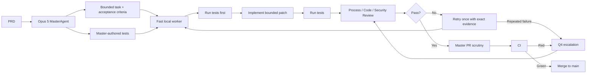
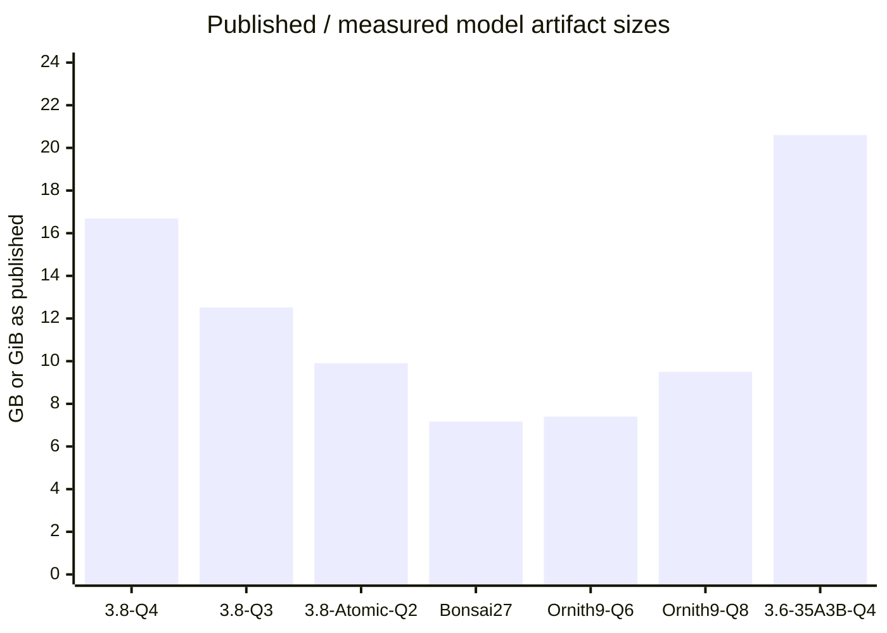
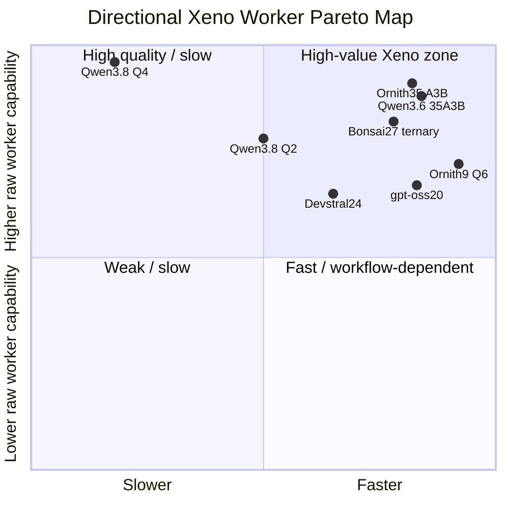

# Optimizing Xeno’s Local Worker: Model, Quantization, and Runtime Selection for RTX 4070 SUPER 12GB

## Executive summary

The key conclusion is that **Xeno should not optimize for the smartest model that fits the machine, nor for the fastest model in isolation**. It should optimize for the cheapest path from a Master-authored bounded task to a **verified, review-approved, CI-green merged change**.

That distinction changes the answer substantially.

Your current `Qwen3.8-27B UD-Q4_K_XL` is already a strong quality reference: the tuned 16K configuration delivers **90.0% first-pass execution success, about 12.27 tok/s median over the task suite, and 36.1 verified tasks/hour**. But roughly half the dense model remains CPU-resident, so this is fundamentally a memory-topology problem, not a lack of remaining llama.cpp flags to tune. Your own measurements also show that going from Q4 to Q3 did **not** help system throughput: Q3 produced more tokens, reasoned longer, and fell to 22.2 verified tasks/hour despite better GPU residency. fileciteturn0file6 fileciteturn0file7

My research therefore changes the candidate ranking from “try Q2 and wait for Qwen3.8 MoE” into four distinct lanes:

| Rank | Candidate | Why it matters |
|---|---|---|
| **Immediate / lowest integration risk** | **Qwen3.8-27B Q2**, especially AtomicChat AD-IQ2_XS vs Unsloth Q2 | Same model behavior and tool protocol; directly tests whether crossing the VRAM-residency threshold beats Q4 despite lower raw fidelity. |
| **Most interesting Pareto challenger** | **PrismML Ternary Bonsai 27B** | A custom ternary Qwen3.6-27B derivative is only **7.17 GB deployed** and has an actual 12GB-GPU report around **63 tok/s target-only**, with speculative decoding approaching ~96 tok/s under a short-context setup. Its vendor benchmark retains 94.6% of the FP16 aggregate. citeturn23search0 |
| **Best architectural match if runtime is stable** | **35B-A3B MoE: Qwen3.6-35B-A3B / Ornith-1.0-35B** | 35B total but only ~3B active/token; an RTX 4070 12GB community benchmark reports **76.6 tok/s** for Qwen3.6-35B-A3B Q4 using CPU expert offload. Ornith improves the same class substantially on several agentic-code benchmarks. citeturn23search5turn23search1 |
| **Best small/high-precision experiment** | **Ornith-1.0-9B Q6_K or Q8_0** | Instead of destroying a 27B model with extreme quantization, spend the same VRAM budget on a smaller agent-trained model at nearly lossless precision. Q6 is ~7.4 GB and Q8 ~9.5 GB in AtomicChat builds; Q6 is actually more attractive because it leaves runtime/KV headroom. |

The most important new discovery is **Ternary Bonsai 27B**. It directly attacks the specific problem Xeno has: conventional Q2 reduces the information in a pretrained model after the fact, whereas Bonsai uses a custom ternary representation and custom kernels intended for this memory regime. Prism reports a **7.17 GB deployed language model**, coding score 85.96 versus 88.74 for its Qwen3.6-27B FP16 reference, agent/tool score 74.01 versus 80.00, and overall 80.49 versus 85.07. Those are vendor benchmarks rather than Xeno measurements, and Prism explicitly says long-horizon agentic coding is not yet a strong target of this release, so it absolutely requires your real workflow benchmark before adoption. citeturn23search0

The MoE route is potentially even better. Official Qwen data shows Qwen3.6-35B-A3B is not “3B-intelligence”: despite activating only about 3B parameters per token, it scores 73.4 SWE-bench Verified versus 77.2 for dense 27B, 49.5 versus 53.5 SWE-Pro, 51.5 versus 59.3 Terminal-Bench, and 29.4 versus 36.2 NL2Repo. General reasoning gaps are much smaller: MMLU-Pro 85.2 versus 86.2 and GPQA 86.0 versus 87.8. citeturn23search2turn23search5

That makes the rumored/future **Qwen3.8-35B-A3B** particularly important. There is not yet enough official public evidence for me to assign it real benchmark scores, so it remains a projection. But if it reproduces the 3.6 architecture/economics while preserving roughly **90–97% of Qwen3.8-27B's agentic performance**, it may be the best possible Xeno worker for this particular 12GB-GPU/48GB-RAM machine.

The important qualification is that hybrid MoE models currently have a more serious runtime risk than dense Q2: llama.cpp has seen build-specific **multi-turn cache invalidation, state drift, and slot-hang issues** in Qwen hybrid/MoE workloads. Consequently, a MoE candidate does not pass merely because `llama-bench` prints 70 tok/s. It must survive a 100+ turn OpenCode/OpenClink-shaped cache/tool loop before its performance means anything.

For Xeno specifically, I would use this decision rule:

> **A worker may have substantially lower Pass@1 than Q4 and still be the superior production worker if Xeno preserves final accepted quality, average attempts remain low, and Verified Merged Tasks/Hour increases by at least 25%.**

A reasonable initial production threshold is **≥70% first-pass success for an ultra-fast worker**, provided that after one evidence-assisted retry plus Q4 escalation the accepted-output quality remains indistinguishable from the Q4 workflow, Q4 escalation stays below roughly 5%, and no critical defect escapes review/CI.

Your verification architecture is precisely what makes that trade possible.



That means **raw quantization damage should be treated primarily as retry/escalation cost until evidence shows that it creates undetected semantic errors**.

## Evaluation criteria and the decision rule

The model selection benchmark should have three layers. Treating them separately prevents a fast but sloppy model from winning on tok/s, and prevents a slower high-Pass@1 model from winning simply because verification overhead was ignored.

**Worker capability** measures what the model can do before Xeno rescues it. The primary measure should remain execution-verified first-pass success rather than an LLM judge. Record Pass@1 by task class, malformed tool-call rate, required-field omission rate, scope violations, token count, reasoning-token count, number of tool rounds, and wall time. Your existing 30-run benchmark is useful precisely because it exposed that Q3's loss was not merely “slightly lower accuracy”: Q3 generated 18% more tokens and 25% more reasoning characters while completing the same work, which compounded its runtime disadvantage. fileciteturn0file6

**System quality** is more important. A candidate should be judged after the complete Xeno path:

\[
Q_{\text{system}} =
\text{worker}
+\text{master tests}
+\text{TDD}
+\text{review}
+\text{security review}
+\text{CI}
+\text{master PR scrutiny}
\]

The hard quality criterion should therefore be **escaped defects per accepted change**, not only worker Pass@1. For the candidate model to replace Q4, I would require zero escaped critical/high-severity defects in the evaluation corpus, no unresolved security-review findings, no scope escape, all Master-authored tests green, and final accepted behavior statistically indistinguishable from the Q4 workflow.

**Economic efficiency** should be reported as:

\[
\textbf{Verified Merged Tasks/Hour}
=
\frac{\text{accepted, fully verified changes}}
{\text{worker + retries + escalation + review + CI wall time}}
\]

Also report `attempts / accepted task`, `Q4 escalations / 100 tasks`, and `Opus interventions / 100 tasks`. This captures exactly what your architecture is trying to achieve: a Q2 mistake detected immediately by tests is not a quality defect; it is an economic cost.

**Runtime efficiency** should record actual GPU/CPU placement, not just file size:

| Dimension | What to record | Why |
|---|---|---|
| Decode | context-bearing code tok/s, p50/p95 | Short prompts dramatically understate MTP gains on your workload. fileciteturn0file1 |
| Prefill | cold PP tok/s and seconds | Cache misses can dominate long sessions. |
| Residency | GPU layers, CPU layers, CPU-MoE experts | Your Q4 bottleneck is residency; total parameter count alone is misleading. |
| VRAM | before launch, post-load free, peak generation | `--fit` depends on boot-time VRAM availability. |
| RAM | resident set, available RAM, pagefile activity | Your 256K experiment already showed paging makes a result meaningless. fileciteturn0file8 |
| KV | F16/Q8, GPU/CPU placement, size | Q8 helped only after context became deep enough to reclaim meaningful VRAM. |
| Speculation | type, n-max, acceptance, accepted tokens | MTP behavior changed dramatically with target residency. |
| Trajectory | tokens/task, reasoning/task, tool rounds | Q3 proved that faster individual operations do not guarantee faster tasks. |
| Cache | reused prefix, evaluated new tokens, cache-miss cost | This can outweigh every runtime flag combined. |
| Stability | 100+ sequential turns, hangs, NaNs, p95, crashes | Particularly important for MoE/hybrid models. |

Your machine has a **13.6% peak-to-peak restart spread on an unchanged configuration**, so a supposed 5–10% improvement cannot be established by one control-first run. Candidate comparisons must be interleaved (`A/B/A/B/A/B`), environment-snapshotted, paired, and N≥3; close candidates need N≈5 or more. fileciteturn0file1

I would establish the following gates before a candidate may become Xeno's default worker:

| Gate | Default-worker threshold |
|---|---:|
| Final verified correctness | **No degradation detected vs Q4 workflow** |
| First-pass success | **≥70%** minimum for fast lane; ≥80% preferred |
| Critical/high escaped defect | **0** |
| Required tool/schema compliance | **100%** |
| Q4 escalation | **≤5 per 100 tasks** |
| Average local attempts | **≤1.30** |
| Tokens/accepted task | preferably ≤Q4 +30% |
| Tool rounds/accepted task | preferably ≤Q4 +20% |
| Speed improvement needed to justify a weaker model | **≥1.6× Q4 decode** or ≥1.25× end-to-end VMT/h |
| Stable VRAM reserve | target **≥512 MiB**, without driver eviction |
| Prefix reuse | only newly appended tokens should be evaluated |
| Long session | no hang/corruption in **100+ sequential agent turns** |
| MTP/speculation | keep only if paired improvement exceeds machine noise; acceptance preferably >60% |

The prefix criterion deserves special emphasis. Your measured exact-prefix cache turns evaluate roughly **40 tokens rather than ~3,900**, while changing the system prompt, tool order, or prepending skills destroys reuse. At 4K the difference was roughly 2.4 seconds versus 11–12 seconds; the penalty grows enormously with context. fileciteturn0file2L1-L1 Consequently, preserving a byte-stable OpenCode/OpenClink prefix is likely more important to real Xeno latency than another 10% of model decode.

## Candidate model and quantization landscape

The supplied AtomicChat comparison is useful because it reveals why **“Q2” is not a sufficiently precise model-selection category**. Different quantizers at approximately the same size can retain very different behavior.


In the supplied AtomicChat evaluation, `AD-IQ2_XS` is **9.9 GB with 83.5% Top-1 agreement to BF16**, while `AD-IQ3_S` at 13.8 GB reaches 92.4%, Q5 at 20.2 GB reaches 97.3%, Q6 at 25 GB reaches 98.7%, and Q8 at 28.9 GB reaches 98.9%. Those figures are **quantization-fidelity proxies, not coding success rates**. Your own Q3/Q4 results prove that proxy fidelity cannot predict Xeno throughput by itself: Q3's smaller footprint still lost heavily because of kernels, MTP economics, and longer trajectories.

The resulting landscape is broader than simply “Qwen Q4 → Qwen Q2”:

| Configuration | Artifact / memory size | Expected 12GB behavior | 16K decode estimate | Expected first-pass vs current 90% Q4 | Evidence status / main risk |
|---|---:|---|---:|---:|---|
| **Qwen3.8-27B UD-Q4_K_XL** | **16.69 GiB** | ~half CPU-offloaded | **~12–13.5 t/s measured** | **90% measured** | Production control. fileciteturn0file6L1-L1 |
| **Qwen3.8-27B UD-Q3_K_XL** | **12.52 GiB** | more GPU layers but still hybrid | **8.7–10.3 measured** | **86.7% measured** | Already rejected: fewer bytes did not mean greater productivity. fileciteturn0file6 |
| **Qwen3.8-27B conventional Q2** | Unsloth graphic gives roughly **11–13 GB total-memory class**; exact selected artifact unspecified | may become near-resident but **not guaranteed fully resident** | **18–35 projected** | **~72–84% projected** | Highest-priority direct test; same model/protocol minimizes integration variables. |
| **Qwen3.8-27B Atomic AD-IQ2_XS** | **9.9 GB** | likely much closer to full residency; runtime buffers still matter | **20–38 projected** | **~72–85% projected** | 83.5% Top-1 proxy from supplied Atomic chart; exact Xeno quality unknown. |
| **Qwen3.8-27B Q1/IQ1** | roughly **8–9 GB class** from supplied chart; exact candidate unspecified | likely full/near-full GPU | **25–45 projected** | **~50–75% projected, very uncertain** | Primarily a negative-control/throughput-ceiling experiment; severe fidelity risk. |
| **Prism Ternary Bonsai 27B Q2_0_g128** | **7.17 GB deployed LM** | full-GPU with useful headroom | **~35–65 projected at 16K**; ~63 t/s reported on a 12GB 3080 Ti target-only setup | **~75–88% projected** | Custom ternary kernels/fork; vendor aggregate retains 94.6% of FP16. Long-horizon agent coding explicitly remains a limitation. citeturn23search0 |
| **Bonsai 27B + DSpark drafter** | 7.17 GB + **1.95 GB drafter** | still plausible within 12GB at modest context | **~45–75 projected at 16K** | same target model | Source reports 1.47× in one short-context CUDA setup; must re-measure at 16K. citeturn23search0 |
| **Qwen3.6-35B-A3B Q4_K_M** | ~**20.6 GiB** in published 4070 benchmark | weights span VRAM+RAM, but inactive experts can stay CPU-side | **~50–80 projected at 16K**; **76.6 t/s** reported on RTX 4070 12GB with CPU-MoE | **~80–90% projected on Xeno corpus** | Extremely promising physics; hybrid/MoE cache behavior is the hard risk. citeturn23search5 |
| **Ornith-1.0-35B MoE Q4-class** | exact current GGUF **unspecified**; likely similar broad memory class to its 35B-A3B base | CPU expert offload potentially ideal | **~45–80 projected** | **~82–91% projected** | Stronger agent post-training; runtime/cache validation mandatory. citeturn23search1 |
| **Ornith-1.0-9B Q6_K** | ~**7.4 GB** Atomic build | full GPU + strong KV/buffer margin | **~60–90 projected** | **~68–82% projected** | Best small/high-precision candidate; capability ceiling rather than quant damage becomes risk. |
| **Ornith-1.0-9B Q8_0** | ~**9.5 GB** | likely full GPU but much tighter runtime margin | **~55–85 projected** | **~69–83% projected** | Near-lossless target precision but may surrender headroom for little capability gain over Q6. |
| **gpt-oss-20b native MXFP4** | designed for **~16GB total-memory-class** deployments | MoE; hybrid CPU/GPU plausible | **~45–75 projected** | **~60–78% projected** | 21B total / 3.6B active; strong tool-oriented design, but Harmony/tool-path and Xeno capability need direct validation. citeturn15search0 |
| **Devstral Small 2 24B IQ2/IQ3** | IQ2_M ~**8.1 GB**, IQ3_XXS ~**9.3 GB** community GGUF class | mostly/full GPU possible | **~35–50 projected** | **~60–75% projected** | Official model has 68.0 SWE Verified but much weaker Terminal-Bench 2.0 at 22.5; agent-environment mismatch risk. |
| **Gemma 4 26B-A4B Q4** | typically >12GB model artifact | CPU-MoE/hybrid | **~50–80 projected** | **~45–65% projected** | Attractive compute geometry, but Qwen's cross-evaluation shows poor SWE-agent results; not a default Xeno candidate. citeturn23search5 |
| **Qwen3.8-27B Q8/Q16** | Q8 ~**28.9 GB** in Atomic chart; BF16/Q16 roughly **50+ GB class** | massive CPU residency / no practical VRAM fit | likely **slower than Q4** | higher raw fidelity | Wrong trade on this machine. Spend memory on a smaller high-precision model or MoE instead. |

All speed ranges not explicitly marked **measured/reported** are engineering projections, not benchmark results. They exist to prioritize experiments, not to declare a winner.

The artifact-size picture helps explain why there are three fundamentally different solutions:



The final bar is deliberately counterintuitive: **the 35B-A3B artifact is much larger than VRAM yet can still be extremely fast**, because an MoE model does not need to execute all 35B parameters for every generated token. Official Qwen3.6-35B-A3B activates about 3B parameters/token, whereas dense Qwen3.6-27B effectively traverses the dense model each token. citeturn23search5turn23search2

That is also why simply asking “does the GGUF fit in 12GB?” is the wrong optimization question.

**Conventional Qwen3.8 Q1/Q2.** Q2 is absolutely smart enough to justify a serious test, but **not proven smart enough to become the default worker yet**. Atomic's 83.5% Top-1 agreement suggests substantial raw perturbation versus the Q4-class ~96% region in your supplied plots. Because Xeno provides bounded tasks, Master-authored tests, review and escalation, such degradation may be completely acceptable. What matters is whether errors are detectable and cheap, rather than silent and semantically plausible.

I would not prioritize Q1 as a production candidate. Its useful role is as a control: “what is the maximum throughput available if the worker is made aggressively lossy?” If Q1 unexpectedly survives Xeno verification well, that is valuable; otherwise it tells us where the quality cliff lies.

**Small model at Q6/Q8 versus large model at Q2.** This is the most important alternative the original Q2 discussion missed. A 9B model at Q6/Q8 can occupy roughly the same memory as an extreme 27B Q2 but preserve nearly all of its own model weights. The question becomes:

\[
\text{27B architecture + heavy quant damage}
\quad\text{vs}\quad
\text{9B architecture + nearly lossless weights}
\]

There is no universal answer. For bounded implementation, a well-agent-trained 9B can plausibly win because it is dramatically faster; for subtle architecture reasoning, the 27B's latent capacity may win even after Q2 damage. This is exactly the kind of trade Xeno's workflow can turn into an empirical question.

I would choose **Ornith-9B Q6 before Q8**. The ~7.4GB Q6 build gives several gigabytes more runtime space than the ~9.5GB Q8 build. The last couple of precision points are unlikely to be as valuable as room for KV, CUDA buffers, prefix state, a potential draft model, and protection against desktop VRAM drift. The same principle is why a 4–5B model at Q16 is not especially compelling: full precision cannot replace a major capability gap. The high-precision sweet spot here looks more like **9B Q6/Q8**, not 4B BF16.

**Ternary Bonsai is different from conventional Q2.** Prism says its Q2 representation uses ternary `{-1,0,+1}` values with group scaling, yielding about 1.71 effective bits/weight and a 7.17GB deployed language-model artifact. Its own 15-benchmark evaluation reports overall 80.49 versus 85.07 FP16, coding 85.96 versus 88.74, and agent/tool 74.01 versus 80.00. It therefore deserves to be treated as a different quantization technology, not merely another Q2 file. citeturn23search0

There is a major caveat: Prism itself says long-horizon multi-file agentic coding is **not yet a strong target of this release**. That warning is more important to Xeno than HumanEval or LiveCodeBench. citeturn23search0

**MoE is the highest-ceiling direction.** Official Qwen3.6 comparisons quantify the quality sacrifice surprisingly well:

| Public benchmark | Qwen3.6-27B dense | Qwen3.6-35B-A3B | MoE gap |
|---|---:|---:|---:|
| SWE-bench Verified | 77.2 | 73.4 | −3.8 |
| SWE-bench Pro | 53.5 | 49.5 | −4.0 |
| SWE-bench Multilingual | 71.3 | 67.2 | −4.1 |
| Terminal-Bench 2.0 | 59.3 | 51.5 | −7.8 |
| SkillsBench | 48.2 | 28.7 | −19.5 |
| NL2Repo | 36.2 | 29.4 | −6.8 |
| Claw-Eval Avg | 72.4 | 68.7 | −3.7 |
| MMLU-Pro | 86.2 | 85.2 | −1.0 |
| GPQA | 87.8 | 86.0 | −1.8 |
| LiveCodeBench | 83.9 | 80.4 | −3.5 |

These are official same-family evaluations and are the best evidence for projecting what a future Qwen3.8-35B-A3B might look like. citeturn23search2turn23search5

The pattern is not “A3B becomes dumb.” It is closer to **general reasoning almost intact, agentic reliability several points lower, with a few large outliers**.

This is why my working projection for an eventual Qwen3.8-35B-A3B is:

\[
\text{general capability} \approx 97\%-100\%\text{ of dense 27B}
\]

\[
\text{agentic coding} \approx 90\%-97\%\text{ of dense 27B}
\]

These are explicitly projections, not leaked or published Qwen3.8-35B-A3B results.

Ornith makes the MoE case even more interesting. DeepReinforce reports Ornith-1.0-35B at **75.6 SWE Verified, 50.4 SWE-Pro, 69.3 multilingual, 64.2 Terminal-Bench 2.1 under Terminus, and 34.6 NL2Repo**, versus its listed Qwen3.6-35B values of 73.4, 49.5, 67.2, 52.5 and 29.4 respectively. Benchmark scaffolds differ by task, so these numbers should not be mixed into one scalar score, but they show that **post-training can materially improve the same small-active-parameter MoE physics for agentic coding**. citeturn23search1

A directional Pareto map therefore looks approximately like this. This is **not a benchmark chart**; position combines your measurements, public agent benchmarks, and projected 4070S runtime to show where experiments are most valuable.



## End-to-end impact under the Xeno workflow

To avoid pretending that public benchmarks directly tell us Xeno throughput, I built a simple economic model around your workflow.

Let:

- \(p_1\) = first-attempt worker success probability.
- \(p_2\) = success probability on the evidence-assisted retry.
- \(T_w\) = average worker attempt time.
- \(T_{Q4}=90s\) = approximate current Q4 attempt cost derived from the tuned 30-run suite.
- \(H\) = fixed Master/reviewer/CI overhead per accepted change.
- One candidate retry is allowed; if both candidate attempts fail, escalate to Q4.

Then:

\[
E[T_{\text{merge}}]
=
H
+
T_w(2-p_1)
+
T_{Q4}(1-p_1)(1-p_2)
\]

and:

\[
\text{Verified Merged Tasks/h}
=
\frac{3600}{E[T_{\text{merge}}]}
\]

For illustration I use \(p_2=\min(p_1+0.10,0.95)\) and initially \(H=60s\). **These are economic assumptions, not measured probabilities.** Real Xeno data must replace them.

| Worker | Assumed Pass@1 | Approx attempt time | Q4 escalations/100 tasks | Modeled merged tasks/h at 60s fixed overhead |
|---|---:|---:|---:|---:|
| **Current Q4** | 90% | 90s | 0.5 | **22.6** |
| **Qwen3.8 Q2** | 78% | 49s | 2.64 | **29.5** |
| **Ternary Bonsai 27B** | 82% | 27s | 1.44 | **38.6** |
| **Qwen3.6-35B-A3B Q4** | 85% | 27s | 0.75 | **39.2** |
| **Ornith-35B A3B** | 87% | 27s | 0.65 | **39.5** |
| **Ornith-9B Q6** | 75% | 21s | 3.75 | **40.2** |
| **gpt-oss-20b** | 69% | 27s | 6.51 | **35.6** |
| **Devstral Small 2** | 68% | 35s | 7.04 | **32.0** |

Again, **do not read 40.2 versus 39.5 as a forecast that Ornith-9B beats Ornith-35B**. The table demonstrates the economics of your architecture: once verification is authoritative, a much faster model can withstand a surprisingly large Pass@1 penalty.

The model also exposes the most important optimization after the worker itself: **fixed orchestration overhead**.

For example, under the same central assumptions:

| Candidate | H = 60s | H = 120s | H = 180s |
|---|---:|---:|---:|
| Q4 | 22.6/h | 16.4/h | 12.9/h |
| Qwen3.8 Q2 | 29.5/h | 19.8/h | 14.9/h |
| Bonsai 27B | 38.6/h | 23.5/h | 16.9/h |
| Qwen3.6 35A3B | 39.2/h | 23.7/h | 17.0/h |
| Ornith35 A3B | 39.5/h | 23.8/h | 17.1/h |
| Ornith9 Q6 | 40.2/h | 24.1/h | 17.2/h |

As Master/review/CI overhead grows, raw worker speed becomes less valuable. This is another reason prefix caching, parallel review, test selection, compact tool responses, and fewer tool rounds need to be measured together with model tok/s.

It also clarifies your earlier disagreement with me about “quality dropping”:

\[
\boxed{
\text{Lower worker quality}
\not\Rightarrow
\text{lower merged quality}
}
\]

provided:

\[
P(\text{worker defect escapes all verification})
\approx 0
\]

The difference instead appears primarily in:

\[
\text{retries}
+
\text{review corrections}
+
\text{CI failures}
+
\text{escalations}
\]

The one kind of weakness that Xeno must watch especially carefully is a **silent semantically wrong patch that satisfies inadequate tests**. That is why model selection cannot stop at “CI green”: the independent code/security review and Master's requirement-level PR scrutiny remain essential.

There is another reason I would not choose a candidate based simply on public SWE-bench. Qwen's own 3.6 table shows **Gemma4-26B-A4B scores 77.1 on LiveCodeBench but only 17.4 on SWE-bench Verified and 13.8 on SWE-Pro** in that evaluation. The ability to generate code and the ability to operate an agent over a real repository are very different capabilities. citeturn23search5 Xeno needs the latter.

## Prioritized experimental program

The three experiments below are deliberately ordered to maximize information gained per unit of engineering effort. They should all inherit your measurement rules: snapshot environment before launch; interleave arms; N≥3 and N=5 when close; use a realistic code-bearing prompt; record ranges and paired differences; treat changes below ~14% as unresolved unless the paired design establishes them. fileciteturn0file1

**Experiment A — Qwen3.8 Q2 quantizer battle: the fastest path to an answer.**

Run the existing Q4 production configuration as control against at least **AtomicChat `AD-IQ2_XS`** and the best available **Unsloth Q2/Dynamic Q2 artifact**. The value of this experiment is that model family, chat template, thinking behavior, tool-call protocol, and MTP implementation remain constant. Only weight representation and residency change.

Start every candidate at the already-measured production settings rather than inventing another tuning sweep:

```powershell
.\llama-server.exe `
  -m "<QWEN38-Q2.gguf>" `
  --alias qwen38-q2 `
  -c 16384 `
  -ngl 999 `
  --fit on `
  --fit-target 768 `
  -fa on `
  -np 1 `
  -t 18 `
  -b 2048 `
  -ub 256 `
  --no-mmproj-auto `
  --host 127.0.0.1 `
  --port 8080
```

First test **MTP off**, because your own Q3 results showed speculative benefit can collapse when the target forward pass becomes cheap. Then repeat with the same Qwen3.8 built-in MTP configuration that is already proven on Q4:

```text
--spec-type draft-mtp
--spec-draft-n-max 2
```

Do **not** assume n=2 remains optimal merely because it was optimal on Q4. The first question is only “MTP off versus n=2.” If the Q2 target becomes almost entirely GPU-resident and the improvement is below the machine's noise floor, leave MTP off rather than reopening the entire n=2…6 sweep. Your Q4 data showed MTP gains were largest precisely when the target suffered expensive CPU-offloaded forwards. fileciteturn0file6

For each Q2 build capture:

```text
artifact size
quant tensor distribution
GPU layers / CPU layers
VRAM before load
VRAM post-load
VRAM peak
RAM working set
pagefile delta
F16 KV / recurrent state sizes
cold prefill
code tok/s p50 / p95
MTP acceptance
tokens/task
reasoning tokens/task
tool rounds/task
pass@1
retry pass
Q4 escalations
full accepted wall time
```

Only re-sweep `--fit-target` if Q2 is close to a residency boundary:

```text
512
768
1024 MiB
```

Do not chase zero headroom. Your `fit-target 256` experiment already produced intermittent performance collapse at only ~345 MiB free VRAM. fileciteturn0file7

There is one particularly interesting sub-test. At 16K your current F16 KV uses around 512 MiB. If Q2 ends up only one to four layers short of full GPU residency, test:

```text
--no-kv-offload
```

once. The hypothesis is that moving 512 MiB of KV into host memory could make enough room for the remaining **dense weights**, and moving a relatively small attention cache over PCIe might cost less than traversing CPU-resident dense layers every generated token. This is unmeasured and therefore should be treated strictly as an A/B experiment, not a recommended production setting. Your open-questions report already identifies CPU KV placement as one of the few still-untested runtime directions. fileciteturn0file3

**Pass criterion:** Q2 should either reach approximately **≥21.5 code tok/s**, about 1.6× the present Q4 code lane, or produce **≥25% more full-workflow Verified Merged Tasks/Hour**. First pass may fall as low as 70% if final accepted quality remains unchanged, average attempts stay ≤1.30 and Q4 escalation ≤5%.

The decisive result is not:

```text
Q2 = 28 tok/s
```

but:

```text
Q2
→ tests
→ retry when necessary
→ reviews
→ Master
→ CI
= X accepted changes in Y hours
with zero quality regression
```

**Experiment B — Prism Ternary Bonsai as the unconventional challenger.**

This is the highest-information experiment after direct Q2 because it asks whether a **custom low-bit representation beats conventional quantization at the same memory objective**.

Prism's current model card publishes the language model at 7.17GB deployed and an optional 1.95GB DSpark Q4_1 drafter. It also publishes CUDA/Metal/CPU support, but this path uses custom representation/kernel work, so isolate it from the production llama.cpp binary and pin the exact runtime revision. citeturn23search0

Start without speculative decoding:

```powershell
.\llama-bench.exe `
  -m "Ternary-Bonsai-27B-Q2_0.gguf" `
  -ngl 999 `
  -fa 1 `
  -p 512 `
  -n 128
```

Then serve at the **real Xeno context**, not the attractive short-context benchmark:

```powershell
.\llama-server.exe `
  -m "Ternary-Bonsai-27B-Q2_0.gguf" `
  -c 16384 `
  -ngl 999 `
  -fa on `
  -np 1 `
  -t 18 `
  -b 2048 `
  -ub 256 `
  --host 127.0.0.1 `
  --port 8081
```

Only after baseline stability add the Prism drafter:

```text
-md Ternary-Bonsai-27B-dspark-Q4_1.gguf
--spec-type draft-dspark
--spec-draft-n-max 4
-ngld 999
```

Do **not** copy the source's short-context speculative result into the production estimate. Measure 2K, 8K and 16K separately; speculative economics can change when context and KV occupy more of the 12GB card.

The protocol gate is stricter here than for Qwen3.8 Q2 because this changes both model generation and runtime path:

```text
developer/system behavior
nested JSON tool calls
arrays / objects
tool_call_id correlation
two-round tool loop
reasoning separation
required-field compliance
100-turn stability
prefix reuse
cache invalidation / recovery
```

Then run the same 30-task corpus and finally the real OpenClink/Xeno workflow.

**Pass criterion:** at least **35 tok/s target-only or ~45 tok/s with speculation at 16K**, first-pass ≥75%, ≤15% inflation in tokens/accepted task relative to Q4, no tool/protocol regressions, and no final accepted-quality loss.

There is a plausible outcome in which Bonsai is better than Qwen3.8 conventional Q2 despite using a **Qwen3.6 base**: extreme post-training quantization can damage a newer 3.8 model more than a representation specifically designed for extreme compression damages an older 3.6 model. That is exactly why this head-to-head is worth running rather than assuming “newer base always wins.”

**Experiment C — MoE race: Qwen3.6-35B-A3B versus Ornith-35B, then replace the leader with Qwen3.8-35B-A3B if it appears.**

This is potentially the eventual production winner, but it comes third because runtime state/caching deserves validation before spending hours on quality benchmarking.

Official Qwen describes 35B-A3B as a 35B-total, roughly 3B-active architecture. The official capability gap from dense 27B is mostly modest outside a handful of agentic benchmarks. citeturn23search5turn23search2

More importantly, there is real community evidence from an **RTX 4070 12GB** configuration using CPU-MoE expert offload that reports roughly **76.6 tok/s generation** for Qwen3.6-35B-A3B Q4. That number is not directly comparable to your Xeno code-generation measurement, but it establishes that 35B total parameters do not imply dense-35B speed on this topology.

The source configuration is useful as a starting point, not a copy-paste production answer. Start approximately here:

```powershell
.\llama-server.exe `
  -m "<35B-A3B-Q4.gguf>" `
  -c 16384 `
  -ngl 999 `
  --n-cpu-moe 34 `
  -fa on `
  --fit on `
  --fit-target 768 `
  -t 18 `
  -b 2048 `
  -ub 256 `
  -np 1 `
  --host 127.0.0.1 `
  --port 8082
```

Do **not** begin with Q8 KV merely because the community benchmark used quantized KV. Your own machine says F16 KV is the correct 16K control and Q8 becomes advantageous only at deeper context. fileciteturn0file8 Establish F16 first, then test Q8 at 32/64K if this model actually becomes a long-context worker.

The first sweep should be CPU-MoE placement rather than ordinary `-ngl`:

```text
--n-cpu-moe 32
--n-cpu-moe 34
--n-cpu-moe 36
```

Start with 34 because it has external RTX-4070 evidence, then test adjacent settings. CPU threading must also be revalidated rather than blindly copying either the community's thread count or your dense-Q4 optimum; your own i5-13500 result showed that `-t 18` beat physical-core-only configurations substantially on the dense hybrid workload. fileciteturn0file7

Before the coding corpus, run a deliberately hostile cache-state test:

```text
100–200 sequential agent turns
append-only most of the time

every tenth turn:
    force one controlled prefix invalidation

then:
    tool call
    tool result
    retry evidence
    continue

compare:
    cached answer
    cold-replay answer
    slot health
    evaluated prompt tokens
    latency
    state after invalidation
```

This is a **hard gate**. The reason is not theoretical: llama.cpp has had Qwen hybrid/MoE issues involving cache invalidation and state management in agent-like multi-turn workloads. A model that achieves 75 tok/s but occasionally hangs a server slot after a tool loop is a worse Xeno worker than 13 tok/s Q4.

Only a candidate surviving this phase should run the 30-task corpus and real Xeno workflow.

**Pass criterion:** zero hangs/state corruption over the stress test; correct exact-prefix reuse; **≥40 tok/s at 16K**; Qwen first-pass ≥80% or Ornith ≥82% as an experimental target; Q4 escalation preferably ≤3%; final accepted output indistinguishable from current Q4.

When an official Qwen3.8-35B-A3B becomes available, **replace the weaker of these two MoE candidates immediately rather than designing a new benchmark**. Use the same harness, same runtime gate, same task order and same Xeno end-to-end measurement. That gives you a clean answer within hours.

## Final recommendation and source map

The answer to the original question — **“Is Qwen3.8-27B Q2 still smart enough to work under Xeno?”** — is:

> **Very plausibly yes, but only as a bounded candidate-patch worker, not as an autonomous final authority.**

Its raw capability almost certainly falls noticeably below Q4. But Xeno does not give the worker the authority to establish correctness. Opus owns decomposition and tests; the worker is constrained by xeno-skills/TDD; independent review handles process, code and security; Master scrutinizes the PR; CI is a mechanical merge gate. Therefore the relevant question is whether Q2's errors remain **detectable and cheap enough**.

I would expect the experiment to have three possible outcomes:

| Outcome | Interpretation | Action |
|---|---|---|
| Q2 ≥70–80% Pass@1, ≥1.6× faster, final quality unchanged | **Success** | Q2 becomes default bounded fast lane; Q4 becomes escalation lane. |
| Q2 extremely fast but <70% Pass@1 / trajectory inflation large | Workflow cost consumes runtime gain | Keep Q4 or try Bonsai/Ornith9. |
| Q2 creates silent semantic errors that survive tests/review too often | Verification boundary inadequate | Reject Q2 regardless of tok/s; strengthen workflow before weaker workers. |

However, **I would no longer assume conventional Qwen3.8 Q2 is the likely final winner**.

My actual research ranking is:

**Safest next download: Qwen3.8 Q2.** It answers the exact hypothesis with the fewest integration variables. Test AtomicChat's ~9.9GB `AD-IQ2_XS` against the best Unsloth Q2 rather than assuming one “Q2” represents all quantizers.

**Most interesting unconventional candidate: Ternary Bonsai 27B.** Its 7.17GB deployed footprint is comfortably inside the card, while Prism's reported quality retention is much better than what is normally associated with an extreme low-bit conventional 27B artifact. The 12GB-GPU performance evidence is sufficiently strong to justify a full Xeno run. Its key weakness is exactly the capability Xeno cares about—long-horizon agentic coding—so this is a **must benchmark, not a blind recommendation**. citeturn23search0

**Best smaller/high-precision candidate: Ornith-9B Q6.** I prefer Q6 over Q8 on a 12GB card: approximately 7.4GB of weights leaves materially more room for KV, runtime buffers and desktop variance while preserving far more precision than an extreme 27B Q2. Q8 should be the quality-control arm rather than the assumed winner.

**Highest-ceiling architecture: 35B-A3B MoE.** Qwen3.6 proves that this is a genuine sweet spot: agentic quality remains in the neighborhood of dense 27B while only around 3B parameters are active each token, and an RTX 4070 12GB can operate it in a completely different speed class using CPU expert offload. citeturn23search5turn23search2 Ornith-35B demonstrates that stronger agentic post-training can improve that same general operating point. citeturn23search1

**Qwen3.8-35B-A3B, if released with similar geometry, becomes priority zero.** Based on the 3.6 dense-vs-A3B gap, I would initially expect general reasoning to land near 97–100% of the dense model and agentic coding around 90–97%, with some outlier tasks capable of larger regression. If it simultaneously delivers tens of tokens/second on the 4070S, it is almost tailor-made for Xeno's verifier-heavy architecture. That remains a projection until the actual model and weights exist publicly enough to benchmark.

**gpt-oss-20b is worth a secondary lane, not first priority.** OpenAI describes it as 21B total / 3.6B active with 128K context, adjustable reasoning and strong tool-oriented deployment, designed for roughly 16GB-class local environments. citeturn15search0 It is architecturally attractive, but the model/interface change creates more integration uncertainty than Qwen Q2, Bonsai or the Qwen-derived MoEs.

**Devstral Small 2 is also secondary.** Its smaller low-bit builds fit well, and Mistral designed it for software-engineering agents, but the public benchmark profile does not make it an obvious replacement for Qwen3.8 in the specific long-horizon tool environment Xeno is targeting.

**Gemma4-26B-A4B is not a priority despite attractive MoE compute.** Qwen's own comparative evaluation shows the important caution: strong raw coding results do not imply strong repository-agent performance. citeturn23search5

And **Qwen3.8-27B Q8/Q16 should not be pursued on this machine**. High precision on a dense 27B model makes the exact memory bottleneck you already have worse. The better use of a ~10GB budget is either:

\[
\boxed{\text{27B at sophisticated extreme-low-bit}}
\]

or

\[
\boxed{\text{9B at Q6/Q8}}
\]

or, most promisingly,

\[
\boxed{\text{35B total / ~3B active MoE with CPU expert offload}}
\]

rather than:

\[
\cancel{\text{27B Q8/Q16 heavily spilled into CPU RAM}}
\]

The resulting target architecture for Xeno should therefore be considered a **model hierarchy**, not a single winner:

```text
                         OPUS 5 MASTER
                              │
                    PRD / tests / contract
                              │
                ┌─────────────┴─────────────┐
                │                           │
        FAST EXECUTION LANE            HARD LOCAL LANE
                │                           │
     Qwen3.8 Q2 / Bonsai /             Qwen3.8 Q4
       Ornith9 / A3B                         │
                │                           │
       tests + reviewer                     │
                │                           │
          PASS ──┴───────────────┐          │
          FAIL → retry once      │          │
                 │               │          │
                 └── FAIL ───────┴──────────┘
                              │
                        Q4 escalation
                              │
             code review + security review
                              │
                         Opus PR review
                              │
                              CI
                              │
                            main
```

The immediate experimental order I recommend is therefore:

**Qwen3.8 Q2 quantizer battle → Ternary Bonsai 27B → Qwen3.6/Ornith 35B-A3B MoE race.**

Do not spend another tuning cycle on Q3, Q4 ngram, speculative sub-knobs, or tiny 16K batch/thread changes. Those questions are already answered by your machine measurements, and improvements below the ~14% restart-noise envelope are not where the next order-of-magnitude gain lives. fileciteturn0file1 fileciteturn0file2

The next large gain will come from **changing the model's memory/computation regime**, then allowing Xeno's verification architecture to turn the resulting raw-model weakness into controlled retry cost.

**Primary and high-value sources used in the analysis:** [Qwen3.6-27B official model card](https://huggingface.co/Qwen/Qwen3.6-27B), [Qwen3.6-35B-A3B official model card](https://huggingface.co/Qwen/Qwen3.6-35B-A3B), [PrismML Ternary Bonsai 27B](https://huggingface.co/prism-ml/Ternary-Bonsai-27B-gguf), [DeepReinforce Ornith-1.0-35B](https://huggingface.co/deepreinforce-ai/Ornith-1.0-35B), [llama.cpp](https://github.com/ggml-org/llama.cpp), and [OpenAI's official gpt-oss announcement](https://openai.com/index/introducing-gpt-oss/). Public claims above are grounded primarily in official model cards/runtime repositories; community runtime measurements are treated as directional evidence rather than interchangeable benchmarks. citeturn23search0turn23search1turn23search2turn23search5turn15search0