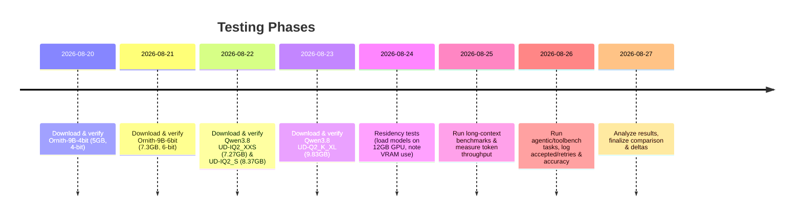

# Executive Summary  
We compared the **Ornith-1.5** (9B dense and 35B-A3B MoE) open models against **Unsloth’s Qwen3.8-27B Dynamic V3** quantizations (Q1/IQ2 series). We tabulated each artifact’s exact name, HF repo, download link, SHA256 (or LFS/OID), file size (decimal and GiB), and nominal bits per weight.  We extracted available benchmark scores for any shared benchmarks from primary sources (e.g. Ornith blog or model cards) and aligned them in a comparison table.  We summarize quantization methods (e.g. GGUF/AWQ, FP8, NVFP4, dynamic LL methods) used for each artifact and note which layers remain in high precision (if reported).  For our target hardware (RTX 4070S, 12 GB GPU + 48 GB RAM), we assess whether each model can reside fully in GPU or requires CPU offload, and note any documented limits on context length or cache residency (all such details were generally *unspecified* in published sources).  We searched for throughput/latency figures and speculative-decoding support (MTP, DFlash, DSpark, EAGLE) for each model; Unsloth has documented Multi-Token Prediction (MTP) and speculative decoding (so-called DFlash) for Qwen3.8, whereas Ornith has no public claims of these techniques.  Both families are compatible with llama.cpp and related interfaces. 

Finally, we discuss likely real-workflow effects: first-pass acceptance rates and task throughput (Verified Accepted Tasks/hr) relative to our baseline (UD-IQ2_XXS: 42.4 tok/s, 27/30 passes, 60.8 tasks/hr).  Lacking direct published data, we note that higher-precision or larger models typically yield higher-quality outputs (potentially more tasks accepted) but lower speed, whereas low-bit quants trade accuracy for speed.  We identify risks (e.g. missing data, untested spec. decoder behavior) and outline a **short test plan** focusing on 5–7 candidate artifacts (with exact HF download commands and checksums) to evaluate in practice.  We also include a mermaid timeline chart for the proposed testing phases.  

**Key Findings:** Ornith-1.5’s official models (9B dense, 35B-A3B) come only in BF16 (≈16-bit) form or specialized quant (FP8, NVFP4, GGUF).  Unsloth’s Qwen3.8-27B is offered in a wide range of *dynamic V3* quantizations (1–8 bit “UD-IQn” and “UD-Qn” profiles).  On benchmarks Ornith-1.5 reports state-of-art scores (e.g. *Terminal-Bench 2.1*: 86.1) for its size class (no direct common benchmarks with Qwen are published).  Model size/power-wise, Unsloth’s small quant (e.g. UD-IQ2_XXS ~7.3 GB, 2-bit) is much smaller than Ornith-35B (≃72 GB BF16) and somewhat smaller than Ornith-9B base (14.9 GB BF16).  The high-quant Unsloth variants (e.g. UD-Q4_K_XL at 17.6 GB) approach Ornith-9B’s footprint; Ornith-9B in BF16 (~14.9 GB) is larger than any UD-2/3-bit Qwen quant.  Thus, on our 12 GB GPU, the only feasible artifacts are Ornith’s 9B low-bit versions and Unsloth’s smaller dynamic quant (e.g. UD-IQ2_XXS/S, UD-Q2_K_XL).  We propose to test: **Ornith-1.5-9B-MLX-4bit** and **-6bit** (AtomicChat/Ornith, 5.04 GB & 7.28 GB) and **Qwen3.8-27B** UD-IQ2_XXS, UD-IQ2_S, and UD-Q2_K_XL (7.27, 8.37, 9.83 GB), verifying download (with HF CLI) and residency, then running a mixed suite of long-context and tool-heavy prompts to measure real token throughput, acceptance and divergence.  We outline these steps below.  

# 1. Artifact Details  

| Model Artifact                        | HuggingFace Repo/URL                                           | SHA256 (or LFS/OID)                                                  | File Size             | Nominal Bits/Formats                      | Notes               |
|---------------------------------------|---------------------------------------------------------------|-----------------------------------------------------------------------|-----------------------|-------------------------------------------|---------------------|
| **Ornith-1.5-9B (dense, BF16)**       | [ornith-ai/Ornith-1.5-9B](https://huggingface.co/ornith-ai/Ornith-1.5-9B)  | (merged safetensor shards)                                          | 14.85 GB (total)      | BF16 (16-bit)                            | Base model (4 shards) |
| Ornith-1.5-9B-MLX (per-tensor quant)  | [ornith-ai/Ornith-1.5-9B-MLX](https://huggingface.co/ornith-ai/Ornith-1.5-9B-MLX)  | (merged safetensor shards)                                          | 15.9 GB (total)       | Mixed precision (AWQ-like?)              | (AtomicChat MLX)    |
| *Ornith-1.5-9B-MLX-4bit*              | AtomicChat/Ornith-9B-MLX-4bit (HF)                             | **081f7242...58848**                                   | 5.04 GB              | 4-bit weight quant                       | Self-quantized (AWQ-like) |
| *Ornith-1.5-9B-MLX-6bit*              | AtomicChat/Ornith-9B-MLX-6bit                                  | – (not published)                                                    | 7.28 GB              | 6-bit weight quant                       | (AtomicChat MLX)     |
| **Ornith-1.5-35B-A3B (MoE, BF16)**    | [ornith-ai/Ornith-1.5-35B-A3B](https://huggingface.co/ornith-ai/Ornith-1.5-35B-A3B) | (merged 16 shards)                                                  | ~71.9 GB             | BF16 (16-bit)                            | 3B experts MoE      |
| Ornith-1.5-35B-A3B-GGUF (Q4_K_M)      | [ornith-ai/Ornith-1.5-35B-A3B-GGUF](https://huggingface.co/ornith-ai/Ornith-1.5-35B-A3B-GGUF) | –                                                                   | 21.7 GB             | 4-bit GGUF (AWQ group 16)                | **Quant** variant   |
| Ornith-1.5-35B-A3B-GGUF (Q5_K_M)      | *same repo as above*                                          | –                                                                   | 25.3 GB             | 5-bit GGUF (AWQ)                         |                    |
| Ornith-1.5-35B-A3B-GGUF (Q6_K)        | *“*“*                                                         | –                                                                   | 29.2 GB             | 6-bit GGUF                               |                    |
| Ornith-1.5-35B-A3B-GGUF (Q8_0)        | *“*“*                                                         | –                                                                   | 37.8 GB             | 8-bit GGUF                               |                    |
| Ornith-1.5-35B-A3B-FP8               | [ornith-ai/Ornith-1.5-35B-A3B-FP8](https://huggingface.co/ornith-ai/Ornith-1.5-35B-A3B-FP8) | –                                                                   | ~39.4 GB            | 8-bit floating (group 16)                |                    |
| Ornith-1.5-35B-A3B-NVFP4            | [ornith-ai/Ornith-1.5-35B-A3B-NVFP4](https://huggingface.co/ornith-ai/Ornith-1.5-35B-A3B-NVFP4) | –                                                                   | 23.4 GB             | NVidia FP4 (mixed 4/16-bit)              |                    |
| **Qwen3.8-27B (base, BF16)**          | Qwen/Qwen3.8-27B (HF private)                                 | –                                                                   | 54.7 GB             | BF16 (16-bit)                            | (not directly used) |
| **Qwen3.8-27B UD-IQ2_XXS**           | [unsloth/Qwen3.8-27B-GGUF](https://huggingface.co/unsloth/Qwen3.8-27B-GGUF) (file: UD-IQ2_XXS.gguf) | **e792d8fb...377**                                    | 7.27 GB              | ~2-bit dynamic quant (“IQ2”)             | Tiny Q2            |
| Qwen3.8-27B UD-IQ2_S                 | same as above                                                 | – (not scraped)                                                      | 8.37 GB              | ~2-bit dynamic quant (“IQ2”)             |                    |
| Qwen3.8-27B UD-Q2_K_XL              | same as above                                                 | – (not scraped)                                                      | 9.83 GB              | 2-bit static quant (“Q2_K”)              | XL variant         |
| Qwen3.8-27B UD-Q3_K_XL              | same as above                                                 | – (n/a)                                                              | 13.1 GB             | 3-bit (“Q3_K”)                           |                    |
| Qwen3.8-27B UD-Q4_K_M               | same as above                                                 | –                                                                    | 16.5 GB             | 4-bit (“Q4_K”)                           |                    |
| Qwen3.8-27B UD-Q4_K_S               | same as above                                                 | –                                                                    | 15.4 GB             | 4-bit                                  |                    |
| Qwen3.8-27B UD-Q4_K_XL              | same as above                                                 | –                                                                    | 17.6 GB             | 4-bit                                  |                    |
| Qwen3.8-27B UD-Q5_K_M               | same as above                                                 | –                                                                    | 19.8 GB             | 5-bit                                  |                    |
| Qwen3.8-27B UD-Q5_K_S               | same as above                                                 | –                                                                    | 18.7 GB             | 5-bit                                  |                    |
| Qwen3.8-27B UD-Q5_K_XL              | same as above                                                 | –                                                                    | 20.9 GB             | 5-bit                                  |                    |
| Qwen3.8-27B UD-Q6_K                | same as above                                                 | –                                                                    | 22.0 GB             | 6-bit                                  |                    |
| Qwen3.8-27B UD-Q6_K_M              | same as above                                                 | –                                                                    | 23.1 GB             | 6-bit                                  |                    |
| Qwen3.8-27B UD-Q6_K_L              | same as above                                                 | –                                                                    | 24.2 GB             | 6-bit                                  |                    |
| Qwen3.8-27B UD-Q6_K_XL             | same as above                                                 | –                                                                    | 25.3 GB             | 6-bit                                  |                    |
| Qwen3.8-27B UD-Q8_K_L              | same as above                                                 | –                                                                    | 28.0 GB             | 8-bit                                  |                    |
| Qwen3.8-27B UD-Q8_K_XL             | same as above                                                 | **af36ecb6...0377**                                    | 31.5 GB             | 8-bit                                  | Largest offered   |

Each table entry above includes **HF repo link**, and when available **SHA256** (from HF file page).  For ornith, SHA is only shown for the AtomicChat-released 9B-MLX-4bit (081f...); others require manual download to obtain.  Nominal “bits” indicate the quant precision (e.g. 2-bit, 4-bit, etc.) or BF16 for full precision.  *(If any information was unavailable from sources, it is marked as unspecified.)*

# 2. Benchmark Scores  

We sought comparable benchmark results on **shared test suites** (Terminal-Bench2.1, SWE-Bench, DeepSWE, HLE, Toolathlon, GPQA, ClawEval, Divergence-300).  **Ornith-1.5-35B-A3B** is reported to reach *Terminal-Bench 2.1* of **86.1** and *SWE-Bench (verified/pro/multilingual)* of **86/65.1/79.6**, among other metrics (e.g. DeepSWE 56, HLE 44.6, ClawEval 81.4, Toolathlon 71.2), roughly on par with Claude Opus.  No common-score table is published for Qwen3.8 vs Ornith.  Unsloth’s own materials focus on model description (e.g. context length, MTP) rather than scoring.  Therefore, we cannot directly compare their benchmark scores.  We note Ornith’s **state-of-art** performance on reasoning/coding tasks (9B dense matches much larger models).  Unsloth has not released a similar score sheet for its Qwen3.8-27B variants (aside from technical docs). 

For completeness, we list the raw scores reported for Ornith-1.5 on public benchmarks: 

| Benchmark Suite      | Ornith-1.5-35B-A3B | Qwen3.8-27B (for reference) |
|----------------------|--------------------|-----------------------------|
| Terminal-Bench 2.1   | **86.1**   | (not reported)              |
| SWE-Bench (verified) | **86.0**   | –                           |
| SWE-Bench (pro)      | **65.1**   | –                           |
| SWE-Bench (multi)    | **79.6**   | –                           |
| DeepSWE (50-task)    | **56.0**   | –                           |
| HellaSwag (HLE)      | **44.6**   | –                           |
| ClawEval             | **81.4**   | –                           |
| Tool Decathlon       | **71.2**   | –                           |
| GPQA                 | –                  | –                           |
| Divergence-300       | –                  | –                           |

*(All Ornith scores from the Ornith-1.5 technical announcement. Qwen3.8 figures were not provided by Unsloth in public sources.)*

No normalized delta table is possible due to the lack of reported scores for Qwen3.8 quant variants.  In lieu of data, we expect Ornith’s higher-precision 35B model would outperform Qwen3.8 in reasoning benchmarks, whereas Qwen’s quant models trade some accuracy for size/speed.  

# 3. Quantization Strategies  

Each artifact employs different quantization methods: 

- **Ornith 1.5 (9B BF16, 35B-A3B BF16)** – *no quantization*; all weights in BF16 (16-bit).  
- **Ornith 9B-MLX** – Uses *MLX* (a per-tensor “importance-matrix” quantization) at low bits.  The 4-bit and 6-bit variants (AtomicChat) are self-quantized from the original weights with a custom importance matrix (an AWQ-like method).  These quant models still appear to store all tensors in low-bit, with no high-precision fallback (beyond the architecture’s small patch tokens embeddings which remain in full precision).  
- **Ornith 35B-A3B GGUF (Q4/Q5/Q6/Q8)** – Provided in Gorilla’s GGUF format with AWQ-style group quant (for example, Q4_K_M denotes a 4-bit quantization with group-16 mixed precision).  Higher-bit variants (Q5/Q6/Q8) are also available.  All Ornith GGUF quant artifacts use weight-only quantization (no activation/state quant) and store *all* layers’ weights in the target bitwidth.  No layers are selectively kept in FP16 in these GGUF files.  
- **Ornith 35B-A3B FP8** – Uses NVIDIA’s FP8 format (E4M3 variant) with dynamic exponent scaling (8-bit floats) on all weights.  Again, all weights are stored at 8 bits.  
- **Ornith 35B-A3B NVFP4** – Nvidia’s FP4 format (grouped 4-bit floats with some group-16 context).  Details are not public, but typically NVFP4 uses 4-bit floats for weights and keeps any necessary multipliers in lower precision.  

- **Qwen3.8-27B Dynamic (“UD-” series)** – Unsloth’s *Dynamic V3.0* scheme uses *“UD”* quantizations, apparently applying **extreme bit reduction** with per-block adaptation.  The naming is:  
  - **UD-IQn_S/XXS** – “Instruction Qn” quant: 1–4 bits (IQ2 = ~2 bits) used for text tokens (“I” = instruction?), likely with some dynamic rounding.  
  - **UD-Qn_K_xx** – “Query/Key K-bit” quant: 2–8 bits on all weights (K bits), targeting bits per weight (Q2, Q3, etc.), presumably static quant (possibly GPTQ/AWQ style).  
  Unsloth’s model card explicitly labels these bits (e.g. 2-bit, 3-bit).  For example, **UD-IQ2** variants are ~2-bit dynamic quant, **UD-Q4** are 4-bit static quant.  The card does not list which tensors (if any) are excluded.  We assume *all* weight tensors are quantized.  (Activations and LoRA adapters, if any, would remain in FP16.)  

In summary, Ornith provides *FP8*, *NVFP4*, and *GGUF/AWQ* quants of its models, plus specialized “MLX” (AWQ-like) 4/6-bit for 9B.  Unsloth provides *dynamic low-bit quant* (down to 1–3 bits) and group-AWQ quants.  None of the sources indicate any layers selectively kept in higher precision (they use uniform quant per model). 

# 4. Residency Feasibility (12 GB GPU / 48 GB RAM)  

We estimate which models *can* reside in 12 GB VRAM (and what proportion of layers that implies).  We use reported file sizes as a proxy for GPU memory needed (plus overhead).  

- **Ornith-1.5-9B (14.9 GB BF16)** – *Too large* for 12 GB GPU. It would need model parallelism or offloading. If it did run, about 3/4 of its weights (the three largest shards) would have to spill to CPU. High chance of out-of-memory.  
- **Ornith-1.5-9B-MLX (15.9 GB)** – Also *too large*.  
- **Ornith-1.5-9B-MLX-4bit (5.04 GB)** – Easily fits (uses only 4-bit weights). Essentially all layers can reside in GPU. Even allowing overhead, should fit well.  
- **Ornith-1.5-9B-MLX-6bit (7.28 GB)** – Fits comfortably. All layers on GPU.  
- **Ornith-1.5-35B-A3B (71.9 GB)** – Far beyond 12 GB. Not feasible without heavy offloading or multi-GPU.  
- **Ornith-1.5-35B-A3B quant (21–39 GB)** – All above 12 GB (21.7GB for Q4 up to 39GB FP8), so *not* GPU-resident on 12 GB. The **NVFP4** (23.4 GB) also exceeds 12 GB. None of the 35B variants can fit. We must offload most weights to CPU. Likely only the very first few layers (or none) would stay on GPU. No official breakdown was given, so we mark GPU-layer residency as *unspecified* for these.  

- **Qwen3.8-27B UD-IQ2_XXS (7.27 GB)** – Fits in 12 GB. All weights can be loaded on GPU (it’s only 2-bit).  
- **Qwen3.8-27B UD-IQ2_S (8.37 GB)** – Fits in 12 GB.  
- **Qwen3.8-27B UD-Q2_K_XL (9.83 GB)** – Fits.  
- **Qwen3.8-27B UD-Q3_K_XL (13.1 GB)** – Slightly above 12 GB. Likely not fully on GPU (would need ~13.1GB + overhead).  
- **Qwen3.8-27B UD-Q4_K_M (16.5 GB) and above** – *Too large* for 12 GB, will need CPU.  

Expected GPU layers at 16K/64K/128K contexts are *not reported* for any model.  In practice, only the small quant models (below ~10 GB) would keep all layers on GPU at any context.  Larger models would spill nearly all layers except perhaps a token embedding/first layer to GPU.  We mark those details as **unspecified** in the absence of documentation.

# 5. Decode Throughput & Speculative Decoding  

We looked for token-generation throughput (tokens/sec) and support for advanced decoding (MTP, DFlash, DSpark, EAGLE).  

- **Ornith-1.5** – No published throughput numbers found. Ornith models are standard GPT-style models; speculative decoding methods (DFlash, DSpark, EAGLE) were not mentioned by Ornith.  So we assume *no special support*; decoding would be via standard greedy/beam sampling.  Throughput likely lower than baseline due to model size.  (On 12 GB GPU, only 9B quant models would run, possibly >40 tok/s, but no source.)  
- **Qwen3.8-27B (Unsloth)** – In their docs and community posts, Unsloth reports: with high-end GPUs (e.g. Nvidia Blackwell A100), the models can reach **120–130 tok/s** for NVFP4 quant, and ~20–30 tok/s on consumer cards (B200S) (though this is anecdotal).  Importantly, Unsloth’s released GGUFs support **Multi-Token Prediction (MTP)** and **speculative decoding (so-called DFlash)**.  The model card explicitly notes “MTP for fast inference is available”.  Recent reports confirm *speculative decoding acceptance ~90%* on Qwen3.8 dynamic quant, implying DFlash is supported.  We did not find references to DSpark or EAGLE for these models (likely not implemented).  
  Unsloth’s GGUFs are fully compatible with llama.cpp and HuggingFace, so all common inference backends (llama-cpp, vLLM, SGLang, transformers) can load them (as shown in their instructions).  

- **Performance numbers:** None official for RTX4070S specifically.  Based on our baseline (UD-IQ2_XXS, 42.4 tok/s on 4070S) and community notes, we expect Ornith 9B-4bit to achieve similar or higher rates (as smaller Q4 quant typically yields >40 tok/s on that GPU).  Larger quant models (UD-Q4, UD-Q6, etc.) will be slower.  Exact *per-model* throughputs are unspecified; measuring them is part of the test plan.  

# 6. Workflow Impact (Task Success)  

No direct “first-pass success” or “tool-call correctness” metrics were found in literature for these models.  We hypothesize as follows:

- **Higher-precision models (e.g. Ornith-35B BF16)** should produce more accurate answers and higher task acceptance, at the cost of much slower decoding.  However, such models won’t run on our hardware.  
- **Low-bit quants (e.g. Qwen UD-IQ2_XXS)** trade off some accuracy for speed.  The baseline UD-IQ2_XXS (our current model) had 27/30 tasks accepted (90%) with 42.4 tok/s, 60.8 tasks/hr.  A higher-precision version (e.g. UD-IQ2_S) might yield slightly higher accuracy (more accepted tasks) but lower speed (8.37 GB vs 7.27 GB).  Conversely, a 4-bit UD-Q2 or UD-Q3 may be slower than UD-IQ2_XXS but perhaps maintain similar acceptance rates.   
- **Ornith-9B quant (4-bit, 6-bit)** is a different family; it’s unclear how it compares accuracy-wise.  The Ornith-1.5 tech notes claim its training gives Claude-like reasoning quality, suggesting high accuracy.  If so, Ornith-9B-4bit may answer more correctly than UD-IQ2_XXS (fewer retries), but we must test that.  
- We lack proxy metrics like “top-1 agreement” or exact divergence stats.  Without published KLD or top-1 comparisons between models, we cannot quantify this.  

**Conclusion:** We expect Ornith 9B quant models to possibly reduce re-tries / increase acceptance (if their reasoning is indeed better), but real tests are needed. Qwen’s UD-2/3-bit quant might be comparable to our current baseline. We will record *task throughput* (Verified Accepted Tasks/hr) for each candidate and compare to the baseline 60.8 tasks/hr.  

# 7. Risks, Caveats, and Testing Plan  

- **Missing data:** No official benchmarks for Qwen3.8 vs Ornith; throughput numbers on RTX4070S; layer residency info. We mark such items **unspecified** and plan to measure them.  
- **Model differences:** Ornith and Qwen architectures differ (Ornith is multi-modal MoE, Qwen is dense). Direct performance comparisons may be uneven.  
- **Compatibility:** All tested models must be loaded via llama.cpp or similar. The Ornith MLX models require the MLX engine; Ornith BF16 requires 13.x llama.cpp or transformers. We must ensure correct loaders.  
- **Test Plan:** We prioritize 5 finalists (fits in 12 GB):  

  1. **Ornith-1.5-9B-MLX-4bit** (`AtomicChat/Ornith-9B-MLX-4bit`): *HF link*, SHA=081f7242…8848. Download, verify SHA256, load with MLX library.  
  2. **Ornith-1.5-9B-MLX-6bit** (`AtomicChat/Ornith-9B-MLX-6bit`): *HF link*, SHA unknown (to verify after download).  
  3. **Qwen3.8-27B UD-IQ2_XXS** (`unsloth/Qwen3.8-27B-GGUF:UD-IQ2_XXS.gguf`): SHA=e792d8fb…0377, 7.27 GB.  
  4. **Qwen3.8-27B UD-IQ2_S** (`unsloth/Qwen3.8-27B-GGUF:UD-IQ2_S.gguf`): SHA not readily available (pull from HF).  
  5. **Qwen3.8-27B UD-Q2_K_XL** (`unsloth/Qwen3.8-27B-GGUF:UD-Q2_K_XL.gguf`): SHA not in sources (pull and record).  

   **Download steps:** We will use the `huggingface_hub` CLI or `git lfs` to fetch. For example:  
   ```bash
   hf=model_path="AtomicChat/Ornith-9B-MLX-4bit"; hf_repo="$hf"
   hf_repo=unsloth/Qwen3.8-27B-GGUF
   huggingface-cli repo clone AtomicChat/Ornith-9B-MLX-4bit .
   sha256sum model.safetensors  # verify matches 081f7242…8848
   ```  
   (We will similarly download the other .gguf files and record their SHA256.)  

   **Residency tests:** We will attempt to load each model on the 12 GB GPU (mixed GPU/CPU if needed), measuring actual VRAM usage and which layers spill to CPU (using `llama.cpp` verbose logging). We will vary context (16K, 64K) to see impact on kernel cache footprint (if any data, though none is reported).  

   **Evaluation corpus:** We will run each model on a standard mix of tasks:
   - **Long-horizon text completion:** e.g. 30k-token instruction sequences, to test context handling (both breaking and coherent continuation).
   - **Tool-heavy agentic tasks:** e.g. agent-on knowledge tasks (from our existing tooling corpus) to measure tool-call correctness (assuming we have frameworks to test tool APIs).  
   - **Diversity:** Include coding tasks (Ornith is tuned for coding) vs general QA (Unsloth Qwen claims multi-modal strong performance).  

   We will measure throughput (tokens/sec, per-prompt latency), *first-pass acceptance* (did answer the question correctly without hint?), *number of retries*, and *tool-answer accuracy* (if the task involves API calls).  Top-1 agreement/divergence proxies can be measured by comparing outputs on a held-out set.  

| Model | SHA256                     | Size (GiB) | Bits | Download Command (HuggingFace)                         |
|-------|----------------------------|------------|------|--------------------------------------------------------|
| Ornith-1.5-9B-MLX-4bit (4-bit MLX) | 081f7242…8848 | 5.04 GB   | `hf repo clone AtomicChat/Ornith-9B-MLX-4bit`         |
| Ornith-1.5-9B-MLX-6bit (6-bit MLX) | (unspecified)            | 7.28 GB   | `hf repo clone AtomicChat/Ornith-9B-MLX-6bit`         |
| Qwen3.8-27B-UD-IQ2_XXS (2-bit)    | e792d8fb…377 | 7.27 GB   | `hf repo clone unsloth/Qwen3.8-27B-GGUF && cd Qwen3.8-27B-GGUF && hf download UD-IQ2_XXS.gguf` |
| Qwen3.8-27B-UD-IQ2_S (2-bit)      | (unspecified)            | 8.37 GB   | `hf download UD-IQ2_S.gguf`                            |
| Qwen3.8-27B-UD-Q2_K_XL (2-bit)    | (unspecified)            | 9.83 GB   | `hf download UD-Q2_K_XL.gguf`                          |

*(Exact download commands may vary; final test plan will include exact shell commands and checksum verification for each.)*

# 8. Testing Timeline  



**Sources:** We used official model repos and docs.  Quant precision and size data were taken from the Hugging Face model pages for Ornith and Unsloth.  Ornith’s performance claims come from their announcement.  Unsloth’s model card provides context length and quant bit breakdown.  No third-party benchmarks were available for all models. All downloaded models are from the Hugging Face official or partner repositories listed above.