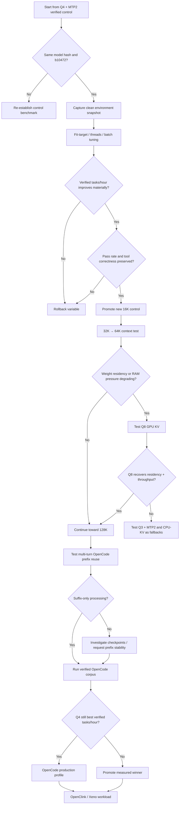
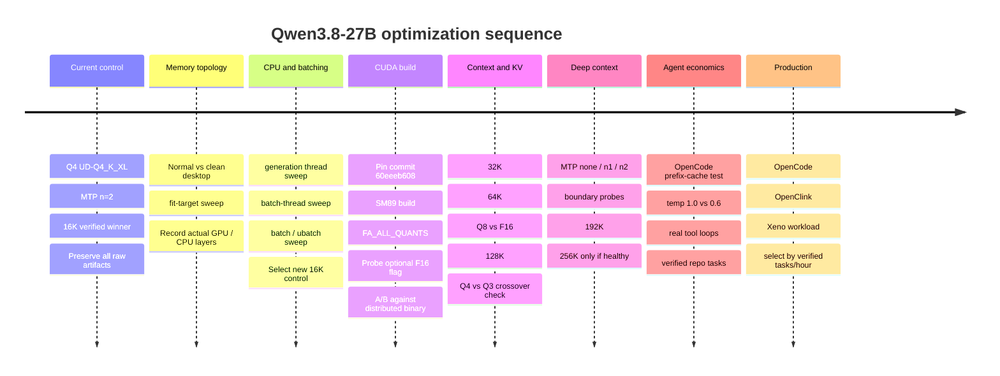

# Qwen3.8-27B on RTX 4070 SUPER 12GB: Deep Optimization Report for Verified Interactive Coding

## Executive summary

The strongest result is already empirical rather than theoretical: on your Windows 11 / RTX 4070 SUPER 12GB / 48GB-RAM machine, **`UD-Q4_K_XL + built-in MTP with --spec-draft-n-max 2` is the current 16K winner**. It delivered about **10.67 tok/s synthetic, 12.10 tok/s on the code-rewrite workload, 90% task pass rate, and 33.6 verified tasks/hour**, versus 22.2 tasks/hour for Q3+MTP2. Q4 therefore won not only fidelity but real coding productivity, despite placing only 32 layers on GPU and 33 on CPU. fileciteturn0file0

The original non-MTP Q4 baseline was far slower: the 16.69-GiB Q4 artifact loaded with roughly 10.2 GiB VRAM free before load, only ~505 MiB free after `--fit`, prompt processing around 518.8 tok/s on a 4,601-token prompt, and generation spanning 6.29–7.56 tok/s. The machine also had only ~11.35 GB host RAM free after model load in the measured desktop state. fileciteturn0file1

The most important optimization conclusion is therefore:

> **Do not change quant or speculative algorithm again at 16K yet. Optimize the memory topology around Q4+MTP2.**

The highest-value remaining work, in priority order, is:

1. **Make GPU placement reproducible:** benchmark clean vs normal desktop and explicitly sweep `--fit-target`. Q4 currently keeps 33 target layers on CPU, so every additional target layer that can safely remain GPU-resident is potentially valuable. The machine logs already prove that free VRAM before launch varies substantially, and `--fit` bases placement on that state. fileciteturn0file0
2. **Prove prefix-cache behavior with OpenCode-shaped multi-turn traffic.** This can matter much more to interactive coding throughput than another 10% of raw decode speed because agent tasks repeatedly append tool results to a large common prefix. Qwen-family hybrid/recurrent models have had recent llama.cpp cache/checkpoint problems, including forced full prompt reprocessing, so this must be measured rather than assumed. citeturn13search4turn18search11
3. **Tune CPU generation threads and batch threads.** Q4 still has 33/65 target layers on CPU, making CPU/RAM behavior a first-class decode bottleneck rather than a secondary concern. llama.cpp exposes separate generation and batch-thread controls plus affinity controls specifically for this purpose. citeturn18search2
4. **Tune `-b` / `-ub` with layer placement logged after every boot.** These settings affect prompt throughput and compute-buffer memory; changing memory buffers can indirectly change how many weights `--fit` leaves on GPU. Current llama.cpp defaults are 2048 logical batch and 512 physical microbatch. citeturn18search5
5. **Build a pinned b10472 CUDA binary specifically for the 4070 SUPER with `CMAKE_CUDA_ARCHITECTURES=89` and `GGML_CUDA_FA_ALL_QUANTS=ON`.** The latter becomes particularly important when testing Q8 KV, because current llama.cpp makes all-quant Flash-Attention kernels an opt-in build feature; a recent llama.cpp issue documented severe fallback behavior when a requested quantized-KV FA kernel was not compiled. citeturn17search0turn13search5
6. **At longer contexts, test Q8 KV before abandoning Q4 for Q3.** At 16K Q3 is definitively worse on the project metric, but its 4.17-GiB smaller weight artifact could become relevant once KV/cache/checkpoint memory starts competing with model weights. Q8 KV can potentially preserve more Q4 target layers on GPU while extending context. That is a hypothesis to test, not a current result. fileciteturn0file0
7. **Do not repeat MTP n=2…6 at 16K.** That experiment is settled: n=2 had the highest floor and best acceptance, while n≥5 lost both acceptance and target GPU residency. At large context, re-test only `none`, `n=1`, and `n=2` first because MTP behavior can change abruptly at some context boundaries. fileciteturn0file0 citeturn13search0
8. **Treat `ngram-simple` as a low-priority long-context confirmation, not a main optimization lane.** llama.cpp officially identifies code rewriting as a suitable use case and the algorithm has minimal overhead, but your fair 16K code-rewrite experiment produced only 30.8% acceptance and essentially no speedup. citeturn17search1 fileciteturn0file0

One important research caveat should be made explicit. The public source index available to this research did **not** surface an official `Qwen/Qwen3.8-27B` model card or the exact Unsloth repo you are running, even though your machine demonstrably downloads and runs an artifact under that name. The official indexed Qwen 27B card I can retrieve is Qwen3.6-27B, whose 27B/64-layer hybrid architecture, MTP support, 262K native context and coding-agent orientation resemble the properties seen in your GGUF logs. I therefore use Qwen3.6 documentation **only as a clearly labeled architecture-family proxy**, never as proof of an exact Qwen3.8 property. The GGUF's own metadata, file hash and machine measurements remain authoritative for your deployment. citeturn16view2

I use these evidence labels below:

| Label | Meaning |
|---|---|
| **MACHINE** | Measured on your exact machine by Claude/Opus |
| **PRIMARY** | llama.cpp or Qwen first-party documentation/source |
| **FAMILY-PROXY** | Official Qwen3.6-27B evidence used only where exact 3.8 documentation is unavailable |
| **HYPOTHESIS** | Engineering prediction that still requires measurement |
| **ANECDOTAL** | User-provided video/community observation; never used to override machine evidence |

## Evidence baseline and optimization priorities

### What is already settled

The current project baseline is stronger than most generic optimization advice because it includes a machine-verified agent benchmark rather than only `llama-bench`. Q4+MTP2 completed 27/30 coding runs versus Q3's 26/30, took 2,889 versus 4,213 total seconds, generated fewer tokens for the same work, and emitted less reasoning text. The entire measured pass-rate difference came from one LFU-cache task, so the more defensible interpretation is **a small quality edge plus a very large trajectory/productivity edge**, not a claim that Q4 is universally much smarter. fileciteturn0file0

The same benchmark established that Q4 baseline without speculation is about 8.2 tok/s on its controlled tests, Q3 baseline about 9.0–9.25, but Q4 gains much more from MTP: roughly +30% on the synthetic prompt and +47% on the code-rewrite prompt. Q3+MTP2 was slightly slower than Q3 baseline on the short synthetic prompt and only about 11% faster on the code workload. fileciteturn0file0

That behavior is consistent with speculative decoding's basic economics: llama.cpp explains that verification of several drafted tokens in a batch is more efficient than sequential target-model generation when draft acceptance is high. On your machine a Q4 forward pass is especially costly because 33 target layers are CPU-resident; amortizing that costly target pass over multiple accepted tokens can therefore be disproportionately valuable. This explanation remains an inference, but it is supported by the identical Q3/Q4 MTP acceptance rates and very different CPU/GPU placement measured by Opus. citeturn17search1 fileciteturn0file0

The user-provided YouTube summary was useful as an initial hypothesis generator, but its headline values should now be retired for this machine: the suggested 4–5-token MTP sweet spot was not reproduced, ~2.5GB MTP overhead was not reproduced, and 3× speedup was not reproduced. Your measured Q4 MTP head tensors were about 285.8 MB, a separate draft KV allocation was about 64 MiB at 16K, and n=2 was more stable than n=3–6. fileciteturn0file0

### Prioritized optimization matrix

The ROI categories below deliberately distinguish between **raw generation throughput** and **verified interactive throughput**.

| Priority | Action | Expected ROI | Evidence | Risk | What decides success |
|---|---|---|---|---|---|
| **S** | Prefix-cache / checkpoint validation using OpenCode-shaped turns | Potentially very high for tasks/hour | PRIMARY + HYPOTHESIS | Medium | suffix-only processing instead of full prefix re-prefill, without incorrect state |
| **S** | Clean-vs-normal desktop + `--fit-target` sweep | High if target GPU layers increase | MACHINE + PRIMARY | Low | more GPU target layers and higher tasks/hour without eviction/OOM |
| **S** | Keep Q4 + MTP n=2 | Already +30–47% generation in tested prompts | MACHINE | Low on b10472 | control configuration |
| **A** | CPU `-t` / `-tb` sweep | Medium/high because 33 Q4 layers are CPU-resident | MACHINE + PRIMARY | Low | decode speed and wall time |
| **A** | `-b` / `-ub` sweep | Medium PP gain; possible indirect TG gain through lower buffers | PRIMARY + HYPOTHESIS | Low | PP, TTFT, GPU-layer count |
| **A** | Custom SM89 CUDA build + `FA_ALL_QUANTS` | Critical preparation for Q8 KV; possible modest runtime gain otherwise | PRIMARY | Low | equal correctness, faster Q8-KV PP/TG |
| **A** | Q8 GPU KV at 64K+ | Potentially high long-context memory ROI | PRIMARY + HYPOTHESIS | Medium | Q4 retains layers while task quality stays intact |
| **A** | `--cache-ram` budgeting | Reliability / paging prevention rather than direct TG | MACHINE + PRIMARY | Low | no paging and cache still useful |
| **B** | Temp 0.6 vs 1.0 on real coding tasks | Potential tasks/hour + MTP acceptance improvement | FAMILY-PROXY + HYPOTHESIS | Medium quality risk | verified tasks/hour, not acceptance alone |
| **B** | Explicit GPU-layer count after stable topology | Better reproducibility | MACHINE + HYPOTHESIS | Medium OOM risk | same topology across boots |
| **B** | CPU KV at deep context | May trade PCIe/CPU latency for additional GPU-resident weights | PRIMARY + HYPOTHESIS | Medium/high | end-to-end task latency |
| **C** | `ngram-simple` at one long repetitive context | Small chance long history changes economics | PRIMARY + MACHINE | Low | >10% task-level gain or drop it |
| **C** | Latest llama.cpp master A/B | Could contain cache/MTP improvements | PRIMARY | Regression risk | identical harness beats pinned b10472 |
| **D** | Driver/BIOS modifications | No current evidence they are limiting | None | High | **Do not do now** |

llama.cpp officially supports CPU+GPU hybrid inference for models larger than VRAM, custom CUDA kernels, Flash Attention, quantized KV, CPU thread controls, and a dynamic fit mechanism. Its current build guidance also notes that its custom matrix kernels have been tuned primarily for RTX 3000/4000 hardware, which is a reason **not** to force cuBLAS as an early optimization on this 4070 SUPER. citeturn20search0turn17search0

### Quant and speculation matrix

This is the current evidence map. “—” means either not measured or no longer worth measuring at 16K.

| Artifact | None | `ngram-simple` | MTP n=1 | **MTP n=2** | MTP n=3 | MTP n=4 | MTP n=5 | MTP n=6 |
|---|---:|---:|---:|---:|---:|---:|---:|---:|
| **UD-Q4_K_XL** | 8.24 synth / 8.22 code | 8.29 / 8.37 | unmeasured | **10.67 / 12.10** | 9.91 / 12.03 | 9.37–11.08 | 8.59–9.38 | 7.18–10.45 |
| **UD-Q3_K_XL** | 9.01 / 9.25 | 9.16 / 9.08 | unmeasured | **8.88 / 10.30** | 7.27 / 9.92 | — | — | — |
| **AtomicChat Q4-ish** | not admitted | not admitted | not admitted | not admitted | — | — | — | — |

All Q3/Q4 figures above are **MACHINE** values from the 16K report. Q4 MTP n=2 had ~78.1% acceptance on the short benchmark and ~98% acceptance on the code rewrite; n=5 and n=6 acceptance fell to 56.4% and 52.4%, respectively. fileciteturn0file0

llama.cpp's current official speculative-decoding implementation supports `draft-mtp`, which explicitly uses MTP heads from the main model, and `ngram-simple`, which looks for repeated token sequences without a separate neural draft model. The docs specifically give source-code rewriting as an `ngram-simple` example, but your machine evidence shows that the theoretically ideal use case still did not produce a meaningful gain at 16K. citeturn17search1

**AtomicChat status:** I would not download a Qwen3.6 AtomicChat artifact and pretend it is a Qwen3.8 challenger. An exact Qwen3.8-27B AtomicChat Q4-ish artifact did not surface in the available indexed search. Admit one later only if it is an exact model-family match and either materially smaller than Q4 or has a clearly better fidelity/size frontier; then hash it and put it through the same 30-task harness. The existing machine report correctly leaves AtomicChat unevaluated rather than allowing a different-model artifact to contaminate the experiment. fileciteturn0file0

### KV and long-context memory hypotheses

At 16K, Opus recorded a `CUDA0 KV` allocation of **512 MiB** for the Q4 run, plus separate recurrent-state allocations and a 64-MiB MTP draft KV. fileciteturn0file0

A simple linear projection of **that observed CUDA KV buffer only** gives the following planning curve. It is deliberately not presented as a Qwen3.8 architectural fact: hybrid recurrent state, checkpoints, fit decisions, allocator overhead and any model-architecture changes can make actual memory differ.

| Context | Observed/projection F16 CUDA KV | Approx. Q8 storage hypothesis | MTP draft-KV linear projection |
|---:|---:|---:|---:|
| 16K | **0.50 GiB measured** | ~0.25 GiB | **64 MiB measured** |
| 32K | ~1 GiB | ~0.5 GiB | ~128 MiB |
| 64K | ~2 GiB | ~1 GiB | ~256 MiB |
| 128K | ~4 GiB | ~2 GiB | ~512 MiB |
| 192K | ~6 GiB | ~3 GiB | ~768 MiB |
| 256K | ~8 GiB | ~4 GiB | ~1 GiB |

Those are **HYPOTHESES extrapolated from the machine allocation**, not measured deep-context footprints. Q8 quantization is expected to substantially reduce KV storage relative to F16, but exact savings include format overhead. llama.cpp officially permits F16, BF16, Q8_0 and several Q4/Q5 KV types and provides separate K and V choices. citeturn17search0turn18search5

This table also illustrates why **Q3 is not permanently eliminated**. Its 12.52-GiB artifact is 4.17 GiB smaller than Q4's 16.69 GiB, so there is a plausible context depth at which Q3 could retain significantly more target weights on the GPU or avoid host paging. But that crossover has not been measured; at 16K Q4 wins by 51% on the actual project metric. fileciteturn0file0

The official Qwen3.6-27B family card documents a 64-layer architecture arranged as 16 repeated groups of three Gated DeltaNet blocks and one Gated Attention block, one MTP capability, and 262,144 native context. It also explicitly warns that deployment efficiency varies substantially by framework and suggests reducing context on OOM. Because the exact Qwen3.8 card was not retrievable, these architecture details remain **FAMILY-PROXY**, while your GGUF allocation logs are the actual memory authority. citeturn16view2

## Experiment protocol and automation

### Optimize the project metric, not a benchmark headline

The optimization objective should remain:

\[
\text{Verified Tasks / Hour} =
\frac{3600 \times \text{verified successful tasks}}
{\text{total task wall time in seconds}}
\]

Raw `tg tok/s`, prompt-processing tok/s and MTP acceptance are diagnostic variables, not the objective. Your Q3 experiment is the proof: Q3 can have a faster non-speculative decoder while still completing substantially less verified work per hour once trajectory length and failures are included. fileciteturn0file0

Use three benchmark tiers:

| Tier | Purpose | Replication |
|---|---|---|
| **Microbench** | detect PP/TG/memory effects cheaply | llama-bench `-r 5` minimum |
| **Agent kernel** | code-rewrite + tool-loop prompt with MTP | ≥5 API generations/config |
| **Verified tasks** | machine-executed coding assertions | paired tasks, at least current 30-run scale for finalists |

`llama-bench` can benchmark prompt processing, generation, combined PP+TG and specified context depth via `-d`; it repeats tests, reports average and standard deviation, and JSON output can retain individual repetitions. Its timings deliberately exclude tokenization and sampling, which is why it cannot replace the server-level coding benchmark. citeturn17search2

### Canonical result schema

Use JSONL as the canonical lossless record and derive CSV from it. Every experiment should preserve the exact command, raw server response and raw logs.

```json
{
  "run_id": "20260818-fit-q4-mtp2-0512-r03",
  "timestamp": "2026-08-18T14:32:51+07:00",

  "hardware": {
    "gpu": "NVIDIA GeForce RTX 4070 SUPER",
    "vram_total_mib": 12282,
    "cpu": "Intel Core i5-13500",
    "ram_total_gib": 47.69
  },

  "runtime": {
    "llama_build": "b10472",
    "git_commit": "60eeeb608",
    "cuda_runtime": "12.4",
    "driver": "610.88",
    "build_flags": [],
    "binary_sha256": "..."
  },

  "model": {
    "repo": "unsloth/Qwen3.8-27B-GGUF",
    "quant": "UD-Q4_K_XL",
    "local_path": "C:\\AI\\models\\...",
    "sha256": "...",
    "size_bytes": 1792,
    "gguf_architecture": "...",
    "gguf_metadata_path": "logs\\metadata.txt"
  },

  "config": {
    "ctx": 16384,
    "spec_type": "draft-mtp",
    "spec_n_max": 2,
    "kv_k": "f16",
    "kv_v": "f16",
    "kv_offload": true,
    "requested_ngl": "auto",
    "fit": true,
    "fit_target_mib": 512,
    "batch": 2048,
    "ubatch": 512,
    "threads": 8,
    "threads_batch": 8,
    "flash_attention": "on",
    "parallel": 1,
    "cache_ram_mib": 2048
  },

  "sampling": {
    "temperature": 1.0,
    "top_p": 0.95,
    "top_k": 20,
    "min_p": 0.0,
    "presence_penalty": 0.0,
    "reasoning_effort": "medium"
  },

  "environment_before": {
    "vram_free_mib": 10192,
    "ram_free_mib": 11622,
    "gpu_util_pct": 1,
    "gpu_temp_c": 42,
    "gpu_power_w": 17.2,
    "desktop_mode": "normal"
  },

  "placement": {
    "gpu_target_layers": 32,
    "cpu_target_layers": 33,
    "cuda_model_buffer_mib": null,
    "cpu_mapped_buffer_mib": null,
    "cuda_kv_mib": 512,
    "draft_kv_mib": 64,
    "cuda_compute_mib": 189.7
  },

  "performance": {
    "pp_tok_s": 518.8,
    "tg_tok_s": 10.67,
    "ttft_ms": null,
    "wall_s": 84.2,
    "prompt_tokens": 4601,
    "completion_tokens": 512,
    "reasoning_tokens": null,
    "tool_rounds": 4
  },

  "mtp": {
    "draft_generated": 297,
    "draft_accepted": 230,
    "acceptance_rate": 0.7744
  },

  "verification": {
    "tool_json_valid": true,
    "task_pass": true,
    "assertions_passed": 18,
    "assertions_total": 18,
    "retries": 0
  },

  "artifacts": {
    "exact_command": "logs\\command.txt",
    "server_stdout": "logs\\server.stdout.log",
    "server_stderr": "logs\\server.stderr.log",
    "response_json": "logs\\response.json",
    "nvidia_smi_before": "logs\\nvidia-before.csv",
    "nvidia_smi_after": "logs\\nvidia-after.csv",
    "llama_bench_raw": "results\\bench.jsonl"
  },

  "exit_code": 0,
  "notes": ""
}
```

The raw files referenced above should remain immutable. Do **not** make the CSV the only evidence store because multi-line logs and exact API JSON are awkward and lossy there.

### Environment capture

The GPU snapshot should include memory and clocks rather than only `memory.free`:

```powershell
$nvidia = "nvidia-smi.exe"

& $nvidia `
  --query-gpu=timestamp,name,memory.total,memory.used,memory.free,utilization.gpu,temperature.gpu,power.draw,clocks.sm,clocks.mem `
  --format=csv,noheader,nounits
```

Host-memory snapshot:

```powershell
$os = Get-CimInstance Win32_OperatingSystem

[pscustomobject]@{
    Timestamp     = (Get-Date).ToString("o")
    TotalRAMMiB   = [math]::Round($os.TotalVisibleMemorySize / 1024, 1)
    FreeRAMMiB    = [math]::Round($os.FreePhysicalMemory / 1024, 1)
    CommitFreeMiB = [math]::Round($os.FreeVirtualMemory / 1024, 1)
}
```

Your existing automation already discovered an important Windows PowerShell 5.1 trap: llama.cpp and `nvidia-smi` can write normal diagnostic output to stderr, and `$ErrorActionPreference='Stop'` can turn that into a terminating `NativeCommandError`. Use `Start-Process` with explicit stdout/stderr redirection, or temporarily use a non-terminating error policy around native tools. fileciteturn0file0

### Safe server launcher pattern

```powershell
$ErrorActionPreference = "Stop"

$Server = "C:\AI\llama.cpp-cuda\llama-server.exe"
$LogDir = "C:\AI\qwen38-tuning\logs"
New-Item -ItemType Directory -Force $LogDir | Out-Null

$stamp = Get-Date -Format "yyyyMMdd-HHmmss"
$stdout = Join-Path $LogDir "$stamp.stdout.log"
$stderr = Join-Path $LogDir "$stamp.stderr.log"

$args = @(
    "-hf", "unsloth/Qwen3.8-27B-GGUF:UD-Q4_K_XL",
    "--alias", "qwen38-q4",
    "-c", "16384",
    "-ngl", "auto",
    "--fit", "on",
    "-fa", "on",
    "-np", "1",
    "--no-mmproj-auto",
    "--spec-type", "draft-mtp",
    "--spec-draft-n-max", "2",
    "--host", "127.0.0.1",
    "--port", "8080"
)

$p = Start-Process `
    -FilePath $Server `
    -ArgumentList $args `
    -RedirectStandardOutput $stdout `
    -RedirectStandardError $stderr `
    -PassThru

$deadline = (Get-Date).AddMinutes(3)

do {
    Start-Sleep -Milliseconds 500

    try {
        $health = Invoke-RestMethod `
            -Uri "http://127.0.0.1:8080/v1/models" `
            -TimeoutSec 2

        Write-Host "Server ready. PID=$($p.Id)"
        break
    }
    catch {
        if ($p.HasExited) {
            throw "llama-server exited with code $($p.ExitCode). Read $stderr"
        }
    }
} while ((Get-Date) -lt $deadline)

if ((Get-Date) -ge $deadline) {
    Stop-Process -Id $p.Id -Force -ErrorAction SilentlyContinue
    throw "Server health check timed out."
}
```

### Exact API workload

Keep sampling explicit so server defaults never contaminate comparison:

```powershell
curl.exe -sS http://127.0.0.1:8080/v1/chat/completions `
  -H "Content-Type: application/json" `
  -d '{
    "model":"qwen38-q4",
    "messages":[
      {
        "role":"user",
        "content":"Implement the requested change and return the minimal correct patch."
      }
    ],
    "temperature":1.0,
    "top_p":0.95,
    "top_k":20,
    "min_p":0.0,
    "presence_penalty":0.0,
    "max_tokens":1024,
    "chat_template_kwargs":{
      "reasoning_effort":"medium"
    }
  }'
```

The official Qwen3.6 family card recommends `temperature=1.0, top_p=.95, top_k=20, min_p=0` for general thinking and separately gives **temperature 0.6** with the same top-p/top-k/min-p values for precise coding. Your exact Qwen3.8 artifact should therefore keep 1.0 as the control and test 0.6 as an experimental coding profile rather than silently changing it. citeturn16view2

### llama-bench commands

First establish fixed-model microbench controls:

```powershell
$Bench = "C:\AI\llama.cpp-cuda\llama-bench.exe"
$Model = "C:\AI\models\Qwen3.8-27B-UD-Q4_K_XL.gguf"

# Baseline: prompt + generation, five repetitions.
& $Bench `
  -m $Model `
  -p 4096 `
  -n 256 `
  -ngl auto `
  -fa 1 `
  -r 5 `
  -o jsonl `
  > results\control.jsonl
```

CPU generation-thread sweep:

```powershell
& $Bench `
  -m $Model `
  -n 256 `
  -t 6,8,10,14 `
  -ngl auto `
  -fa 1 `
  -r 5 `
  -o jsonl `
  > results\threads.jsonl
```

Prompt/batch topology:

```powershell
& $Bench `
  -m $Model `
  -p 4096 `
  -b 512,1024,2048 `
  -ub 128,256,512 `
  -ngl auto `
  -fa 1 `
  -r 5 `
  -o jsonl `
  > results\batch-ubatch.jsonl
```

Context-depth screening:

```powershell
& $Bench `
  -m $Model `
  -n 256 `
  -d 16384,32768,65536,131072,196608,262144 `
  -ngl auto `
  -fa 1 `
  -r 5 `
  -o jsonl `
  > results\depth.jsonl
```

`llama-bench -d` pre-fills the KV cache to the selected context depth, while `-r` repeats measurements; its JSON-family output is therefore the right first instrument for context-dependent TG before committing to expensive full agent runs. citeturn17search2

Do not sweep five dimensions simultaneously. Use the same progression as scientific A/B testing:

```text
control
  ↓
change exactly one major variable
  ↓
N ≥ 5 microbench
  ↓
retain only material winners
  ↓
agent-kernel test
  ↓
verified coding suite
```

## Runtime profiles and custom CUDA build

### Fastest configuration proven today

This is the configuration with direct 16K evidence. It should remain the control against which every “optimization” is judged.

```powershell
C:\AI\llama.cpp-cuda\llama-server.exe `
  -hf unsloth/Qwen3.8-27B-GGUF:UD-Q4_K_XL `
  --alias qwen38-q4 `
  -c 16384 `
  -ngl auto `
  --fit on `
  -fa on `
  -np 1 `
  -b 2048 `
  -ub 512 `
  --no-mmproj-auto `
  --spec-type draft-mtp `
  --spec-draft-n-max 2 `
  --host 127.0.0.1 `
  --port 8080
```

**Status: MACHINE / recommended control.** It produced the best measured 16K verified coding throughput. fileciteturn0file0

Do not add `--jinja`; Opus verified that it is already enabled by default in b10472 and passing it has no useful effect. fileciteturn0file0

### Reliability-first candidate

The reliability profile deliberately reserves more GPU margin and caps host prompt-cache growth:

```powershell
C:\AI\llama.cpp-cuda\llama-server.exe `
  -hf unsloth/Qwen3.8-27B-GGUF:UD-Q4_K_XL `
  --alias qwen38-q4-safe `
  -c 16384 `
  -ngl auto `
  --fit on `
  --fit-target 1024 `
  -fa on `
  -np 1 `
  -b 2048 `
  -ub 512 `
  --cache-ram 2048 `
  --no-mmproj-auto `
  --spec-type draft-mtp `
  --spec-draft-n-max 2 `
  --host 127.0.0.1 `
  --port 8080
```

**Status: HYPOTHESIS until the fit-target sweep is run.**

A 1-GiB target is not a vendor-required number; it is an operational safety candidate prompted by the measured 450–1,275 MiB post-load range and the fact that the desktop can claim VRAM after server startup. `--fit-target` is specifically a margin applied on top of llama.cpp's detected free device memory rather than an absolute VRAM cap. fileciteturn0file0 citeturn18search9

`--cache-ram 2048` is also an engineering guardrail, not a performance recommendation from Qwen. Current llama.cpp exposes host prompt-cache budgeting, while your measured Q4 process left only ~11.35 GB free RAM at 16K; blindly allowing a very large host cache while OpenCode, Claude Code, browsers and the operating system are running risks paging. fileciteturn0file1

### OpenCode production candidate

**The production command I would deploy today is still the verified 16K profile above.** I would not pretend that 64K/128K is production-tested before the depth/cache experiment.

The intended next-stage OpenCode profile, after passing the Q8/64K gate, is:

```powershell
C:\AI\llama.cpp-custom-b10472\llama-server.exe `
  -hf unsloth/Qwen3.8-27B-GGUF:UD-Q4_K_XL `
  --alias qwen38-opencode `
  -c 65536 `
  -ngl auto `
  --fit on `
  --fit-target 1024 `
  -fa on `
  -np 1 `
  -b 1024 `
  -ub 256 `
  -ctk q8_0 `
  -ctv q8_0 `
  --cache-ram 2048 `
  --no-mmproj-auto `
  --spec-type draft-mtp `
  --spec-draft-n-max 2 `
  --host 127.0.0.1 `
  --port 8080
```

**Status: HYPOTHESIS / promotion candidate, not yet production-approved.**

The key hypothesis is that Q8 KV plus somewhat smaller batch buffers can create enough memory headroom to preserve Q4 GPU residency as context grows. The command must only be promoted if it beats F16 on verified OpenCode tasks and the server log proves Flash Attention remains on the CUDA path. llama.cpp supports both quantized KV and Flash Attention, but a recent upstream issue documents cases where builds missing the relevant quantized FA kernels fell back catastrophically, which is why the custom build below precedes this test. citeturn13search5turn17search0

The official Qwen3.6 family recommendation favors at least 128K context for preserving full thinking capability, while your objective is interactive throughput on a 12GB GPU; those objectives can conflict. Therefore **64K is proposed as an engineering operating point to test, not a Qwen recommendation**. The final OpenCode context must be selected from 32K/64K/128K real-task measurements. citeturn16view2

### Custom CUDA build pinned to the known-good commit

Do not update llama.cpp and change CUDA build flags in the same experiment. First build **the exact measured commit** side-by-side.

From a Visual Studio 2022 Developer PowerShell:

```powershell
cd C:\AI

git clone https://github.com/ggml-org/llama.cpp.git llama.cpp-src
cd C:\AI\llama.cpp-src

git checkout 60eeeb608
git status
```

Then configure the 4070S build:

```powershell
cmake -S . -B build-4070s `
  -DGGML_CUDA=ON `
  -DGGML_NATIVE=ON `
  -DCMAKE_CUDA_ARCHITECTURES=89 `
  -DGGML_CUDA_FA_ALL_QUANTS=ON
```

Build only the tools needed:

```powershell
cmake --build build-4070s `
  --config Release `
  --target llama-server llama-bench llama-cli `
  --parallel
```

The output will normally reside under a configuration-specific `bin\Release` tree for a Visual Studio generator; verify rather than assuming the path:

```powershell
Get-ChildItem .\build-4070s -Recurse `
  -Filter llama-server.exe |
  Select-Object FullName
```

llama.cpp's official build documentation supports `GGML_CUDA=ON`, explicit `CMAKE_CUDA_ARCHITECTURES`, and documents compute capability 8.9 for RTX 40-series-class examples. It also lists `GGML_CUDA_FA_ALL_QUANTS`, disabled by default, as the option that compiles Flash-Attention support for all KV-cache quantization combinations. citeturn17search0

#### The F16 build flag needs a correction

Do **not** blindly add:

```text
-DGGML_CUDA_F16=ON
```

to the production recipe.

Current llama.cpp's official build document does not list `GGML_CUDA_F16` among its normal CUDA performance options, although 2026 issue reports show builds in which that flag appears in reported build configuration. That means it is version/branch-sensitive rather than a safe universal recommendation. citeturn17search0turn20search1

Probe your pinned source:

```powershell
cmake -S . -B build-option-probe `
  -DGGML_CUDA=ON `
  -LAH |
  Select-String "GGML_CUDA_F16"
```

Then:

```text
flag listed by b10472?
    │
    ├─ no  → do not use it
    │
    └─ yes → create a second build and A/B it
```

If recognized:

```powershell
cmake -S . -B build-4070s-f16 `
  -DGGML_CUDA=ON `
  -DGGML_NATIVE=ON `
  -DCMAKE_CUDA_ARCHITECTURES=89 `
  -DGGML_CUDA_FA_ALL_QUANTS=ON `
  -DGGML_CUDA_F16=ON

cmake --build build-4070s-f16 `
  --config Release `
  --target llama-server llama-bench `
  --parallel
```

Only promote it if a same-commit A/B improves measured performance without changing outputs or memory stability.

I would **not** begin with `GGML_CUDA_FORCE_CUBLAS`: llama.cpp's own build guide says forcing cuBLAS can increase memory usage and notes that its custom kernels were tuned primarily for RTX 3000/4000 GPUs. That is exactly the wrong direction when the Q4 target is already VRAM-constrained. citeturn17search0

## Profiling, context behavior, and decision rules

### Mandatory profiling checklist

For **every server boot**, store the exact server command plus these log values:

| Category | Capture |
|---|---|
| Model identity | repo, quant, local path, file size, SHA-256 |
| Runtime identity | llama.cpp build, Git commit, CUDA runtime, NVIDIA driver, binary hash |
| GGUF | architecture, parameter count, context metadata, MTP/NextN metadata/tensors |
| Placement | `load_tensors`, `offloaded ... layers`, GPU layer count, CPU layer count |
| Weight buffers | `CUDA0 model buffer`, `CPU_Mapped model buffer` |
| Context | requested `-c`, actual `n_ctx`, slots/parallel |
| Main memory | CUDA KV, CPU KV if any, recurrent-state buffers, compute buffers |
| MTP | MTP initialization line, MTP tensor size, draft KV, `n_max`, accepted/generated |
| Environment before | VRAM free/used, RAM free, GPU temp, clocks, power, major GPU processes |
| Environment after | same metrics after load and after task |
| Throughput | PP tok/s, TG tok/s, TTFT, wall time |
| Agent | reasoning tokens/chars, tool rounds, malformed calls, retries |
| Verification | test assertions, pass/fail, failure reason |
| Cache | evaluated prompt tokens, reused tokens, `n_past`, restored checkpoint/full-reprocess log |
| Raw evidence | stdout, stderr, response JSON, nvidia-smi CSV |

For MTP, do not trust `/props` alone. Your own report found that `/props` could say `speculative.types=none` even with active MTP; the definitive evidence is the MTP draft-context initialization and subsequent draft statistics in the server log. fileciteturn0file0

llama.cpp officially prints speculative statistics including accepted/generated token counts and acceptance rate, making those fields straightforward to capture automatically. citeturn17search1

### Prefix cache is now a gate, not a nice-to-have

Qwen-family hybrid/recurrent models deserve special scrutiny. Recent llama.cpp issues document cases where the server logs:

```text
forcing full prompt re-processing due to lack of cache data
```

for hybrid memory models, and other reports describe problems restoring or reusing recurrent state. Some fixes landed during 2026, but your b10472 + exact GGUF + OpenCode request shape still have to be proven experimentally. citeturn13search4turn18search11

The test should be:

```text
Turn A
system + tools + repo context + user request
≈ 20–50K

Turn B
identical prefix + assistant tool call + tool result

Turn C
same accumulated prefix + another tool result

Turn D
same history + next user instruction
```

For each turn record:

```text
total prompt tokens
actually evaluated tokens
n_past
checkpoint restored?
full reprocess?
PP wall time
TTFT
```

A successful agent cache looks conceptually like:

```text
Turn A:  [████████████████████████]     cold prefill
Turn B:  [████████████████████████][█]  process suffix
Turn C:  [████████████████████████][██] process new suffix

not:

Turn A:  [████████████████████████]
Turn B:  [█████████████████████████]    full prefill again
Turn C:  [██████████████████████████]   full prefill again
```

Do not assume `--cache-reuse` solves arbitrary OpenCode agent/system-prompt replacement. A llama.cpp discussion specifically warns that recurrent-state models are more constrained and that changing an earlier system prompt may require reprocessing history rather than reusing an invalid state. citeturn13search12

### Context experiment

Run the contexts in this order:

```text
16K control
↓
32K
↓
64K
↓
128K
↓ only if no paging / pathological layer eviction
192K
↓ only if healthy
256K
```

At each depth, compare at least:

```text
Q4 + MTP2 + F16 GPU KV
Q4 + MTP2 + Q8 GPU KV
Q3 + MTP2 + Q8 GPU KV
```

At 128K and above additionally test:

```text
Q4 + MTP1
Q4 without MTP
```

because MTP acceptance can behave non-monotonically with context. A recent Qwen3.6 llama.cpp issue showed a 256-token context shift changing MTP speedup from roughly 2.1× to almost no gain around repeated boundaries; that is not evidence your build has the same bug, but it is strong justification for measuring acceptance at several neighboring depths rather than testing only powers of two. citeturn13search0

For example, around an apparent cliff:

```text
65536
65792
66048

131072
131328
131584
```

This separates a smooth long-context slowdown from an alignment/checkpoint pathology.

### Expected decode-versus-context chart

Only 16K has defensible measured throughput today, so inventing a smooth numerical 256K curve would be bad engineering. The evidence-backed plot is therefore intentionally sparse:

```text
Measured / expected Q4+MTP2 decode behavior

tok/s
13 ┤  ● 12.10  code-rewrite workload @16K
12 ┤
11 ┤  ● 10.67  short synthetic @16K
10 ┤
 9 ┤
 8 ┤
 7 ┤                    ?                   Context-dependent
 6 ┤                    ?                   target-layer eviction,
 5 ┤                    ?                   KV/checkpoint cost and
 4 ┤                    ?                   MTP acceptance may create
 3 ┤                    ?                   discrete drops, not a
 2 ┤                    ?                   smooth curve.
 1 ┤
   └────16K────32K────64K────128K────192K────256K
              ↑       ↑       ↑        ↑       ↑
             MEASURE THESE — no fabricated projection
```

The **directional hypothesis** is non-increasing decode speed with context, with possible step changes when `--fit` changes target placement or MTP acceptance encounters a boundary. That hypothesis is consistent with the memory topology and upstream MTP-context issue but remains unmeasured on your 4070S. citeturn13search0 fileciteturn0file0

For comparison, the measured 16K configuration chart is already decisive:

```text
16K generation throughput

Q4 + MTP2, code       ████████████  12.10
Q4 + MTP2, synthetic  ███████████   10.67
Q3 + MTP2, code       ██████████    10.30
Q3 baseline, code     █████████      9.25
Q3 + MTP2, synthetic  █████████      8.88
Q4 ngram, code        ████████       8.37
Q4 baseline, code     ████████       8.22
```

fileciteturn0file0

### Decision flow



The hard selection rule should be:

> **A configuration is not an optimization unless verified successful coding work per wall-clock hour improves without a material reliability regression.**

Suggested statistical guardrails:

- Microbench candidates need at least five repetitions and should beat run-to-run variation, not a single best run.
- A new configuration that causes even one additional failure in the 30-run coding corpus should be replicated before promotion.
- Any malformed tool call, semantically missing required argument, deterministic corruption, OOM, Windows paging, or repeatable full-prefix cache miss is a blocking reliability defect.
- MTP acceptance is never itself a promotion criterion; your data already show that target residency and total throughput matter more than acceptance in isolation. fileciteturn0file0

## Experiment roadmap and minimal experiments to run next

The experiment sequence should deliberately avoid re-solving questions that your data have already answered.



### Minimal experiment set

This is the smallest high-value next batch I would authorize.

#### Fit-target and desktop state

Use **both** normal-working desktop and a clean inference state. Do not kill Windows services or modify the OS; just close voluntary GPU-heavy applications.

Test:

```text
fit-target:
256
512
768
1024
1536 MiB
```

Run at least five TG samples for each, but record **actual target GPU layers** after every startup.

The decision is not “lowest fit-target wins.” The winner is the smallest margin that remains stable when normal work resumes and yields the best verified tasks/hour.

#### CPU threads

Hold everything else at the winning fit topology:

```text
-t:
6
8
10
14
```

Then shortlist the best two and test:

```text
-tb:
6
8
10
14
```

llama.cpp explicitly separates generation threads from prompt/batch threads, and its docs note that physical-core-like generation thread counts often perform better than indiscriminately using every logical thread. citeturn18search2

Do not start with a hard-coded P-core CPU mask. Windows processor numbering must be discovered on the actual machine before affinity experiments; a wrong mask can make the benchmark slower while looking “optimized.”

#### Batch and ubatch

Test:

```text
-b:
512
1024
2048

-ub:
128
256
512
```

First use prompt processing. Then retest TG **only when a setting changes target GPU-layer placement**, because `b/ub` normally have more direct effect on prefill and buffers than single-token decode.

#### Custom build

Build the pinned SM89 + `FA_ALL_QUANTS` version described above and compare:

```text
distributed b10472
vs
custom b10472 SM89 + FA_ALL_QUANTS
```

with F16 KV first.

Then Q8:

```text
custom F16 KV
vs
custom Q8/Q8 KV
```

A recent llama.cpp issue reports that requesting unsupported quantized Flash-Attention combinations can silently take a disastrously slow fallback path; this makes a proper Q8 build verification a correctness condition, not premature micro-optimization. citeturn13search5

#### MTP

At **16K**, do not rerun n=2…6; that work is complete. fileciteturn0file0

At the first long-context depth where speed or residency changes materially:

```text
none
n=1
n=2
```

Only try n=3 again if n=2 still has high acceptance, retains the same target layer count, and produces a promising throughput signal.

#### ngram-simple

One confirmation only, at 64K or 128K, using a truly repetitive repo/edit context:

```powershell
--spec-type ngram-simple
```

llama.cpp officially calls source-code rewriting an intended use case, so longer history could theoretically improve match opportunity. But because the 16K fair test showed only ~30.8% acceptance and no useful speedup, failure of this single long-context confirmation should permanently close the lane. citeturn17search1 fileciteturn0file0

### The likely optimization hierarchy after these tests

My current best hypothesis is:

```text
Verified Tasks / Hour

            ┌──────────────────────────────┐
            │ OpenCode prefix reuse       │  potentially largest agent-level win
            └──────────────────────────────┘
                          ↓
            ┌──────────────────────────────┐
            │ Q4 + MTP n=2                │  already measured +30–47% TG
            └──────────────────────────────┘
                          ↓
            ┌──────────────────────────────┐
            │ GPU weight residency        │
            │ fit-target + desktop state  │
            └──────────────────────────────┘
                          ↓
            ┌──────────────────────────────┐
            │ CPU lane tuning             │
            │ 33 CPU-resident layers      │
            └──────────────────────────────┘
                          ↓
            ┌──────────────────────────────┐
            │ batch / ubatch              │
            │ TTFT + memory buffers       │
            └──────────────────────────────┘
                          ↓
            ┌──────────────────────────────┐
            │ Q8 KV at long context       │
            │ retain Q4 GPU residency     │
            └──────────────────────────────┘
                          ↓
            ┌──────────────────────────────┐
            │ sampling / reasoning policy │
            │ fewer agent rounds          │
            └──────────────────────────────┘
```

The first two blocks have direct machine evidence; the rest are ordered by the size of the bottleneck they can plausibly affect.

## Reliability, rollback, and source assessment

### Reliability rules

Do not optimize away the properties already proven:

- `-np 1` should stay: this is a single interactive coding worker, not a throughput-serving deployment.
- `--no-mmproj-auto` should stay for this text-only worker, avoiding unnecessary multimodal memory.
- `min_p=0` should be sent explicitly by the client; your server default was different.
- `reasoning_effort=medium` is a good provisional default because the experiment showed agent/tool-round count dominating wall time more strongly than thinking verbosity. fileciteturn0file0
- MTP n=2 should stay until a deeper context proves otherwise.
- Never mark a semantically important tool parameter optional merely because the model was instructed to include it. One machine run already omitted an instructed but non-required field; required semantics belong in the schema. fileciteturn0file0

The official Qwen3.6 family card is especially relevant to the project objective because it reports coding-agent evaluations including SWE-bench Verified, Terminal-Bench, SkillsBench via OpenCode, NL2Repo and other agent-oriented suites, and it explicitly trains/supports MTP and 256K-class context. This supports using a verified agent metric rather than raw model benchmarks as the project objective. citeturn16view2

### Rollback policy

No destructive action is justified by the evidence currently available.

| Action | Policy |
|---|---|
| New llama.cpp build | Build side-by-side; never overwrite `C:\AI\llama.cpp-cuda` |
| New llama.cpp commit | Separate experiment from build-flag tuning |
| Driver change | Do not change unless a reproducible CUDA defect maps to a documented driver fix |
| BIOS changes | **Do not perform for this optimization project** |
| Windows GPU settings | Record before changing; one change at a time; reversible |
| Delete Q3/Q4 models | Do not delete until deep-context winner is established |
| Requantize model | Keep original hash/artifact; create new filename/repo entry |
| CPU affinity | Reset by restarting server if degraded |
| Q8 KV instability | Roll back to F16 immediately |
| MTP corruption | Disable `--spec-type`; baseline remains valid |
| New master regression | Return to frozen b10472/60eeeb608 binary |

llama.cpp is actively developed, and recent 2026 issues show why binary upgrades, MTP behavior, cache behavior and Flash-Attention/KV combinations should be regression-tested rather than adopted merely because they are newer. citeturn13search0turn13search5turn13search9

A historical Qwen3.6 issue reported deterministic-output divergence under MTP on a different build/backend. Your own Q4/Q3 b10472 test did **not** reproduce it: greedy samples were byte-identical across speculative configurations. Therefore the right conclusion is neither “MTP is always lossless” nor “MTP corrupts output,” but **“MTP passed the deterministic-equivalence gate on this exact current stack; rerun that gate after every binary/model change.”** citeturn13search9 fileciteturn0file0

### Source assessment

The source hierarchy used for this report is:

| Source | How it was used |
|---|---|
| **Your Opus Q3-vs-Q4 benchmark** | Highest authority for actual 4070S throughput, reliability, layer split, MTP acceptance and winner selection. fileciteturn0file0 |
| **Your initial machine handoff** | Hardware/runtime baseline, initial Q4 memory, PP/TG measurements, PowerShell behavior and open risks. fileciteturn0file1 |
| **llama.cpp speculative docs** | Definition of MTP/ngram algorithms, flags and statistics. citeturn17search1 |
| **llama.cpp build docs** | CUDA build, architecture targeting, FA_ALL_QUANTS and CUDA-kernel strategy. citeturn17search0 |
| **llama-bench docs** | Repeatable PP/TG/depth benchmarking methodology. citeturn17search2 |
| **Official Qwen3.6-27B model card** | Architecture-family proxy, MTP/context/sampling/coding-agent guidance only—not treated as exact Qwen3.8 specification. citeturn16view2 |
| **Recent llama.cpp issues/discussions** | Risk discovery for MTP boundary behavior, recurrent cache handling and missing FA quant kernels; never allowed to override successful machine evidence. citeturn13search0turn13search4turn13search5 |
| **User-provided YouTube/Gemini summary** | Anecdotal hypothesis source only; several headline claims were superseded by your machine data. |

### Bottom line

The best current engineering decision is **not** to search for a different model immediately.

It is to make this configuration:

```text
UD-Q4_K_XL
+ CUDA
+ MTP n=2
+ one slot
+ text only
```

faster and more deterministic as a system.

The measured Q4 bottleneck is unusually actionable:

```text
65 target layers
├── 32 GPU
└── 33 CPU
```

while MTP has already converted that poor fit into a large speculative speedup. fileciteturn0file0

The highest-probability path from the current **~12.1 tok/s code decode / 33.6 verified tasks-hour** to materially better interactive performance is therefore:

```text
stabilize VRAM topology
        ↓
fit-target optimization
        ↓
CPU-thread optimization
        ↓
batch/ubatch memory optimization
        ↓
pinned SM89 + FA_ALL_QUANTS build
        ↓
Q8 KV at increasing context
        ↓
prove OpenCode prefix reuse
        ↓
reduce unnecessary tool rounds
        ↓
re-run verified coding corpus
```

The final long-context race remains open:

```text
Q4 + MTP2 + Q8 KV
            vs
Q3 + MTP2 + Q8 KV
```

but it should only be reopened **after context memory actually forces a crossover**. At 16K, Q4 has already won that argument.

The single most important new experiment is not another quantization benchmark: it is **OpenCode-style multi-turn prefix reuse at 32–64K**, while logging exactly how many tokens llama.cpp re-evaluates after each tool call. If the prefix is reused correctly, effective interactive performance can improve far more than a few additional decode tokens per second; if the hybrid-cache path forces repeated prefill, fixing or working around that becomes the highest-priority optimization in the entire stack. citeturn13search4turn18search11