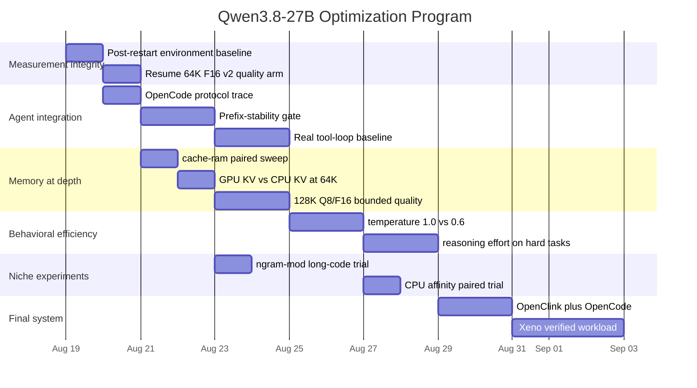
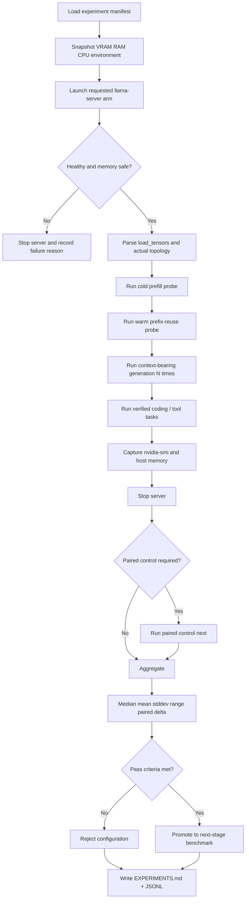

# Deep Research Report: Optimizing Qwen3.8-27B on RTX 4070 SUPER 12GB for Throughput and Verified Tasks per Hour

## Executive Summary

The most important conclusion from this research is that the project has already passed the point where broad “LLM tuning” is useful. The machine measurements have eliminated several plausible optimization paths and identified a much narrower set of high-value experiments.

The original baseline named in the research request—`UD-Q4_K_XL + draft-mtp n=2`, 16K context, roughly 10.6–12.1 tok/s, about 32 GPU / 33 CPU layers, and only ~505 MiB VRAM free—was correct for the earlier measurement state. Subsequent Opus experiments have already improved that configuration to the current 16K production stack:

```text
UD-Q4_K_XL
CUDA
16K
MTP n=2
--fit-target 768
-t 18
-b 2048
-ub 256
F16 KV
-np 1
```

On the execution-verified benchmark this raised productivity from **33.6 to 36.1 verified tasks/hour**, while preserving the same 90% pass rate. Code-rewrite throughput reached approximately **13.5 tok/s** in the runtime sweep, while the independent end-to-end task suite reported a median of 12.27 tok/s. After correcting for substantial machine drift, the honest measured benefit of the complete runtime-tuning stack is approximately **+6.6% paired mean / +9.6% pooled median**, not the initially inferred additive ~19%. fileciteturn0file7

The evidence therefore says **do not spend more time re-sweeping `-t`, `-b/-ub`, `--fit-target`, Q3 versus Q4, MTP depth 2–6, or `ngram-simple` at 16K**. Those questions are sufficiently resolved at this depth, and the machine's unchanged-configuration restart spread is 13.6% peak-to-peak, making small apparent improvements easy to manufacture accidentally. fileciteturn0file1

The next optimization frontier is different:

| Priority | Optimization | Current judgment |
|---|---|---|
| **S+** | Preserve OpenCode prefix cache exactly | Potentially much larger than every runtime flag combined |
| **S** | Validate actual OpenCode serialization and tool loop | Direct determinant of verified tasks/hour |
| **A** | `--cache-ram` budgeting | Important for RAM pressure and long sessions |
| **A** | GPU versus CPU KV at 64K/128K | Still unmeasured; could alter weight residency |
| **A** | Q8 KV at depth | **Already proven valuable at 64K**; quality at 128K still unmeasured |
| **A** | Temperature 1.0 versus 0.6 on real coding tasks | Could shorten trajectories and/or improve MTP acceptance |
| **B** | `ngram-mod` at long repetitive code context | Worth one targeted test, not a broad sweep |
| **B** | CPU affinity | Unknown; `-t 18` already works unusually well |
| **C** | Custom CUDA build | Low expected ROI for the current Q8/Q8 path |
| **C** | External dedicated drafter | Likely loses on 12GB because built-in MTP is already excellent |
| **Experimental** | TurboQuant | Potentially transformative for KV capacity, but not production-ready for this hardware/model |
| **Reject for now** | 256K interactive operation | Host paging already demonstrated; not an optimization target |

This ranking is driven by actual machine evidence. In the current implementation, exact append-only prefix reuse changed a ~3.9K-token subsequent turn from full prefill costing roughly 10–12 seconds to only ~35–43 evaluated tokens and 1.3–3.9 seconds. Reordering the tools, changing one system-prompt sentence, or prepending a skill block destroyed the reuse completely. fileciteturn0file7 On a 64K working set, where cold prefill is measured in hundreds of seconds, preserving the prefix is therefore structurally more important than chasing another 5% of raw decode speed. The server itself documents `cache_prompt` as reusing the KV corresponding to the common prefix so that only the changed suffix must be processed. citeturn13search11

The current recommended operating envelope is consequently:

```text
16K–32K:
Q4 + MTP n=2 + F16 KV
--fit-target 768
-t 18
-b 2048
-ub 256

64K:
same configuration
+ Q8_0 K/V cache

128K:
possible for exceptional tasks
but ~2.48 tok/s even with Q8 KV
and quality at this depth still needs validation

256K:
do not use on this machine
```

That matches the measured context-depth data: Q4 falls from 9.77 tok/s at 16K to 7.44 at 32K, 4.37 at 64K and 2.10 at 128K with F16 KV because growing KV displaces GPU-resident layers; Q8 at 64K halves most of that KV burden, moves two layers back onto the GPU, and increases decode from 4.37 to **5.10 tok/s (+16.7%)**. At 128K it increases 2.10 to **2.48 tok/s (+18.1%)**. fileciteturn0file8

Most importantly, the primary project metric should remain:

\[
\text{Verified Tasks/Hour}
=
\frac{\text{tasks that actually pass verification}}
{\text{total wall-clock hours}}
\]

not maximum tok/s, GPU-layer count, MTP acceptance, or smallest quant. That selection rule already prevented a major mistake: Q3 has more GPU-resident layers, yet Q4+MTP is substantially more productive. fileciteturn0file6

## Evidence Baseline and What Is Already Settled

The hardware is unusually constrained in a way that makes standard GPU-only optimization advice misleading. `llama.cpp` is specifically designed to support CPU+GPU hybrid inference when a model is larger than available VRAM, and that is exactly the regime here. citeturn10search5 The machine is Windows 11, Intel i5-13500, 48GB DDR5, and RTX 4070 SUPER 12GB, using llama.cpp b10472 / commit `60eeeb608` with CUDA 12.4. The Q4 GGUF is 16.69 GiB, so substantial hybrid offload is unavoidable. fileciteturn0file6

The most consequential measured discovery is that **GPU-layer count alone is not a reliable optimization objective**. Q3 placed 43 layers on the GPU versus Q4's 32 in the original 16K comparison, yet Q4+MTP achieved 12.10 tok/s on the code-rewrite workload versus Q3+MTP's 10.30, while also attaining 90.0% versus 86.7% verified pass rate. The same 30-task corpus required 2,889 seconds for Q4 and 4,213 seconds for Q3. Q3 generated 18% more tokens and 25% more reasoning characters to perform essentially the same work. fileciteturn0file6

The eight core configurations requested by the project have therefore already been measured at 16K:

| Quant | Speculation | Code tok/s | Spec acceptance on code | Interpretation |
|---|---:|---:|---:|---|
| Q4 | none | 8.22 | — | Quality control; slow |
| Q4 | `ngram-simple` | 8.37 | 30.8% | No meaningful gain |
| **Q4** | **MTP n=2** | **12.10** | **98.0%** | **Winner** |
| Q4 | MTP n=3 | 12.03 | 88.8% | Similar ceiling, less stable |
| Q3 | none | 9.25 | — | Faster than bare Q4, lower-fidelity quant |
| Q3 | `ngram-simple` | 9.08 | 30.8% | Regression/noise |
| Q3 | MTP n=2 | 10.30 | 96.4% | Useful but loses to Q4+MTP |
| Q3 | MTP n=3 | 9.92 | 99.1% | Worse overall despite high code acceptance |

These values came from the user's own machine rather than vendor benchmarks. fileciteturn0file6 They are also consistent with how upstream llama.cpp defines the available speculative mechanisms: `draft-mtp` uses the model's MTP path, while `ngram-simple` obtains drafts by finding repeated token patterns in the existing context; `ngram-mod` is a newer constant-memory hashing implementation intended for repeated blocks of code/text, reasoning repetition, and summarization. citeturn10search10

The MTP depth question is similarly resolved at 16K. Increasing `n_max` from 2 through 6 reduced measured draft acceptance from 77.5% to 52.4%, and higher draft depths forced `--fit` to reserve more space for the draft path, reducing target-model GPU residency. `n=2` had the strongest floor and tightest range. fileciteturn0file6 Therefore, the popular generic claim that “4–5 MTP steps is the sweet spot” is not applicable to this 12GB hybrid-offload configuration.

The output-equivalence concern is also closed for MTP on **this exact model/build**: greedy samples were byte-identical across the tested speculative settings within each quant. fileciteturn0file6 This does not prove every future build is equivalent, so the regression test should remain in the harness, but there is no reason to treat built-in MTP as a current quality-risk toggle.

`ngram-simple` should be removed from ordinary 16K experimentation. It was tested under the source-code-rewrite condition for which llama.cpp itself describes n-gram speculation as useful, but acceptance was only 30.8% and performance stayed within noise. fileciteturn0file6 This machine result outranks the generic upstream use-case suggestion. `ngram-mod`, however, is sufficiently different to justify **one** later long-context trial: upstream describes it as a roughly 16MB, constant-memory mechanism using a rolling n-gram hash pool and explicitly lists iteration over code/text as an application. citeturn10search10

The runtime stack is also largely settled at 16K. The measured winner is:

```text
--fit-target 768
-t 18
-b 2048
-ub 256
```

The surprising CPU result deserves emphasis. On the i5-13500, `-t 6` produced only 9.38 tok/s, while throughput rose through 8, 10, 12 and 14 threads and peaked around **13.58 tok/s at `-t 18`**. `-t 20` did not improve decode and reduced prompt-processing performance from roughly 167 tok/s to 137 tok/s. Furthermore, setting a smaller `-tb` while MTP was active reduced generation performance because speculative verification itself is a batched operation. The best current rule is therefore **`-t 18`, leave `-tb` unset so it inherits `-t`**. fileciteturn0file7 Upstream llama.cpp exposes separate generation and batch thread controls, CPU masks/ranges, strict placement and priorities, so deeper affinity experiments are technically available. citeturn12search0

Batch tuning also has a clear winner. `2048/256` retained prompt-processing speed while improving the code-decode path, whereas `512/128` had competitive raw generation but cut prompt processing from ~164 to ~103 tok/s. fileciteturn0file7 That trade is unacceptable for an agent whose prompt cache can occasionally miss.

Finally, measurement methodology itself is now a first-class constraint. Six restarts of an unchanged setup produced per-restart medians ranging from 11.63 to 13.21 tok/s—a **13.6% peak-to-peak spread**. Earlier control-first sweeps generated apparent +8–12% optimizations that disappeared or reversed when the control was rerun. fileciteturn0file1 Consequently, any new performance claim below roughly 14% must use interleaved paired trials rather than comparing one baseline run against one subsequent experiment.

## Optimization Portfolio and Expected Return

The table below separates optimizations worth doing from ones that should now be considered closed or experimental. “Expected ROI” is deliberately conservative; where the project already has data, measured evidence replaces speculation.

| Optimization | Rationale | Expected ROI | Principal risk | Recommendation and pass criterion |
|---|---|---|---|---|
| **OpenCode prefix stability** | Avoid repeated prefill at every tool round | **Very high** | Client mutates system/tool prefix | **Do now.** Pass if warm turns evaluate only appended suffix and preserve ≥~99% of stable prefix |
| **`--cache-ram` budget** | Current upstream default is 8192 MiB; host RAM is constrained | High reliability, possibly indirect speed | Too low loses reusable contexts; too high causes paging | Test 2048/4096/8192 at 64K |
| **Q8 KV at 64K** | Reduces KV, restores GPU layers | **Already +16.7% decode** | Quantized-cache quality | **Production-proven at 64K** |
| **Q8 KV at 128K quality** | +18.1% measured speed but quality unknown | High if 128K needed | Retrieval/tool degradation | Run deep quality corpus |
| **CPU KV / `--no-kv-offload`** | Frees GPU VRAM for weights | Unknown; potentially moderate | PCIe/CPU attention latency, host RAM | Test once at 64K Q8; require >14% paired gain |
| **Temperature 0.6** | Qwen-family precise-coding profile; lower entropy may reduce trajectory | Medium | Behavioral/quality change | Real-task A/B, not synthetic tok/s test |
| **`ngram-mod`** | ~16MB constant-memory speculation, suited to repetitive code | Low–medium niche | Verification overhead may erase benefit | One 64K repetitive-refactor test |
| **Explicit `-ngl`** | Fixed topology reduces boot-to-boot fit variability | Low speed; medium reproducibility | OOM / insufficient compute buffers | Do not maximize layers; only test fixed 32/33/34 if reproducibility needed |
| **CPU affinity** | Hybrid CPU contributes materially | Unknown | Wrong P/E mapping can regress badly | Gate on discovering Windows logical CPU topology first |
| **Custom `FA_ALL_QUANTS` build** | Enables all FA KV type combinations | Near-zero for current Q8/Q8 | Build regression/time | Only for asymmetric/non-stock KV experiments |
| **`GGML_CUDA_F16`** | Previously proposed as build optimization | Unsupported as a current documented knob | Building with a stale/no-op option | **Do not use unless pinned b10472 tree proves it exists** |
| **External drafter** | Alternative speculative model | Low | Additional VRAM/RAM, lower acceptance | Defer unless compatible tiny drafter is demonstrated |
| **TurboQuant** | Extremely compressed experimental KV | High theoretical capacity | Fork-specific, unvalidated SM89/Qwen3.8 | Research-only after mainline experiments |
| **T4-Compact** | Reset expensive accumulated context | High on long sessions | Cache invalidation/cold prefill | Trigger by semantic boundary + expected future work, not fixed token percentage |
| **256K** | Maximum model capacity | Negative for tasks/hour | Paging already observed | Reject on current machine |

The strongest near-term optimization is **not a llama.cpp flag at all: preserve the exact request prefix generated by OpenCode**. The existing synthetic OpenCode-shaped test evaluated 3,878 tokens on the cold first turn, then only 43, 35 and 37 tokens on subsequent append-only turns. Reordering tool schemas, editing one sentence in the system prompt or prepending a new skill invalidated the cached prefix entirely. fileciteturn0file7 `llama-server` documents `cache_prompt` as reusing common-prefix KV and only evaluating the differing suffix. citeturn13search11

For this reason, the OpenCode integration should enforce the following invariant:

```text
TURN 1
[system][developer][skills][tool schema A,B,C,...][repo state][user]

TURN 2
[exact same bytes ............................................]
[assistant][tool call][tool result][user continuation]

TURN 3
[exact same bytes ...........................................................]
[next suffix]
```

It should **not** do this:

```text
TURN 2
[new skill prepended]
[tool schemas reordered]
[system prompt regenerated]
[history ...]
```

A single such mutation can eliminate more performance than all current runtime flags combined. The operating guide already records the practical difference as about 2.4 seconds for an append-only warm turn versus roughly 11–12 seconds after a small prefix mutation at a ~4K test prefix. fileciteturn0file2

`--cache-ram` should be the next runtime memory experiment. Current llama.cpp exposes a host-side prompt/context cache budget whose contemporary documented default is 8192 MiB, together with context checkpoints. citeturn12search2 An 8GB host-cache allowance is not automatically sensible on a 48GB machine that is already running a 16.69GiB hybrid-offloaded model and has demonstrated severe RAM pressure at very large contexts. The 256K experiment had only 0.63GB of physical RAM free, was using 10.11GB of pagefile, and had 296 pages/sec, at which point the benchmark was correctly terminated. fileciteturn0file8

The proposed experiment is:

```text
64K + Q8 KV

--cache-ram 2048
--cache-ram 4096
--cache-ram 8192   # control/default-scale
```

The winner is **not** the configuration with the highest cache budget. It is the smallest budget that retains the needed prefix/checkpoint reuse without inducing additional reprefill or eviction and that leaves comfortable host memory for OpenCode, Claude Code and the rest of the development environment.

The existing context checkpoint machinery should remain enabled. Current upstream server options expose 32 checkpoints by default. citeturn12search2 The user's exact b10472 machine has already demonstrated that append-only cache reuse works correctly on this hybrid architecture. fileciteturn0file7 Thus there is no reason to disable the mechanism in search of small memory savings.

KV precision is now depth-conditional rather than a global preference. At 16K, Q8 KV was slower and the execution benchmark dropped from 90.0% to 86.7%, so F16 remains the correct everyday choice. At 64K, however, F16 occupied about 2,304 MiB of growing KV and left 27 layers on GPU, while Q8 reduced KV to about 1,224 MiB and raised GPU residency to 29 layers; decode improved from 4.37 to 5.10 tok/s. fileciteturn0file8 A dedicated deep-context corpus then produced 18/18 passes for both F16 and Q8 in v1, while the harder Q8 v2 arm finished 30/30. The F16 v2 comparator was interrupted at 8/30, standing 8/8, so the full comparison is not yet complete. fileciteturn0file0

That unfinished run should be resumed before claiming Q8 is quality-equivalent rather than “no large degradation detected.” The project correctly discovered that a four-token greedy hash probe was invalid for KV-precision testing: at 46,557 prompt tokens, F16 and Q8 continuations diverged almost immediately even under deterministic sampling, demonstrating that an equivalence test must actually exercise the changed cache. fileciteturn0file0

GPU versus CPU KV remains a legitimate high-value unknown. llama.cpp supports disabling KV offload, while its normal CUDA path can keep KV on the GPU. citeturn12search1 At 64K Q8, moving approximately 1.2GB of KV off the GPU could in principle allow additional model layers to remain GPU-resident. But the trade is not free: attention would then involve CPU-side/cache-transfer cost, and the machine is already CPU-heavy. Therefore this is exactly the sort of experiment that should **not** be predicted from layer counts.

Use:

```powershell
# Control
-ctk q8_0 -ctv q8_0

# Experimental arm
-ctk q8_0 -ctv q8_0 --no-kv-offload
```

with every other parameter identical. Pass only if the interleaved paired test exceeds the machine-noise floor or shows a statistically convincing paired benefit while preserving deep-task quality and avoiding host-memory pressure.

Sampling is another potentially meaningful lever because it can change **trajectory length**, not merely token generation rate. The official current Qwen3.6-27B family documentation recommends `temperature=1.0, top_p=0.95, top_k=20, min_p=0.0` for general thinking but explicitly lists **`temperature=0.6` with the same top-p/top-k/min-p settings for precise coding tasks**. citeturn10search0 This should be treated as a family-level prior, not proof of the exact Qwen3.8 optimum. On the user's actual Qwen3.8 setup, `min_p=0.0` is already known to be necessary because llama-server's ordinary default differs, and the protocol tests passed with `min_p=0`. fileciteturn0file6

A fair temperature experiment must keep MTP enabled in both arms:

```text
A:
temperature 1.0
top_p       0.95
top_k       20
min_p       0.0
reasoning   medium

B:
temperature 0.6
top_p       0.95
top_k       20
min_p       0.0
reasoning   medium
```

Collect not only tok/s and MTP acceptance but:

```text
generated tokens
reasoning tokens
tool rounds
malformed tool calls
verified pass/fail
wall time
verified tasks/hour
```

Because MTP acceptance on the code-rewrite test is already roughly 98%, there may be little raw speculative headroom left. fileciteturn0file6 The larger opportunity is that a precise-coding sampling profile could lead to fewer retries, fewer long trajectories or fewer tool rounds. Conversely, if pass rate drops, a speed gain is worthless.

`ngram-mod` deserves a single narrow experiment rather than revival of the entire n-gram branch. Upstream describes it as a lightweight constant-memory hash-pool approach and gives this reference invocation: citeturn10search10

```powershell
--spec-type ngram-mod `
--spec-ngram-mod-n-match 24 `
--spec-ngram-mod-n-min 48 `
--spec-ngram-mod-n-max 64
```

Test it at 64K on a **large repetitive refactoring task containing substantial source code in context**, because that is where it has the best theoretical chance. Compare three isolated arms:

```text
none
draft-mtp n=2
ngram-mod
```

Do not initially combine MTP and n-gram speculation. Current llama.cpp has documented/issued behavior around simultaneous speculative methods where separate draft streams do not necessarily cooperate efficiently, and router-mode ordering has also caused only one type to remain active. citeturn10search6 On 12GB VRAM, adding complexity before one method independently beats the control is unjustified.

Custom CUDA builds are much lower priority than earlier research suggested. llama.cpp's official build documentation supports:

```text
-DGGML_CUDA=ON
-DCMAKE_CUDA_ARCHITECTURES=89
-DGGML_CUDA_FA_ALL_QUANTS=ON
```

and explains that `GGML_CUDA_FA_ALL_QUANTS` compiles Flash Attention kernels for all KV-cache quantization combinations. It also states that the default custom quantized kernels were tuned primarily for RTX 3000/4000 GPUs, making `GGML_CUDA_FORCE_CUBLAS` an especially weak candidate for this Ada card. citeturn11search0

Crucially, the machine has already demonstrated that **Q8 K + Q8 V is faster on the stock b10472 binary**. fileciteturn0file8 Therefore `FA_ALL_QUANTS` is not required for the current Q8/Q8 production lane. A source build becomes interesting only if you want an unusual mixed KV configuration that the stock build lacks, or if profiling reveals a kernel fallback.

A reproducible pinned build, if required, should be:

```powershell
git clone https://github.com/ggml-org/llama.cpp.git C:\AI\llama.cpp-src
cd C:\AI\llama.cpp-src
git checkout 60eeeb608

cmake -S . -B build-sm89 `
  -DGGML_CUDA=ON `
  -DCMAKE_CUDA_ARCHITECTURES=89 `
  -DGGML_CUDA_FA_ALL_QUANTS=ON

cmake --build build-sm89 --config Release -j 12
```

The RTX 40 series uses compute capability 8.9 examples in llama.cpp's own CUDA build guidance. citeturn11search0

By contrast, **`GGML_CUDA_F16` should not currently be placed in the production build recipe**. The current official CUDA-performance option table documents `GGML_CUDA_FORCE_MMQ`, `GGML_CUDA_FORCE_CUBLAS`, `GGML_CUDA_PEER_MAX_BATCH_SIZE`, and `GGML_CUDA_FA_ALL_QUANTS`, but not a `GGML_CUDA_F16` configuration option. citeturn11search0 Before Opus tries such a flag on the pinned b10472 tree, it should explicitly verify its existence:

```powershell
cmake -S . -B build-inspect -LAH |
    Select-String 'GGML_CUDA_F16|GGML_CUDA_FA_ALL_QUANTS'

git grep -n "GGML_CUDA_F16"
```

No match means the experiment is rejected rather than silently assuming the flag does something.

An external dedicated draft model should also remain below the line. llama.cpp supports separate draft models as a general speculative-decoding mechanism. citeturn10search5turn10search10 But on this machine the built-in MTP path already reaches about **98% acceptance on the representative code-rewrite prompt** without loading another model. fileciteturn0file6 A separate drafter would consume scarce memory and could push more target weights onto CPU, so it must offer exceptional compute efficiency merely to break even. There is currently no primary-source evidence in this research pass for a dedicated Qwen3.8-27B external draft artifact that clearly beats its bundled MTP head. Treat the option as triggered research, not part of the next sweep.

TurboQuant is even more experimental. An upstream llama.cpp discussion reports a CUDA TurboQuant implementation on an RTX 5090 with Qwen3.5-27B, reducing hybrid-model KV storage roughly 4.6× in that particular implementation and successfully testing long-context retrieval; however, that implementation was explicitly reported as tested only on SM120/RTX 5090 at the time. citeturn11search2 The user's RTX 4070 SUPER is SM89, Qwen3.8 is not the tested model, and TurboQuant is not part of the stable b10472 options. There is therefore no legitimate production command to recommend for this setup. It becomes worth revisiting only if 128K becomes a hard requirement and mainline Q8 KV is insufficient.

## Context, Cache, and T4-Compact Strategy

Long context is where the machine's optimization problem changes most dramatically. The measured Q4/F16 topology is:

| Context | GPU / CPU layers | KV | Cold prefill | Decode |
|---:|---:|---:|---:|---:|
| 16K | 33 / 32 | 512 MiB | 40 s | 9.77 tok/s |
| 32K | 31 / 34 | 1,024 MiB | 80 s | 7.44 |
| 64K | 27 / 38 | 2,304 MiB | 205 s | 4.37 |
| 128K | 20 / 45 | 5,632 MiB | 481 s | 2.10 |

fileciteturn0file8

The observed slowdown is not mysterious: context growth consumes memory that otherwise holds model layers, so hybrid CPU offload becomes progressively more severe. At 128K, generating a 500-token answer at ~2.1–2.5 tok/s is on the order of several minutes, even before tool rounds are counted. fileciteturn0file8

Q8 KV changes that balance:

| Context | F16 decode | Q8 decode | F16 GPU layers | Q8 GPU layers |
|---:|---:|---:|---:|---:|
| 64K | 4.37 | **5.10** | 27 | **29** |
| 128K | 2.10 | **2.48** | 20 | **23** |

fileciteturn0file8

This makes a **dynamic context profile** substantially more rational than one giant 256K server:

```text
Normal coding:
16K or 32K / F16 KV

Deep repo task:
64K / Q8 KV

Exceptional analysis:
128K / Q8 KV, only when justified

256K:
not operational
```

The absolute “verified tasks/hour” figures from the ordinary 16K code corpus and the deep 64K corpus should **not** be compared to one another because they contain different task sets. The valid comparison is within the same corpus and configuration family. At 64K, Q8 versus F16 on the v1 deep corpus improved 51.8 to 57.4 tasks/hour while both scored 18/18; this establishes a relative benefit on that workload, not that 64K is somehow more productive than 16K in general. fileciteturn0file0

The T4-Compact policy should therefore optimize **remaining expected work**, not “context percent used.”

A compaction has two costs:

```text
1. semantic information loss / handoff risk
2. destruction of the current exact prefix-cache trajectory
```

After compacting, the fresh state must be prefetched again. Given the measured 64K Q8 cold prefill of ~321 seconds and decode rates of approximately 5.10 tok/s at 64K versus 9.77 tok/s at 16K, a crude generation-only break-even occurs after about **3,425 future generated tokens**. That calculation ignores tool-prefill differences, quality effects and the fact that a good compacted state may be much smaller than 16K, so it is only an engineering lower-order guide rather than a production threshold. fileciteturn0file0

This suggests a better T4 policy:

```text
DO NOT COMPACT because:
"we crossed 50K"

COMPACT when:
current working context is expensive
AND
a clean semantic boundary exists
AND
substantial work remains
OR
memory / reliability requires it
```

For example:

```text
Task A complete
repository understanding stabilized
tests passing
next task is semantically distinct
        ↓
write durable T4 handoff:
- objective
- current architecture
- files changed
- invariants
- tests / evidence
- unresolved questions
        ↓
start a fresh byte-stable prefix
        ↓
pay one cold prefill
        ↓
preserve that prefix for the rest of Task B
```

This is superior to periodically compacting in the middle of a tool loop.

Prompt caching changes the economics further. Current llama.cpp describes `cache_prompt` as using previous-request KV for the common prefix so only the differing suffix needs processing. citeturn13search11 The machine already proves that this works under b10472 for append-only Qwen3.8 turns. fileciteturn0file7 Thus the primary OpenCode design rule becomes:

> **Do not edit history. Append history.**

That includes seemingly harmless operations such as sorting tool schemas differently. Tool ordering should be deterministic, ideally created once from a canonical source and serialized identically on each turn.

A useful OpenCode cache gate should record each round as:

```json
{
  "round": 4,
  "total_prompt_tokens": 3918,
  "prompt_tokens_evaluated": 37,
  "prefix_tokens_reused": 3881,
  "prefix_reuse_pct": 99.06,
  "prompt_ms": 1300,
  "generation_ms": 18000,
  "tool_calls": 1,
  "verified": true
}
```

The exact response field names should follow what b10472 actually exposes in its timing/log output rather than assuming current-master schema. The existing project harness has already read `prompt_n` and `cache_n`, so it should remain the canonical instrument. fileciteturn0file7

For normal append-only agent turns, pass criteria should be:

```text
prefix reuse ≥ 99% of unchanged prefix
OR
prompt_n approximately equals appended suffix only

No reorder of:
system prompt
developer prompt
skills
tool schemas

No unexplained full-prefill turn
```

When a cache miss occurs, log the first differing token or serialized request component. That makes cache invalidation a debuggable client defect rather than an unexplained inference slowdown.

## Prioritized Experimental Program

The biggest methodological change from the original plan is to stop treating every knob as still open. The user's own benchmarks have already closed several questions, and re-testing them consumes time while adding little information.

The experimental program should proceed as follows:



**Measurement integrity.** Before every server launch, snapshot free VRAM, RAM and relevant desktop workload because `--fit` makes memory placement dependent on the state at launch. The machine has recorded free VRAM variations of hundreds of MiB across nominally identical setups. fileciteturn0file1 The first post-restart measurement must also be treated as a new environment block rather than casually compared to pre-restart values. fileciteturn0file5

The unfinished `v2-64k-f16` quality arm is first because its Q8 counterpart is complete at 30/30 while F16 stopped after 8/30. The file explicitly warns against merging the partial run with the resumed one without a distinct label. fileciteturn0file5

**OpenCode integration comes before exotic runtime tuning.** The synthetic protocol gate already proves nested JSON arguments, arrays, repeated tool rounds, tool-result continuation, developer messages and reasoning separation. fileciteturn0file6 What remains unknown is whether OpenCode serializes the *same* system/tool prefix on every actual request. That is the highest-value unresolved integration question. fileciteturn0file3

**Memory-depth experiments** should then use the known 64K Q8 production lane. Run `--cache-ram` first, followed by CPU KV. Do not combine the changes in the same initial test.

Suggested arms:

```text
CACHE RAM
A = 8192 MiB
B = 4096 MiB
C = 2048 MiB

KV PLACEMENT
A = GPU Q8 KV
B = CPU Q8 KV (--no-kv-offload)
```

For every memory arm collect:

```text
VRAM before launch
VRAM after load
host RAM free
pagefile used
GPU layers / CPU layers
CUDA model buffer
CPU_Mapped model buffer
KV buffer GPU/CPU
RS buffers
compute buffers
cold-prefill tok/s + seconds
warm incremental-prefill seconds
generation tok/s
MTP acceptance
verified task pass rate
verified tasks/hour
```

The 128K quality experiment should start bounded, as the project open-questions document recommends, because a full 30-run arm costs hours at ~2.5 tok/s. A sensible first pass is 10 deep tasks × one attempt per KV type, then expand only if the result is ambiguous or reveals failures. fileciteturn0file3

**Behavioral efficiency** should use real coding-agent tasks, not simple completions. Temperature 0.6 versus 1.0 should be run with at least three complete task-corpus repetitions or equivalent paired task attempts. If the difference is within the 13.6% machine noise region, expand to five. The official Qwen-family coding profile makes 0.6 a worthwhile prior, but the actual decision is verified work accomplished. citeturn10search0

`reasoning_effort` should be revisited only with sufficiently difficult tasks. The initial low/medium/xhigh test had only N=2 per level and all six attempts reached the correct patch, while actual reasoning blocks were only about 50–250 tokens. fileciteturn0file6 Therefore `medium` remains the operational default, and the future experiment should ask whether `low` reduces tool-round count or damages reliability on genuinely difficult work—not whether it emits fewer reasoning characters.

**Niche experiments** include `ngram-mod` and CPU affinity. They should only be promoted if they beat the control by a meaningful paired margin.

The automated Opus loop should enforce this structure:



The statistical rule should be explicit:

```text
Timing:
N >= 3 complete server launches per arm
N = 5 if difference is small / ranges overlap

Ordering:
A/B/A/B/A/B
not
A/A/A/B/B/B

Within each launch:
>= 5 representative generation samples where practical

Report:
median
mean
stddev
min/max
paired % delta
failed/zero samples separately

Quality:
execution verification where possible
never use LLM judge for code that can be tested

Reject:
results collected during host paging
results from partial/interrupted arms
results whose benchmark instrument failed validation
```

These requirements directly follow from defects already observed in the project: a PowerShell median calculation mistakenly returned the maximum, a UTF-8 BOM caused baseline rows to be silently dropped, a parser miscounted CPU-resident layers, and sequential drift manufactured false tuning gains. fileciteturn0file1

`llama-bench` is useful for target-model prompt-processing, generation and context-depth experiments; it supports repeated tests and reports average tok/s plus standard deviation, while `-d` preloads the KV to a selected context depth. citeturn11search3 It should not replace the server harness for MTP/tool/cache experiments, because the project metric depends on request-level behavior and agent protocol rather than target-model kernel performance alone.

## Reproducible Commands and Collection Scripts

The canonical 16K control should now be the **tuned** profile, not the older 10.6–12.1 tok/s baseline:

```powershell
$Server = 'C:\AI\llama.cpp-cuda\llama-server.exe'
$LogDir = 'C:\AI\qwen38-tuning\logs'
$Stamp  = Get-Date -Format 'yyyyMMdd-HHmmss'

& $Server `
  -hf 'unsloth/Qwen3.8-27B-GGUF:UD-Q4_K_XL' `
  --alias qwen38-q4 `
  -c 16384 `
  -ngl auto `
  --fit on `
  --fit-target 768 `
  -fa on `
  -np 1 `
  -t 18 `
  -b 2048 `
  -ub 256 `
  --no-mmproj-auto `
  --spec-type draft-mtp `
  --spec-draft-n-max 2 `
  --host 127.0.0.1 `
  --port 8080 `
  -lv 5 `
  2>&1 | Tee-Object "$LogDir\server-$Stamp.log"
```

This reflects the measured runtime winner. fileciteturn0file7 The use of `-np 1` matches the single-agent workload rather than allocating memory for concurrency that the project does not need.

The 64K production/deep profile changes only context and KV precision:

```powershell
& $Server `
  -hf 'unsloth/Qwen3.8-27B-GGUF:UD-Q4_K_XL' `
  --alias qwen38-q4 `
  -c 65536 `
  -ngl auto `
  --fit on `
  --fit-target 768 `
  -fa on `
  -np 1 `
  -t 18 `
  -b 2048 `
  -ub 256 `
  -ctk q8_0 `
  -ctv q8_0 `
  --no-mmproj-auto `
  --spec-type draft-mtp `
  --spec-draft-n-max 2 `
  --host 127.0.0.1 `
  --port 8080 `
  -lv 5
```

Q8 KV at 64K is supported by the measured stock binary and improved generation by 16.7% while the completed deep quality samples have shown no failures to date. fileciteturn0file8turn0file0

Before launch, capture the environment:

```powershell
$Out = 'C:\AI\qwen38-tuning\results\env-' +
       (Get-Date -Format 'yyyyMMdd-HHmmss') + '.txt'

"=== NVIDIA ===" | Out-File $Out
nvidia-smi `
  --query-gpu=timestamp,name,driver_version,memory.total,memory.used,memory.free,utilization.gpu,temperature.gpu,power.draw `
  --format=csv,noheader,nounits 2>&1 |
  Add-Content $Out

"`n=== MEMORY ===" | Add-Content $Out
Get-CimInstance Win32_OperatingSystem |
    Select-Object TotalVisibleMemorySize,FreePhysicalMemory |
    Format-List |
    Out-String |
    Add-Content $Out

"`n=== LLAMA BUILD ===" | Add-Content $Out
C:\AI\llama.cpp-cuda\llama-server.exe --version 2>&1 |
    Add-Content $Out
```

The project has already discovered that normal native tools can write successful output to stderr under Windows PowerShell, so automation should not interpret stderr alone as command failure. fileciteturn0file6

Health and model checks:

```powershell
curl.exe -s http://127.0.0.1:8080/health
curl.exe -s http://127.0.0.1:8080/v1/models
```

A representative OpenAI-compatible tool-less request should explicitly set the client-side sampling values:

```powershell
$Body = @{
    model = 'qwen38-q4'
    messages = @(
        @{
            role = 'user'
            content = 'Refactor this function and preserve behavior.'
        }
    )
    temperature = 1.0
    top_p = 0.95
    min_p = 0.0
    max_tokens = 512
    stream = $false
    cache_prompt = $true
    chat_template_kwargs = @{
        reasoning_effort = 'medium'
    }
} | ConvertTo-Json -Depth 20

Invoke-RestMethod `
    -Uri 'http://127.0.0.1:8080/v1/chat/completions' `
    -Method Post `
    -ContentType 'application/json' `
    -Body $Body
```

The exact Qwen3.8 machine tests already demonstrated clean `reasoning_content`, OpenAI-compatible `tool_calls`, nested arguments and repeated tool loops. fileciteturn0file6 The only observed semantic protocol defect was one omitted field that the prompt requested but the JSON schema did not mark as required. Therefore OpenCode/OpenClink schemas should mark **every semantically mandatory field as `required`**, rather than trusting prose instructions.

For target-model depth benchmarking, use `llama-bench`:

```powershell
C:\AI\llama.cpp-cuda\llama-bench.exe `
  -hf 'unsloth/Qwen3.8-27B-GGUF:UD-Q4_K_XL' `
  -p 4096 `
  -n 256 `
  -r 5 `
  -d 16384,32768,65536,131072 `
  -t 18 `
  -b 2048 `
  -ub 256 `
  -fa 1 `
  -o json `
  > C:\AI\qwen38-tuning\results\llama-bench-depth.json
```

`llama-bench` officially supports prompt-processing, text-generation and combined tests, repeated trials, JSON output, and context-depth prefilling with `-d`; it does not include tokenization or sampling in its performance numbers. citeturn11search3

For the experimental CPU-KV comparison:

```powershell
# A: GPU KV
-c 65536 -ctk q8_0 -ctv q8_0

# B: CPU KV
-c 65536 -ctk q8_0 -ctv q8_0 --no-kv-offload
```

All other parameters must stay identical.

For `--cache-ram`:

```text
Arm A: --cache-ram 8192
Arm B: --cache-ram 4096
Arm C: --cache-ram 2048
```

Current upstream exposes `--cache-ram` as the maximum host cache size and context checkpoints as a server feature. citeturn12search2 Since b10472 may differ in details from current master, Opus should run:

```powershell
C:\AI\llama.cpp-cuda\llama-server.exe --help |
    Select-String 'cache-ram|ctx-checkpoints|checkpoint|fit-target|fit-ctx'
```

before relying on current-master defaults.

To extract the load topology required by the benchmark protocol:

```powershell
$Log = 'C:\AI\qwen38-tuning\logs\server-current.log'

Select-String `
  -Path $Log `
  -Pattern @(
      'load_tensors',
      'offloaded',
      'CUDA0.*model',
      'CPU_Mapped',
      'KV.*buffer',
      'RS.*buffer',
      'compute.*buffer',
      'n_ctx',
      'MTP draft context'
  )
```

Every experiment record should persist those values rather than only the command line. `--fit on` means the same command can produce a different topology after the desktop consumes more VRAM. fileciteturn0file1

A minimal result schema for Opus automation should be:

```json
{
  "experiment_id": "kv-placement-64k-q8-b",
  "timestamp": "2026-08-19T00:00:00+07:00",
  "config": {
    "quant": "UD-Q4_K_XL",
    "context": 65536,
    "kv": "q8_0/q8_0",
    "kv_location": "cpu",
    "spec": "draft-mtp",
    "n_max": 2,
    "fit_target_mib": 768,
    "threads": 18,
    "batch": 2048,
    "ubatch": 256
  },
  "environment": {
    "vram_free_pre_mib": 0,
    "ram_free_pre_mib": 0
  },
  "load": {
    "gpu_layers": 0,
    "cpu_layers": 0,
    "cuda_model_mib": 0,
    "cpu_mapped_mib": 0,
    "kv_cuda_mib": 0,
    "kv_cpu_mib": 0
  },
  "performance": {
    "cold_prefill_tok_s": 0,
    "cold_prefill_s": 0,
    "warm_suffix_tokens": 0,
    "warm_prefill_s": 0,
    "generation_tok_s": [],
    "mtp_acceptance": []
  },
  "quality": {
    "passed": 0,
    "attempted": 0,
    "tool_format_failures": 0
  }
}
```

## Decision Rules and Recommended End State

The optimization project should now use a **promotion ladder** rather than an endless tuning sweep.

An experimental runtime configuration is promoted only when it passes all of the following:

| Dimension | Pass condition |
|---|---|
| Generation | Improvement survives interleaved paired measurement; effects below ~14% require stronger repeated evidence |
| Prompt processing | No large regression that dominates expected cache-miss cost |
| Quality | No repeatable verified-task regression |
| Tool calls | 100% valid parse/round-trip on protocol gate |
| Memory | No paging; no unstable driver eviction |
| VRAM | Sufficient headroom for normal desktop variance |
| Prefix cache | Warm turns reuse essentially all unchanged prefix |
| MTP | Acceptance logged; no output-equivalence regression under deterministic control |
| Agent metric | Verified tasks/hour improves on the same workload |

The machine's earlier `--fit-target 256` experiment is an excellent example of why this multidimensional criterion is necessary: it increased resident layers but left only about 345 MiB free and produced a wildly unstable `[6.70, 8.28, 11.57]` tok/s distribution. fileciteturn0file7 It must be classified as **unstable**, not “slightly slower” or “sometimes fast.”

The expected final production profile for everyday coding is already close to settled:

```powershell
C:\AI\llama.cpp-cuda\llama-server.exe `
  -hf unsloth/Qwen3.8-27B-GGUF:UD-Q4_K_XL `
  --alias qwen38-q4 `
  -c 16384 `
  -ngl auto `
  --fit on `
  --fit-target 768 `
  -fa on `
  -np 1 `
  -t 18 `
  -b 2048 `
  -ub 256 `
  --no-mmproj-auto `
  --spec-type draft-mtp `
  --spec-draft-n-max 2 `
  --host 127.0.0.1 `
  --port 8080
```

This is the current evidence-based winner at 16K: Q4 retains the quality advantage over Q3, MTP n=2 supplies the dominant decode gain, and the tuned runtime stack raises verified throughput without changing the pass pattern. fileciteturn0file6turn0file7

For deep tasks:

```text
64K:
same profile
+ -ctk q8_0 -ctv q8_0
```

is the current winner because Q8 KV increases GPU residency and improves decode by 16.7%, with 48 completed Q8 deep-context samples across two corpus designs yielding zero failures so far. The unfinished F16 v2 comparator still prevents declaring exact quality equivalence. fileciteturn0file0turn0file8

For 128K:

```text
Q4 + MTP2 + Q8 KV
```

is the **speed candidate**, but not yet the quality-certified profile. It reaches about 2.48 tok/s versus 2.10 F16 and restores three GPU layers, yet the project explicitly records 128K quality as unmeasured. fileciteturn0file3turn0file8

For 256K, the correct optimization decision is not to optimize it. The measured host paging condition already makes it unsuitable for an interactive coding worker. fileciteturn0file8 Only a materially different memory technology such as a validated future TurboQuant path, substantially more system RAM, or different hardware should reopen that decision.

The single most important architectural recommendation is therefore:

> **Optimize the agent around a small, stable, append-only working context before optimizing the model around a giant context window.**

The user's data now strongly supports that policy. Runtime tuning is worth roughly high-single-digit percentage gains after drift correction. fileciteturn0file7 MTP is worth roughly 30–47% over bare Q4 on the measured representative prompts. fileciteturn0file6 But preserving the prefix can turn a full prompt re-evaluation into processing only a few dozen appended tokens. fileciteturn0file7 In a multi-round coding agent, that last property compounds on **every tool call**.

The practical optimization hierarchy should therefore be:

```text
Correct task/tool protocol
        ↓
Byte-stable OpenCode prefix
        ↓
Fewer unnecessary tool rounds
        ↓
Q4 + MTP n=2
        ↓
Tuned runtime:
fit-target 768 / t18 / b2048 / ub256
        ↓
Depth-conditional KV:
F16 small context / Q8 deep context
        ↓
Host cache + CPU-KV experiment
        ↓
Sampling/trajectory optimization
        ↓
T4 compact only at semantic boundaries
        ↓
Niche speculation / affinity
        ↓
Experimental kernels and TurboQuant
```

That ordering is the strongest answer the current combination of upstream documentation and the machine's own measurements supports. llama.cpp provides the required hybrid CUDA, KV, speculative, caching and CPU-control mechanisms, but the measurements show that the highest-performing configuration cannot be inferred from “more GPU layers,” “smaller quant,” “more speculative tokens,” or “bigger cache” independently. citeturn10search5turn10search10turn11search0 The system must instead be optimized as a coupled **model + memory topology + cache + agent trajectory** problem, with **verified successful tasks per hour** as the final arbiter.