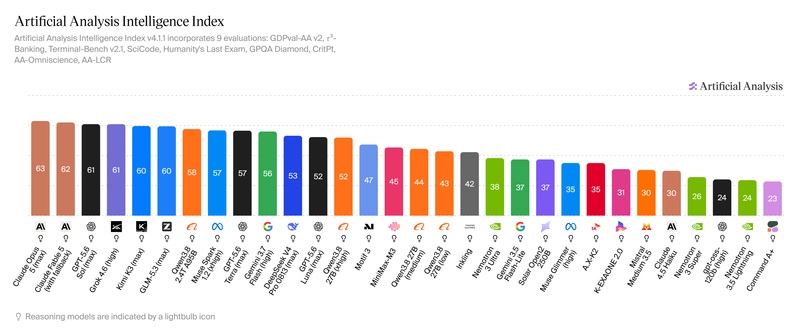
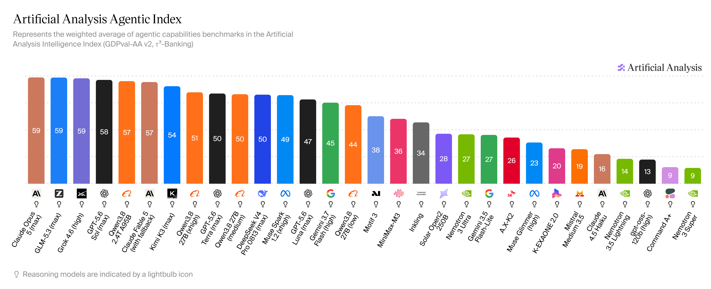

# Artificial Analysis — the three effort levels of Qwen3.8-27B, priced

**External material. Captured 2026-08-24 from charts dated 23 Aug '26. Not
evidence here until measured here.**

Source: Artificial Analysis, Intelligence Index **v4.1.1** (9 evaluations:
GDPval-AA v2, τ³-Banking, Terminal-Bench v2.1, SciCode, Humanity's Last Exam,
GPQA Diamond, CritPt, AA-Omniscience, AA-LCR) and the **Agentic Index**, which is
the weighted average of the agentic benchmarks inside it (GDPval-AA v2,
τ³-Banking).

**Why it is filed.** It is the only source this project has that prices
`reasoning_effort` for *this model* on an *agentic* axis — the axis the worker
actually runs on — and it arrived the same night
[`results/05`](../../results/05-runtime-flags.md) established that **every server
this project has ever launched runs at `xhigh` with an unlimited thinking
budget**, because nothing overrides the template default.

---

## The three levels, both indices





| Qwen3.8-27B | Intelligence Index | **Agentic Index** |
|---|---:|---:|
| `xhigh` | **52** | **51** |
| `medium` | 44 | **50** |
| `low` | 43 | 44 |

### The two indices disagree about where the cost is, and that is the finding

```
Intelligence   xhigh -> medium   -8      medium -> low   -1
Agentic        xhigh -> medium   -1      medium -> low   -6
```

**On the agentic axis, dropping `xhigh` to `medium` costs one point. Dropping
`medium` to `low` costs six.** The reverse is true on the general axis.

**This project's metric is verified accepted coding tasks per hour**, which sits
on the agentic axis. So if the external review
[`results/05`](../../results/05-runtime-flags.md) cites is right that xhigh takes
**15 minutes where medium takes 3**, `medium` buys back most of the wall clock
for one point of agentic capability — and `low` is where the capability actually
goes.

**A question this project asked and answered wrongly for a moment:** *"medium or
low?"* was posed as if the two were the same direction. They are not.

### Where the model sits, for scale

On the Agentic Index `Qwen3.8-27B (xhigh)` at **51** places above
`GPT-5.6 Luna (max)` 47, `Gemini 3.7 Flash (high)` 45 and `Motif 3` 38, and below
`Kimi K3 (max)` 54 and `GPT-5.6 Sol (max)` 58. `Claude Opus 5 (max)` and
`GLM-5.3 (max)` lead at 59.

---

## ⚠️ What this cannot be used for here

- **These are the full-precision model through an API.** Our worker is
  `UD-IQ2_XXS` at **2.16 bpw** or `UD-Q2_K_XL` at ~2.9 — nothing on these charts
  measures a quantised local build, and
  [`results/01`](../../results/01-artifacts.md) shows task success falling
  monotonically with bits per weight across five artifacts. **The effort ranking
  may hold and the absolute numbers certainly do not.**
- **It is not a wall-clock measurement.** The charts price capability, not time.
  The "15 minutes against 3" figure comes from a different external review and is
  itself unverified here.
- **A one-point gap is inside most benchmark noise.** Artificial Analysis
  publishes no error bars on these bars, so `xhigh` 51 against `medium` 50 should
  be read as "no measurable difference", not as "xhigh is slightly better".
- **The agentic index is two benchmarks** (GDPval-AA v2, τ³-Banking), neither of
  which is a coding-agent loop against a real repository.

## What it changes about what to run next

Nothing until measured. But it makes **`--reasoning-effort medium`** the level to
try first on this machine, rather than `low` — and it makes a `low` run worth
doing second, as the arm most likely to show where capability breaks.

*Charts dated 23 Aug '26. Earlier captures of the same two indices (18 Aug,
22 Aug) exist in the operator's downloads and were not filed; nothing here
depends on the series.*
