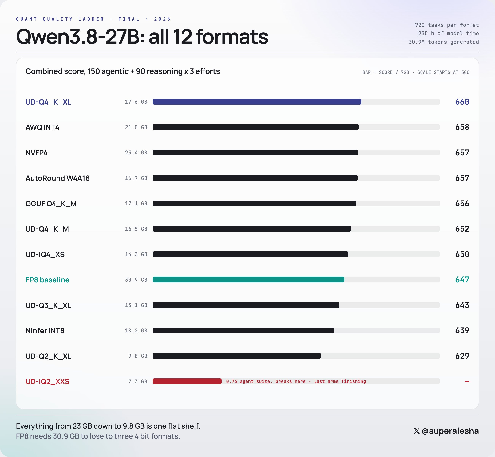
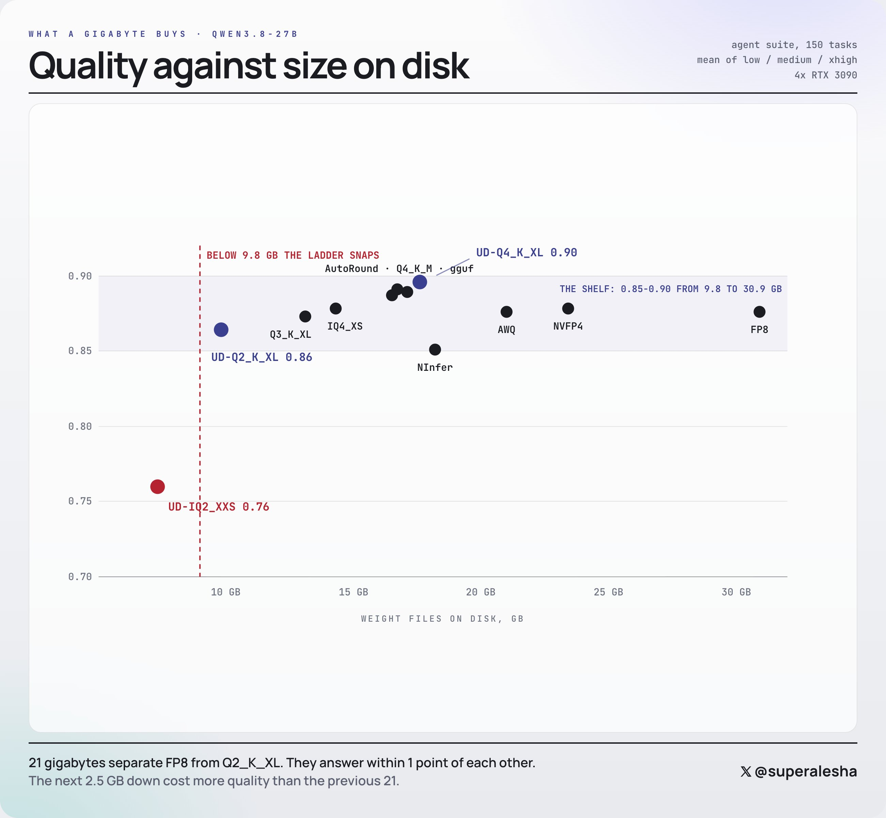
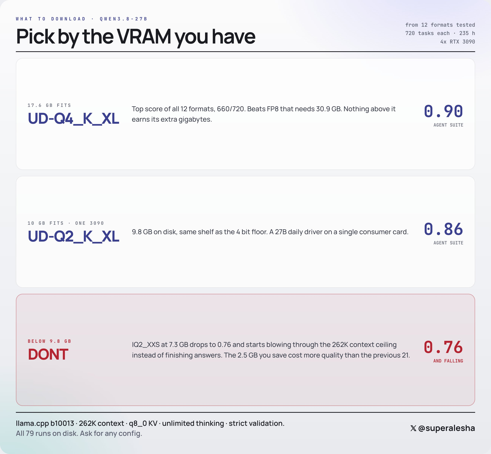
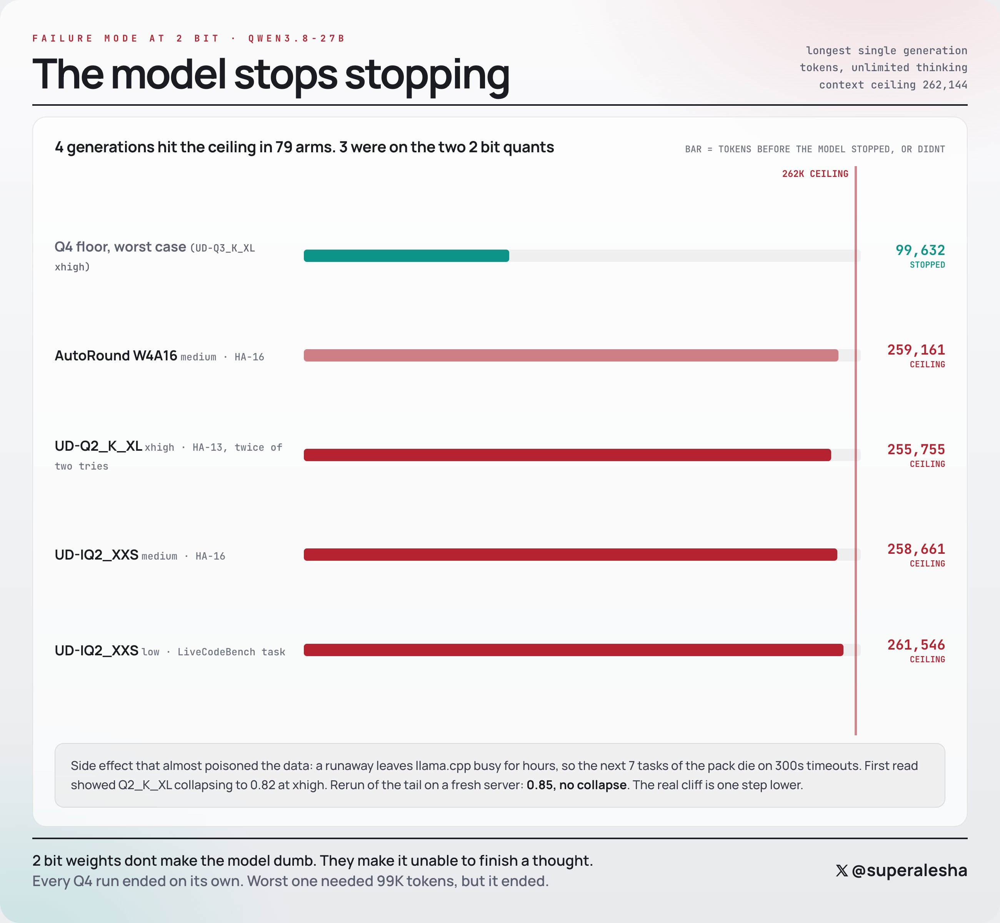
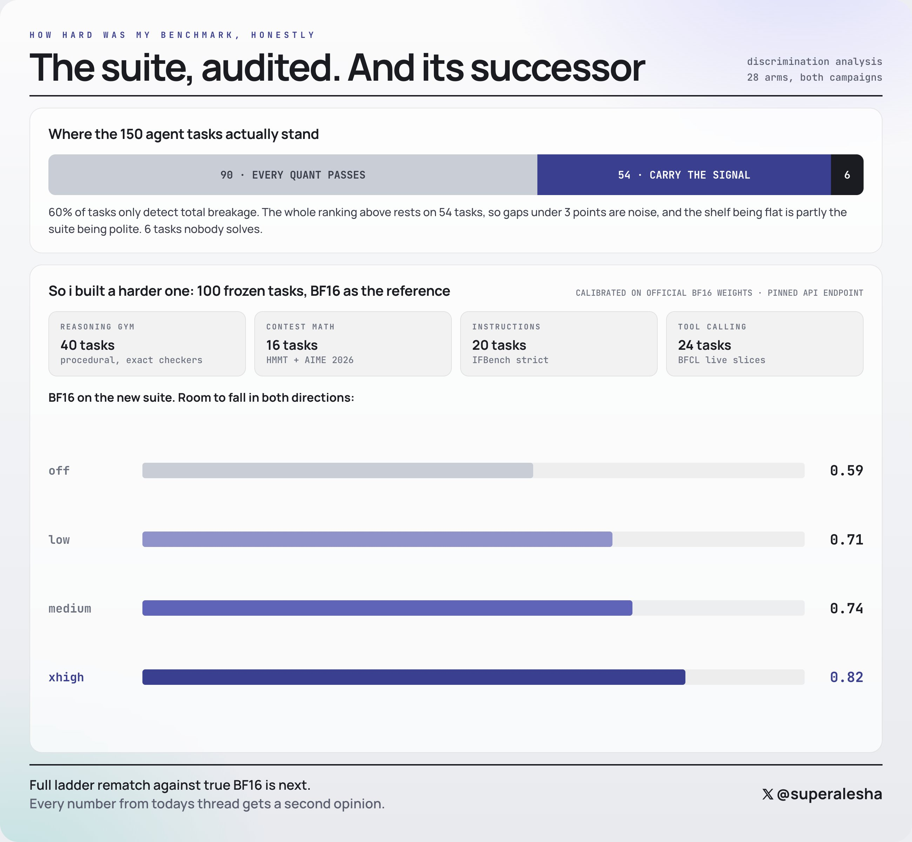

# @superalesha — the 12-format quant ladder for Qwen3.8-27B, and its author's own audit

**External material. Captured 2026-08-24. Not evidence here until measured here.**

Source: an X thread by **@superalesha**, raw traces published at
<https://github.com/alesha-pro/qwen38-27b-bench-4x3090/tree/main/quality>.

| | |
|---|---|
| hardware | **4× RTX 3090** |
| runtimes | **llama.cpp b10013** and vLLM |
| context | **262,144** |
| KV | **`q8_0`** |
| thinking | unlimited, **no token caps** |
| scale | **12 formats × 720 tasks**, 235 h of model time, **30.9M tokens**, 19,925 calls, 79 runs |
| suite | 150 agentic + 90 reasoning, × 3 effort levels (low / medium / xhigh) |

**Why this one is worth a folder.** It is the only public run that puts the exact
two GGUF files this project has on disk on the same axis, at scale, with the raw
traces published — **and whose author then audited his own methodology in public
and said the ranking rests on far less than it appears to.** Both halves matter
here, and the second half is the one that makes it usable rather than the first.

**Our config is not his.** We run **`q4_0` KV at ctx 98,304 on one card**, not
`q8_0` at 262,144 on four. Nothing below transfers as a number. What transfers is
a **failure mode**, and that part we have now seen independently — see §6.

---

## 1. The thread, verbatim

Quoted rather than paraphrased, because the author's hedges are load-bearing and
a summary would drop them.

> I ran the full quant ladder for Qwen3.8 27B on my 4x3090 rig: 12 formats from
> FP8 down to 2 bit, 720 real tasks each, no token caps.
>
> 235 hours of pure model time. 30.9M tokens generated across 19,925 calls. My
> cards did nothing else for 10 days.
>
> Full honest results and raw traces are in this thread, and the bottom of the
> ladder did something I did not expect.

> Boring part: from 23 GB down to 9.8 GB quality is flat.
>
> UD-Q4_K_XL tops the whole board at 660/720. AWQ 658, NVFP4 657, AutoRound 657,
> plain Q4_K_M 656. FP8 at 30.9 GB scores 647 and loses to three 4 bit formats.
>
> UD-Q2_K_XL is 9.8 GB, runs on one 3090, and still holds 0.86 on the agent
> suite. Half the size of anything vLLM can serve, same answers.

> Below 9.8 GB the ladder snaps. IQ2_XXS at 7.3 GB drops to 0.76 and its not
> random noise, both efforts land within a point of each other.
>
> And the failure type surprised me. **The model doesnt get dumber, it stops
> stopping.** The 262K context ceiling got hit 4 times in this campaign: 3 of
> those on the two 2 bit quants, one on a 4 bit. Same agent task blew the ceiling
> twice out of two tries on Q2.
>
> I almost published a wrong number because of this: a runaway wedges llama.cpp
> and the next 7 tasks die on timeouts. First read said Q2 collapsed at xhigh,
> 0.82. It didnt, the server did. Reran the tail on a fresh server: 0.85, back in
> line with the whole ladder.

> And now for my personal drama.
>
> 90 of my 150 agent tasks are passed by every single quant, they only detect
> total breakage. The real ranking comes from 54 tasks. That's a thin edge and
> **differences under 3 points are noise.**
>
> So I already built a harder suite: 100 frozen tasks calibrated against the
> official BF16 weights through an api endpoint. BF16 scores 0.59 off, 0.71 low,
> 0.74 medium, 0.82 xhigh on it. Room to fall in both directions.
>
> Full ladder rematch against a true BF16 reference is next. Every number in
> todays thread gets a second opinion.

> What to actually download for your rig:
>
> Fits in 17.6 GB: UD-Q4_K_XL. Top score of 12 formats, nothing above it earns
> its extra gigabytes. Fits in 10 GB: UD-Q2_K_XL. 0.86 agent suite on a single
> 3090. Below 9.8 GB: dont. The 7.3 GB one forgets how to stop thinking.

And, at the end of the thread, unprompted:

> PS: I doubt many people will read this far, so nobody will see this - and
> that's for the best.
>
> I feel incredibly ashamed of my failure. From the start, I presented results
> that didn't actually reflect the full picture of this model or these quants.
> **The benchmarks are correct, but the methodology was wrong**, and people
> pointed it out to me, showed me, but at first I didn't even understand it right
> away. […] Yes, the issue was with tasks being too easy, and I didn't verify
> them initially. I relied on public repos with pre-built harnesses. Next time, I
> will check everything much more thoroughly, and do it myself.

**That last paragraph is why this folder exists rather than a one-line link.**
An author who separates *"the benchmarks are correct"* from *"the methodology was
wrong"* has done the work of telling a reader which parts to keep. Most published
ladders do not.

---

## 2. The full board — all 12 formats

Combined score out of 720 · 150 agentic + 90 reasoning × 3 efforts · bar scale
starts at 500.

| rank | format | size | score /720 |
|---:|---|---:|---:|
| 1 | **UD-Q4_K_XL** | 17.6 GB | **660** |
| 2 | AWQ INT4 | 21.0 GB | 658 |
| 3 | NVFP4 | 23.4 GB | 657 |
| 3 | AutoRound W4A16 | 16.7 GB | 657 |
| 5 | GGUF Q4_K_M | 17.1 GB | 656 |
| 6 | UD-Q4_K_M | 16.5 GB | 652 |
| 7 | UD-IQ4_XS | 14.3 GB | 650 |
| 8 | **FP8 baseline** | **30.9 GB** | **647** |
| 9 | UD-Q3_K_XL | 13.1 GB | 643 |
| 10 | NInfer INT8 | 18.2 GB | 639 |
| 11 | **UD-Q2_K_XL** | **9.8 GB** | **629** |
| — | **UD-IQ2_XXS** | **7.3 GB** | **— (0.76 agent suite, "breaks here")** |

> *"Everything from 23 GB down to 9.8 GB is one flat shelf. FP8 needs 30.9 GB to
> lose to three 4 bit formats."*

**Note the FP8 result.** A 30.9 GB unquantised-ish baseline placing 8th, below
four 4-bit formats, is the kind of finding that should raise an eyebrow before it
raises a conclusion — and §5 explains why it might.

---

## 3. Quality against size, and where the cliff is

Agent suite, 150 tasks, mean of low / medium / xhigh.

- **The shelf: 0.85–0.90, from 9.8 GB all the way to 30.9 GB.**
- `UD-Q2_K_XL` **0.86** at 9.8 GB — the left edge of the shelf.
- `UD-Q4_K_XL` **0.90** at 17.6 GB — the top.
- `NInfer INT8` **0.85** at 18.2 GB — the shelf's floor, at twice Q2's size.
- `UD-IQ2_XXS` **0.76** at 7.3 GB — **below the line, alone.**

> *"21 gigabytes separate FP8 from Q2_K_XL. They answer within 1 point of each
> other. The next 2.5 GB down cost more quality than the previous 21."*

### The download recommendation

| budget | pick | agent suite |
|---|---|---:|
| 17.6 GB fits | `UD-Q4_K_XL` | **0.90** |
| 10 GB fits (one 3090) | `UD-Q2_K_XL` | **0.86** |
| below 9.8 GB | **DON'T** | 0.76 and falling |

---

## 4. The failure mode — "the model stops stopping"

Longest single generation per arm, against a 262,144 ceiling. **4 generations hit
the ceiling across 79 arms. 3 of the 4 were on the two 2-bit quants.**

| arm | tokens | ended? |
|---|---:|---|
| Q4 floor, worst case (`UD-Q3_K_XL` xhigh) | 99,632 | **STOPPED on its own** |
| AutoRound W4A16 medium · HA-16 | 259,161 | CEILING |
| **`UD-Q2_K_XL` xhigh · HA-13, twice of two tries** | **255,755** | **CEILING** |
| `UD-IQ2_XXS` medium · HA-16 | 258,661 | CEILING |
| `UD-IQ2_XXS` low · LiveCodeBench | 261,546 | CEILING |

> *"2 bit weights dont make the model dumb. They make it unable to finish a
> thought. Every Q4 run ended on its own. Worst one needed 99K tokens, but it
> ended."*

### ⚠️ Read the third row before treating Q2_K_XL as safe

**`UD-Q2_K_XL` blew the ceiling too — on the same agent task, twice out of two
tries.** The recommendation card says 9.8 GB is fine and the ladder snaps below
it; the failure-mode chart says the *non-termination* behaviour is already
present at 9.8 GB and is merely rarer. Those are two different claims and only
the first one made it onto the summary graphic.

### The instrument fault he caught, and published

> *"a runaway leaves llama.cpp busy for hours, so the next 7 tasks of the pack
> die on 300s timeouts. First read showed Q2_K_XL collapsing to 0.82 at xhigh.
> Rerun of the tail on a fresh server: **0.85, no collapse**. The real cliff is
> one step lower."*

**A single non-terminating generation poisoned the seven results after it**, and
the poisoned tail read as a clean quality collapse. This is the same class of
fault this project catalogues in `../reports/CORRECTIONS.md` — an instrument
returning a believable number instead of a failure — and he found it the same
way: by re-running on a fresh server rather than by reasoning about the number.

---

## 5. The author's own audit — what his ranking actually rests on

Discrimination analysis over 28 arms, both campaigns:

| slice of the 150 agent tasks | count |
|---|---:|
| **every quant passes** — detects only total breakage | **90** |
| **carry the signal** | **54** |
| nobody solves | 6 |

> *"60% of tasks only detect total breakage. The whole ranking above rests on 54
> tasks, so **gaps under 3 points are noise**, and the shelf being flat is partly
> the suite being polite."*

### Applying his own noise floor to his own board

| comparison | gap | above his stated 3-point floor? |
|---|---:|---|
| `Q2_K_XL` 629 → `Q4_K_XL` 660 | 31 /720 ≈ **4 pts** on the 0–1 scale | **marginal** |
| `IQ2_XXS` 0.76 → `Q2_K_XL` 0.86 | **10 pts** | **yes — 3× the floor** |
| everything inside the 9.8–30.9 GB shelf | ≤ 5 pts | **no** |

**So the only conclusion of his that survives his own audit is the cliff.** The
fine ordering along the shelf — including `UD-Q4_K_XL` "topping the board" and
FP8 placing 8th — does not clear the noise he himself measured.

### The successor suite

100 frozen tasks, calibrated against official BF16 weights through a pinned API
endpoint:

| slice | tasks | checker |
|---|---:|---|
| reasoning gym | 40 | procedural, exact checkers |
| contest math | 16 | HMMT + AIME 2026 |
| instructions | 20 | IFBench strict |
| tool calling | 24 | BFCL live slices |

BF16 on the new suite — **room to fall in both directions**, which the old suite
did not have:

| effort | BF16 |
|---|---:|
| off | 0.59 |
| low | 0.71 |
| medium | 0.74 |
| xhigh | **0.82** |

> *"Full ladder rematch against a true BF16 reference is next. Every number in
> todays thread gets a second opinion."*

**Until that rematch lands, every table above is provisional by its author's own
statement.**

---

## 6. Cross-check against this machine

### The artifacts are the same files

His sizes are decimal GB; ours are binary GiB. Converted, they identify our own
snapshot `27af057ec…` (Dynamic v3) exactly:

| his label | his size | our file | bytes | MiB | decimal GB |
|---|---:|---|---:|---:|---:|
| `UD-IQ2_XXS` | **7.3 GB** | `…-UD-IQ2_XXS.gguf` (v3) | 7,266,070,528 | 6,929.46 | **7.266** |
| `UD-Q2_K_XL` | **9.8 GB** | `…-UD-Q2_K_XL.gguf` (v3) | 9,828,981,664 | 9,373.65 | **9.829** |
| `UD-Q3_K_XL` | 13.1 GB | `…-UD-Q3_K_XL.gguf` | — | 12,818 | 13.44 |
| `UD-Q4_K_XL` | 17.6 GB | `…-UD-Q4_K_XL.gguf` | — | 17,093 | 17.92 |

**The two that matter agree to three significant figures**, which is not a
coincidence of rounding: `9,828,981,664 bytes = 9.829 GB` against his "9.8 GB",
and `7,266,070,528 = 7.266 GB` against his "7.3 GB".

**He benchmarked the two files at the centre of our decision.** That is unusual
enough to state plainly — most external ladders test a different vendor's build.

### The failure mode has now been seen here, independently

This is the part that is not just a citation. **Four separate observations on
this machine agree with his diagnosis, and none of them was made looking for it —
the earliest predates his thread:**

1. **[`../README.md`](../README.md), written before this capture** — comparing
   the vendor charts against our own corpus, it already says: *"the V3 failure we
   actually see — **looping inside the reasoning block for 19,000–34,000
   characters and never emitting a fenced code block** — cannot be seen at 32
   tokens."* That is his "stops stopping", named here first and independently,
   from a different suite on different hardware.
2. **`docs/results/01-artifacts.md`** — v3 `UD-IQ2_XXS` scores **19/27 with a
   58.3 % contract rate**. "Contract" means *emitted a fenced block at all*.
   **41.7 % of the time it produced no usable answer**, not a wrong one.
3. **The same register, one rung down** — v3 `UD-IQ1_S`: **0 of 12, "no fenced
   block, 12/12"**. At 1.84 bpw the model stops producing terminated output
   entirely.
4. **2026-08-24, `results/real-task-dflash2ngram.jsonl`** — one real task on this
   artifact, ctx 98,304, native `sm_120a` build. The worker ran **537.7 s across
   45 turns, generated to the request cap of 8,192 tokens twice, and changed zero
   files.** Peak context 69,401 of 98,304 with `truncated = 0` — **the window was
   never the constraint.** It did not answer wrongly; it did not finish.

**Two labs, two suites, two sets of hardware, four independent observations, one
failure mode.** That is a stronger claim than anything in his ranking, and it is
the only claim here this project should act on.

His ceiling is 262,144 and ours is an 8,192-token request cap, so the magnitudes
are not comparable. **The shape is: generated to whatever limit was available
instead of emitting a stop token.**

### What this does NOT license

- **His numbers are not our numbers.** `q8_0` KV at 262K on 4× 3090 is a
  different machine and a different configuration. Nothing here is a rate, a
  score or a verdict for this project.
- **`UD-IQ2_S` (7.80 GiB / 8.37 GB) is not covered.** It sits inside his
  **untested gap between 7.3 GB (broken) and 9.8 GB (fine)**. His data cannot
  clear it and must not be quoted as if it did.
- **`UD-Q2_K_XL` is not proven safe from non-termination**, only rarer — see the
  third row of §4.
- **The Unsloth Dynamic v3 top-1 % curve** (`../unsloth v3.jpg`) measures
  divergence over **32 tokens**. By construction it cannot see a failure that
  happens at token 8,192 or 250,000. A quant that looks like the steepest gain on
  that curve may be the wrong pick for this failure mode, and the two charts must
  not be read as measuring the same thing.

---

## 7. What would have to be measured here

In this project's terms, one number would settle it: **the same real task, same
window, same arm, on `UD-IQ2_XXS` and on `UD-Q2_K_XL`.**

`bench/real_task_bench.py` now preserves the worker transcript outside the
scratch root, so a non-terminating run can be diagnosed after the fact rather
than inferred — which is precisely the fault that cost him seven tasks and nearly
a published number.

VRAM, from measured buffers at ctx 98,304 with `dflash2+ngram` — headroom today
is **4,309 MiB**:

| candidate | weights | delta | headroom after |
|---|---:|---:|---:|
| `UD-IQ2_XXS` (current) | 6,929 MiB | — | 4,309 |
| `UD-IQ2_S` | 7,984 MiB | +1,055 | 3,254 |
| **`UD-Q2_K_XL`** | **9,373 MiB** | **+2,444** | **1,865** |
| `UD-Q3_K_XL` | 12,818 MiB | +5,889 | **does not fit** |

**`UD-Q2_K_XL` fits on the installed card at the window we serve, with the full
drafter, leaving 1,865 MiB** — clear of the 45–376 MiB band
(`../reports/CORRECTIONS.md` §26) and inside the 1.5–2 GB margin the dual-GPU
plan recommends.

`UD-Q3_K_XL` and above are what the second GPU is for.

---

*Images 01–05 captured from the thread 2026-08-24 02:04–02:09. Raw traces the
author published: <https://github.com/alesha-pro/qwen38-27b-bench-4x3090/tree/main/quality>
— not downloaded or checked here.*
